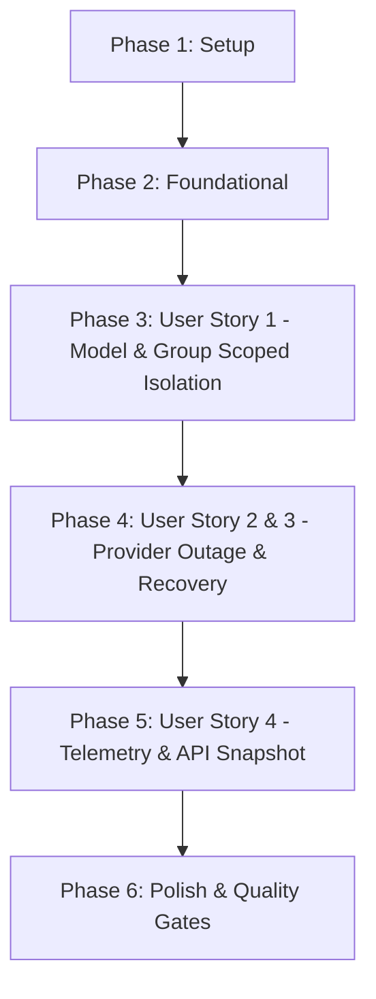

# Tasks: Scoped Overload Cooldown (Phân Vùng Phạm Vi Cooldown Quá Tải)

**Branch**: `041-scoped-overload-cooldown` | **Spec**: [spec.md](file:///e:/tailieuhoctap/laptrinhnangcao/th/merged/specs/041-scoped-overload-cooldown/spec.md) | **Plan**: [plan.md](file:///e:/tailieuhoctap/laptrinhnangcao/th/merged/specs/041-scoped-overload-cooldown/plan.md)

---

## Phase 1: Setup & Type Definitions

**Purpose**: Định nghĩa các interface và cấu trúc dữ liệu cho Model Cooldown, Provider Outage Tracker, và mở rộng Scheduler Telemetry.

- [x] T001 Thêm `ModelCooldownRecord`, `ProviderOutageStatus` và mở rộng `SchedulerTelemetry` trong `shared/models.ts` và `server/services/quotaService.ts`

---

## Phase 2: Foundational Architecture (Scoped Cooldown Engine)

**Purpose**: Cài đặt các cấu trúc dữ liệu quản lý Cooldown theo phạm vi mô hình và nhà cung cấp, tích hợp kiểm tra 4 tầng trong `scheduleAttempt`.

- [x] T002 Cài đặt `modelCooldownsMap`, `triggerModelCooldown`, `getModelCooldownStatus`, và `getActiveModelCooldowns` trong `server/services/quotaService.ts`
- [x] T003 Cài đặt `providerOutageTracker`, `recordUpstreamFailureEvent`, và `getProviderOutageStatus` trong `server/services/quotaService.ts`
- [x] T004 Tích hợp kiểm tra 4 tầng Cooldown (Provider $\to$ Model $\to$ Group $\to$ Key) trong phương thức `scheduleAttempt` tại `server/services/quotaService.ts`

**Checkpoint**: Động cơ phân vùng Cooldown đã sẵn sàng — các User Stories có thể bắt đầu tích hợp.

---

## Phase 3: User Story 1 - Model & QuotaGroup Scoped Isolation (Priority: P1) 🎯 MVP

**Goal**: Đảm bảo lỗi 503 của Model A chỉ cô lập Model A, Model B vẫn hoạt động bình thường với `delayMs = 0`; lỗi của Project A chỉ cô lập Project A, Project B vẫn hoạt động bình thường.

**Independent Test**: Gặp 503 trên `gemini-2.5-pro` $\to$ `gemini-2.5-flash` được cấp phép ngay lập tức; gặp 429 trên Group A $\to$ Group B được cấp phép ngay lập tức.

### Tests for User Story 1

- [x] T005 [P] [US1] Tạo file test `server/services/__tests__/scopedOverloadCooldown.test.ts` và viết 4 ca kiểm thử: `model A overloaded`, `model B remains usable`, `project A overloaded`, `project B remains usable`

### Implementation for User Story 1

- [x] T006 [US1] Cập nhật `recordCategorizedError` trong `server/services/quotaService.ts` để khi gặp 503 Overload sẽ kích hoạt Model Cooldown cục bộ và ghi nhận sự cố

**Checkpoint**: User Story 1 hoàn thành — Không còn hiện tượng Model A làm nghẽn Model B.

---

## Phase 4: User Story 2 & 3 - Provider Outage & Self-Healing Recovery (Priority: P1) 🎯 MVP

**Goal**: Nhận diện đúng sự cố diện rộng thực tế và tự động phục hồi tính khả dụng của Model/Group sau khi hết thời gian Cooldown TTL.

**Independent Test**:
- $\ge 2$ models và $\ge 2$ groups đồng thời gặp lỗi 503 trong 5s $\to$ kích hoạt Provider-Wide Cooldown.
- Sau khi hết thời gian TTL $\to$ Model và Group tự động chuyển về trạng thái `Available` / `Healthy`.

### Tests for User Story 2 & 3

- [x] T007 [P] [US2] Bổ sung 2 ca kiểm thử `provider-wide outage` và `recovery` trong `server/services/__tests__/scopedOverloadCooldown.test.ts`

### Implementation for User Story 2 & 3

- [x] T008 [US2] Hoàn thiện logic phát hiện sự cố diện rộng ($\ge 2$ models và $\ge 2$ groups trong 5s) và cơ chế tự động phục hồi trong `server/services/quotaService.ts`

**Checkpoint**: User Story 2 & 3 hoàn thành — Hệ thống phân biệt chính xác sự cố cục bộ vs toàn diện và tự chữa lành.

---

## Phase 5: User Story 4 - Telemetry & API Snapshot Integration (Priority: P2)

**Goal**: Báo cáo chi tiết trạng thái Cooldown đa tầng (Model, Group, Provider) qua viễn trắc và API `/api/quota-status`.

**Independent Test**: Gọi `/api/quota-status` $\to$ JSON trả về đầy đủ `activeModelCooldowns`, `activeGroupCooldowns`, và `isProviderOutage`.

- [x] T009 [US4] Cập nhật `getSchedulerTelemetry()` và handler trong `server/controllers/quotaController.ts`

**Checkpoint**: User Story 4 hoàn thành — Giám sát trạng thái Cooldown minh bạch.

---

## Phase 6: Polish & Quality Gates (Constitution Non-Negotiable)

**Purpose**: Cập nhật tài liệu kỹ thuật, rà soát type safety và chạy toàn diện các Quality Gates theo Hiến pháp.

- [x] T010 [P] Cập nhật tài liệu kiến trúc Scoped Cooldown trong `docs/quota-and-scheduling.md`
- [x] T011 Kiểm tra Type Safety không có lỗi với `npm run lint` (`tsc --noEmit`)
- [x] T012 Chạy toàn bộ test suite và đảm bảo pass 100% với `npm test` (`vitest run`)
- [x] T013 Kiểm tra đóng gói build production thành công với `npm run build`
- [x] T014 Thực hiện kiểm định xác thực 6 ca kiểm thử theo `specs/041-scoped-overload-cooldown/quickstart.md`

---

## Dependencies & Execution Order

### Phase Dependencies

- **Phase 1 (Setup)**: Không có phụ thuộc — bắt đầu ngay.
- **Phase 2 (Foundational)**: Phụ thuộc vào Phase 1 — CHẶN toàn bộ User Stories.
- **Phase 3 (User Story 1 - P1 MVP)**: Phụ thuộc vào Phase 2.
- **Phase 4 (User Story 2 & 3 - P1 MVP)**: Phụ thuộc vào Phase 3.
- **Phase 5 (User Story 4 - P2)**: Phụ thuộc vào Phase 4.
- **Phase 6 (Polish & Quality Gates)**: Phụ thuộc vào toàn bộ các Phase trước.

---

## Parallel Execution Opportunities

- **Trong Phase 3 & 4**: Viết test suite `T005` và `T007` có thể chuẩn bị song song với các bước logic.
- **Trong Phase 6**: Cập nhật tài liệu `T010` có thể thực hiện song song với việc kiểm tra lints.

---

## Implementation Strategy

### MVP Scope (User Story 1, 2, 3)
1. Hoàn thành Phase 1 (Setup) và Phase 2 (Foundational).
2. Triển khai Phase 3 (US1 - Model & Group Scoped Isolation) và Phase 4 (US2 & US3 - Provider Outage & Recovery).
3. **STOP & VALIDATE**: Chạy toàn bộ 6 bài test kịch bản trong `scopedOverloadCooldown.test.ts` để chứng minh MVP hoạt động chuẩn xác 100%.

### Incremental Delivery (P2 Stories)
4. Triển khai Phase 5 (US4 - Telemetry & API Snapshot).
5. Hoàn tất Phase 6 (Quality Gates: lint, test, build).
