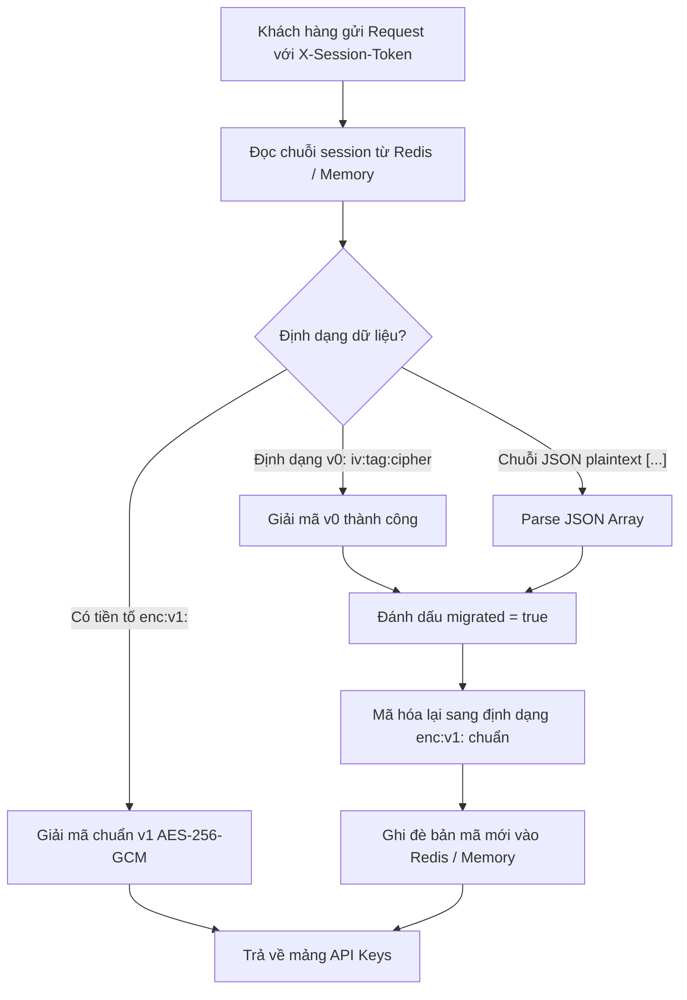

# Phase 0 Research: API Key Encryption at Rest & Migration Architecture

**Feature**: `042-api-key-encryption-at-rest`  
**Date**: 2026-08-20  
**Status**: Completed

---

## 1. Nghiên Cứu Mật Mã Học Ứng Dụng (Applied Cryptography)

### Lựa Chọn Thuật Toán: AES-256-GCM (Authenticated Encryption)
- **Tính bảo mật (Confidentiality)**: Sử dụng độ dài khóa 256 bits (32 bytes) phái sinh qua hàm `scrypt`.
- **Tính toàn vẹn (Integrity & Authenticity)**: GCM sinh ra Authentication Tag (16 bytes) giúp phát hiện 100% các hành vi sửa đổi bit, cắt xén hoặc giải mã bằng sai Master Key.
- **Vector khởi tạo (IV)**: Sinh ngẫu nhiên bằng `crypto.randomBytes(12)` (96 bits) cho mỗi lần mã hóa, đảm bảo 2 lần mã hóa cùng 1 mảng API key sẽ cho ra 2 bản mã hoàn toàn khác nhau.

---

## 2. Định Dạng Phong Bì Bản Mã (Cipher Envelope Format)

```
       ┌──────────┬───────────┬──────────────┬──────────────────┐
       │  enc:v1  │  IV (hex) │ AuthTag(hex) │ Ciphertext (hex) │
       │ (Header) │ (12 bytes)│  (16 bytes)  │    (Variable)    │
       └────┬─────┴─────┬─────┴──────┬───────┴────────┬─────────┘
            │           │            │                │
            └───────────┴──────┬─────┴────────────────┘
                               │
                Được ngăn cách bởi dấu hai chấm (:)
```

---

## 3. Chiến Lược Di Trú Không Gián Đoạn (Zero-Downtime Lazy Migration)



---

## 4. Kịch Bản Kiểm Thử Bắt Buộc

1. `encrypt`: Mã hóa mảng API keys ra chuỗi `enc:v1:<iv>:<authTag>:<ciphertext>`.
2. `decrypt`: Giải mã chuỗi `enc:v1:...` về đúng mảng API keys ban đầu.
3. `wrong key`: Thử giải mã bằng sai Master Key $\to$ ném lỗi xác thực an toàn, không crash.
4. `corrupted ciphertext`: Chỉnh sửa 1 byte trong ciphertext $\to$ phát hiện hỏng Auth Tag và từ chối an toàn.
5. `migration`: Đọc session chứa JSON plaintext $\to$ đọc thành công, tự động mã hóa lại thành `enc:v1:` và ghi đè vào Redis.
6. `redaction`: Kiểm tra logs/errors không bao giờ chứa API key dạng plaintext.
