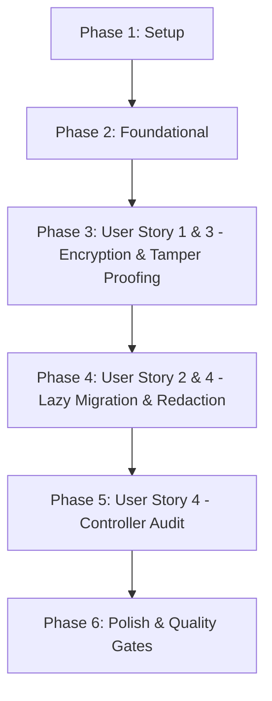

# Tasks: API Key Encryption at Rest (Mã Hóa Khóa API Khi Lưu Trữ)

**Branch**: `042-api-key-encryption-at-rest` | **Spec**: [spec.md](file:///e:/tailieuhoctap/laptrinhnangcao/th/merged/specs/042-api-key-encryption-at-rest/spec.md) | **Plan**: [plan.md](file:///e:/tailieuhoctap/laptrinhnangcao/th/merged/specs/042-api-key-encryption-at-rest/plan.md)

---

## Phase 1: Setup & Type Definitions

**Purpose**: Định nghĩa kiểu dữ liệu kết quả giải mã `DecryptedKeysResult` và lớp ngoại lệ chuẩn hóa `SessionDecryptionError`.

- [x] T001 Thêm `DecryptedKeysResult` và `SessionDecryptionError` vào `server/services/sessionStore.ts`

---

## Phase 2: Foundational Architecture (Cryptographic Envelope Engine)

**Purpose**: Nâng cấp thuật toán mã hóa AES-256-GCM với cấu trúc phong bì phiên bản `enc:v1:` và cài đặt bộ giải mã đa định dạng kiểm soát tính toàn vẹn.

- [x] T002 Nâng cấp `encryptApiKeys` xuất ra định dạng `enc:v1:<iv_hex>:<authTag_hex>:<ciphertext_hex>` trong `server/services/sessionStore.ts`
- [x] T003 Cài đặt `decryptApiKeysWithStatus` và `decryptApiKeys` hỗ trợ `enc:v1:`, `v0`, và `legacy_plaintext` kèm xác thực GCM Authentication Tag an toàn trong `server/services/sessionStore.ts`

**Checkpoint**: Động cơ mã hóa/giải mã an toàn đã sẵn sàng — các User Stories có thể bắt đầu tích hợp.

---

## Phase 3: User Story 1 & 3 - Encryption at Rest & Secure Integrity (Priority: P1) 🎯 MVP

**Goal**: Đảm bảo 100% session mới lưu trong Redis/Memory đều được mã hóa bằng `enc:v1:` và mọi hành vi giả mạo ciphertext / sai master key đều bị từ chối an toàn.

**Independent Test**: Mã hóa keys $\to$ lưu vào Redis mang format `enc:v1:...`; sai key hoặc sửa byte $\to$ từ chối an toàn, ném `SessionDecryptionError`.

### Tests for User Story 1 & 3

- [x] T004 [P] [US1] Tạo file test `server/services/__tests__/apiKeyEncryption.test.ts` và viết 4 ca kiểm thử: `encrypt`, `decrypt`, `wrong key`, `corrupted ciphertext`

### Implementation for User Story 1 & 3

- [x] T005 [US1] Cập nhật `createSession` trong `server/services/sessionStore.ts` để lưu định dạng `enc:v1:` vào Redis/Memory

**Checkpoint**: User Story 1 & 3 hoàn thành — Bảo vệ tuyệt đối API key tại tầng lưu trữ.

---

## Phase 4: User Story 2 & 4 - Lazy Migration & Redaction (Priority: P1) 🎯 MVP

**Goal**: Tự động nhận diện session cũ lưu plaintext hoặc v0, giải mã thành công và tự động re-encrypt sang `enc:v1:` lưu đè vào Redis mà không làm crash active session; đảm bảo key luôn được redact khỏi logs.

**Independent Test**: Đọc session chứa JSON plaintext $\to$ trả về đúng key và Redis tự động được nâng cấp sang `enc:v1:...`.

### Tests for User Story 2 & 4

- [x] T006 [P] [US2] Bổ sung 2 ca kiểm thử `migration` và `redaction` trong `server/services/__tests__/apiKeyEncryption.test.ts`

### Implementation for User Story 2 & 4

- [x] T007 [US2] Tích hợp cơ chế tự động ghi đè bản mã `enc:v1:` khi phát hiện session cũ trong `getSessionKeys` tại `server/services/sessionStore.ts`

**Checkpoint**: User Story 2 & 4 hoàn thành — Di trú dữ liệu trong suốt, không downtime, không rò rỉ log.

---

## Phase 5: User Story 4 - Redaction Audit & Controller Verification (Priority: P2)

**Goal**: Rà soát các endpoint trong `sessionController.ts` đảm bảo cấm hoàn toàn credential trên URL và không trả về plaintext keys.

- [x] T008 [US4] Rà soát và xác nhận `server/controllers/sessionController.ts` không nhận token qua URL params và không trả về key thô

**Checkpoint**: User Story 4 hoàn thành — Tuân thủ tiêu chuẩn an toàn OWASP.

---

## Phase 6: Polish & Quality Gates (Constitution Non-Negotiable)

**Purpose**: Cập nhật tài liệu kỹ thuật, rà soát type safety và chạy toàn diện các Quality Gates theo Hiến pháp.

- [x] T009 [P] Cập nhật tài liệu kiến trúc bảo mật trong `docs/quota-and-scheduling.md` (mục Encryption at Rest)
- [x] T010 Kiểm tra Type Safety không có lỗi với `npm run lint` (`tsc --noEmit`)
- [x] T011 Chạy toàn bộ test suite và đảm bảo pass 100% với `npm test` (`vitest run`)
- [x] T012 Kiểm tra đóng gói build production thành công với `npm run build`
- [x] T013 Thực hiện kiểm định xác thực 6 ca kiểm thử theo `specs/042-api-key-encryption-at-rest/quickstart.md`

---

## Dependencies & Execution Order

### Phase Dependencies

- **Phase 1 (Setup)**: Không có phụ thuộc — bắt đầu ngay.
- **Phase 2 (Foundational)**: Phụ thuộc vào Phase 1 — CHẶN toàn bộ User Stories.
- **Phase 3 (User Story 1 & 3 - P1 MVP)**: Phụ thuộc vào Phase 2.
- **Phase 4 (User Story 2 & 4 - P1 MVP)**: Phụ thuộc vào Phase 3.
- **Phase 5 (User Story 4 - P2)**: Phụ thuộc vào Phase 4.
- **Phase 6 (Polish & Quality Gates)**: Phụ thuộc vào toàn bộ các Phase trước.

---

## Parallel Execution Opportunities

- **Trong Phase 3 & 4**: Viết test suite `T004` và `T006` có thể chuẩn bị song song với các bước logic.
- **Trong Phase 6**: Cập nhật tài liệu `T009` có thể thực hiện song song với việc kiểm tra lints.

---

## Implementation Strategy

### MVP Scope (User Story 1, 2, 3)
1. Hoàn thành Phase 1 (Setup) và Phase 2 (Foundational).
2. Triển khai Phase 3 (US1 & US3 - Encryption & Tamper Proofing) và Phase 4 (US2 - Lazy Migration).
3. **STOP & VALIDATE**: Chạy toàn bộ 6 bài test kịch bản trong `apiKeyEncryption.test.ts` để chứng minh MVP hoạt động chuẩn xác 100%.

### Incremental Delivery (P2 Stories)
4. Triển khai Phase 5 (US4 - Controller Audit).
5. Hoàn tất Phase 6 (Quality Gates: lint, test, build).
