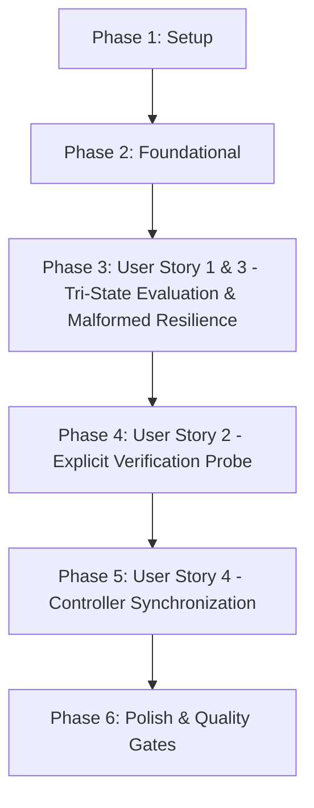

# Tasks: Model Verification Unknown != True (Xác Thực Năng Lực Mô Hình)

**Branch**: `043-model-verification-unknown-not-true` | **Spec**: [spec.md](file:///e:/tailieuhoctap/laptrinhnangcao/th/merged/specs/043-model-verification-unknown-not-true/spec.md) | **Plan**: [plan.md](file:///e:/tailieuhoctap/laptrinhnangcao/th/merged/specs/043-model-verification-unknown-not-true/plan.md)

---

## Phase 1: Setup & Type Definitions

**Purpose**: Định nghĩa các kiểu dữ liệu năng lực 3 trạng thái `ModelCapabilityState` và cấu trúc đánh giá năng lực `ModelCapabilityEvaluation`.

- [x] T001 Thêm `ModelCapabilityState` và `ModelCapabilityEvaluation` vào `server/services/modelInfoService.ts`

---

## Phase 2: Foundational Architecture (Capability Evaluation & Probe Engine)

**Purpose**: Cài đặt hàm đánh giá năng lực `evaluateModelGenerationCapability`, hàm thăm dò thực tế `probeModelGeneration`, và nâng cấp `verifySingleModel` với ma trận 3 nhánh.

- [x] T002 Cài đặt `evaluateModelGenerationCapability(supportedMethods: unknown): ModelCapabilityState` với safe parsing trong `server/services/modelInfoService.ts`
- [x] T003 Cài đặt `probeModelGeneration(modelId: string, apiKey: string): Promise<boolean>` trong `server/services/modelInfoService.ts`
- [x] T004 Nâng cấp `verifySingleModel` với ma trận 3 nhánh (`supported` $\to$ approve, `unsupported` $\to$ reject, `unknown` $\to$ probe) trong `server/services/modelInfoService.ts`

**Checkpoint**: Động cơ xác thực 3 trạng thái đã sẵn sàng — các User Stories có thể bắt đầu tích hợp.

---

## Phase 3: User Story 1 & 3 - Tri-State Evaluation & Malformed Resilience (Priority: P1) 🎯 MVP

**Goal**: Đảm bảo metadata thiếu hoặc dị tật được nhận diện an toàn là `unknown` (không tự động coi là `true`), và `listModelsForKey` chỉ hiển thị các mô hình `supported`.

**Independent Test**:
- `supportedGenerationMethods: ["generateContent"]` $\to$ `supported`.
- `supportedGenerationMethods: ["embedContent"]` $\to$ `unsupported`.
- `supportedGenerationMethods: undefined / null / "malformed"` $\to$ `unknown` an toàn.

### Tests for User Story 1 & 3

- [x] T005 [P] [US1] Tạo file test `server/services/__tests__/modelVerification.test.ts` và viết 4 ca kiểm thử: `capability present`, `capability absent`, `capability missing`, `malformed metadata`

### Implementation for User Story 1 & 3

- [x] T006 [US1] Cập nhật `fetchModelsFromGoogle` trong `server/services/modelInfoService.ts` để lọc chính xác các model có năng lực `supported`

**Checkpoint**: User Story 1 & 3 hoàn thành — Loại bỏ hoàn toàn lỗi gán nhầm metadata thiếu thành `true`.

---

## Phase 4: User Story 2 - Explicit Verification Probe (Priority: P1) 🎯 MVP

**Goal**: Khi model có năng lực `unknown`, hệ thống tự động kích hoạt Explicit Verification Probe để kiểm chứng thực tế và cập nhật trạng thái `verified` chính xác.

**Independent Test**: Model có năng lực `unknown` + probe thành công $\to$ `verified = true`; probe thất bại $\to$ `verified = false` kèm thông báo lỗi.

### Tests for User Story 2

- [x] T007 [P] [US2] Bổ sung 2 ca kiểm thử `verification success` và `verification failure` trong `server/services/__tests__/modelVerification.test.ts`

### Implementation for User Story 2

- [x] T008 [US2] Hoàn thiện tích hợp probe và chuẩn hóa thông báo lỗi khi xác minh thất bại trong `server/services/modelInfoService.ts`

**Checkpoint**: User Story 2 hoàn thành — Hỗ trợ custom models an toàn, không còn lỗ hổng verified giả mạo.

---

## Phase 5: User Story 4 - Controller Synchronization (Priority: P2)

**Goal**: Rà soát và đồng bộ handler `verifyModelHandler` trong `server/controllers/quotaController.ts`.

- [x] T009 [US4] Rà soát và đồng bộ handler `verifyModelHandler` trong `server/controllers/quotaController.ts`

**Checkpoint**: User Story 4 hoàn thành — API endpoint phản ánh kết quả xác minh minh bạch.

---

## Phase 6: Polish & Quality Gates (Constitution Non-Negotiable)

**Purpose**: Cập nhật tài liệu kỹ thuật, rà soát type safety và chạy toàn diện các Quality Gates theo Hiến pháp.

- [x] T010 [P] Cập nhật tài liệu kiến trúc xác thực mô hình trong `docs/quota-and-scheduling.md`
- [x] T011 Kiểm tra Type Safety không có lỗi với `npm run lint` (`tsc --noEmit`)
- [x] T012 Chạy toàn bộ test suite và đảm bảo pass 100% với `npm test` (`vitest run`)
- [x] T013 Kiểm tra đóng gói build production thành công với `npm run build`
- [x] T014 Thực hiện kiểm định xác thực 6 ca kiểm thử theo `specs/043-model-verification-unknown-not-true/quickstart.md`

---

## Dependencies & Execution Order

### Phase Dependencies

- **Phase 1 (Setup)**: Không có phụ thuộc — bắt đầu ngay.
- **Phase 2 (Foundational)**: Phụ thuộc vào Phase 1 — CHẶN toàn bộ User Stories.
- **Phase 3 (User Story 1 & 3 - P1 MVP)**: Phụ thuộc vào Phase 2.
- **Phase 4 (User Story 2 - P1 MVP)**: Phụ thuộc vào Phase 3.
- **Phase 5 (User Story 4 - P2)**: Phụ thuộc vào Phase 4.
- **Phase 6 (Polish & Quality Gates)**: Phụ thuộc vào toàn bộ các Phase trước.

---

## Parallel Execution Opportunities

- **Trong Phase 3 & 4**: Viết test suite `T005` và `T007` có thể chuẩn bị song song với các bước logic.
- **Trong Phase 6**: Cập nhật tài liệu `T010` có thể thực hiện song song với việc kiểm tra lints.

---

## Implementation Strategy

### MVP Scope (User Story 1, 2, 3)
1. Hoàn thành Phase 1 (Setup) và Phase 2 (Foundational).
2. Triển khai Phase 3 (US1 & US3 - Tri-State & Malformed Resilience) và Phase 4 (US2 - Explicit Probe).
3. **STOP & VALIDATE**: Chạy toàn bộ 6 bài test kịch bản trong `modelVerification.test.ts` để chứng minh MVP hoạt động chuẩn xác 100%.

### Incremental Delivery (P2 Stories)
4. Triển khai Phase 5 (US4 - Controller Synchronization).
5. Hoàn tất Phase 6 (Quality Gates: lint, test, build).
