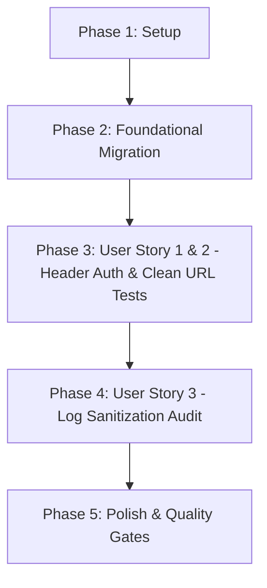

# Tasks: Model Discovery Header Auth (Không Gửi API Key Trong URL)

**Branch**: `044-model-discovery-header-auth` | **Spec**: [spec.md](file:///e:/tailieuhoctap/laptrinhnangcao/th/merged/specs/044-model-discovery-header-auth/spec.md) | **Plan**: [plan.md](file:///e:/tailieuhoctap/laptrinhnangcao/th/merged/specs/044-model-discovery-header-auth/plan.md)

---

## Phase 1: Setup & Constants

**Purpose**: Định nghĩa cấu trúc headers chuẩn cho toàn bộ request outbound tới Google AI Studio API.

- [x] T001 Thêm helper `buildGoogleApiHeaders` trong `server/services/modelInfoService.ts`

---

## Phase 2: Foundational Architecture (Outbound Header Authentication Migration)

**Purpose**: Chuyển đổi toàn bộ các hàm gọi Google API sang URL sạch và header `x-goog-api-key`.

- [x] T002 Cập nhật `fetchModelsFromGoogle` sử dụng URL sạch `/models` và header `'x-goog-api-key': trimmedKey` trong `server/services/modelInfoService.ts`
- [x] T003 Cập nhật `fetchSingleModelFromGoogle` sử dụng URL sạch `/models/{id}` và header `'x-goog-api-key': trimmedKey` trong `server/services/modelInfoService.ts`
- [x] T004 Cập nhật `probeModelGeneration` sử dụng URL sạch `/models/{id}:generateContent` và header `'x-goog-api-key': apiKey.trim()` trong `server/services/modelInfoService.ts`

**Checkpoint**: Toàn bộ các request outbound đã chuyển sang header auth an toàn — sẵn sàng viết test kiểm thử.

---

## Phase 3: User Story 1 & 2 - Header Auth & Clean URL Verification (Priority: P1) 🎯 MVP

**Goal**: Đảm bảo 100% request không chứa key trong URL, header chứa key chính xác và các bài unit test hiện hữu được đồng bộ.

**Independent Test**: Mock fetch và assert `url.includes('?key=') === false` và `headers['x-goog-api-key'] === apiKey`.

### Tests for User Story 1 & 2

- [x] T005 [P] [US1] Tạo file test `server/services/__tests__/modelDiscoveryHeaderAuth.test.ts` và viết 3 ca kiểm thử: `URL does not contain key`, `header contains key`, `logs do not contain key`
- [x] T006 [US1] Cập nhật các mock fetch trong `server/services/__tests__/modelInfoService.test.ts` và `server/services/__tests__/modelVerification.test.ts` để đồng bộ URL sạch và header auth

**Checkpoint**: User Story 1 & 2 hoàn thành — Loại bỏ hoàn toàn rò rỉ key qua URL.

---

## Phase 4: User Story 3 - Log Sanitization Audit (Priority: P1) 🎯 MVP

**Goal**: Đảm bảo mọi đối tượng lỗi và nhật ký hệ thống đều được làm sạch qua `redactApiKey`.

- [x] T007 [US3] Rà soát và xác nhận toàn bộ lỗi ném ra từ `modelInfoService.ts` đều được bọc qua `redactApiKey`

**Checkpoint**: User Story 3 hoàn thành — Bảo vệ tuyệt đối thông tin xác thực trên nhật ký.

---

## Phase 5: Polish & Quality Gates (Constitution Non-Negotiable)

**Purpose**: Cập nhật tài liệu kỹ thuật, rà soát type safety và chạy toàn diện các Quality Gates theo Hiến pháp.

- [x] T008 [P] Cập nhật tài liệu kiến trúc bảo mật trong `docs/quota-and-scheduling.md` (mục Header-Based Authentication)
- [x] T009 Kiểm tra Type Safety không có lỗi với `npm run lint` (`tsc --noEmit`)
- [x] T010 Chạy toàn bộ test suite và đảm bảo pass 100% với `npm test` (`vitest run`)
- [x] T011 Kiểm tra đóng gói build production thành công với `npm run build`
- [x] T012 Thực hiện kiểm định xác thực 3 ca kiểm thử theo `specs/044-model-discovery-header-auth/quickstart.md`

---

## Dependencies & Execution Order

### Phase Dependencies

- **Phase 1 (Setup)**: Không có phụ thuộc — bắt đầu ngay.
- **Phase 2 (Foundational)**: Phụ thuộc vào Phase 1 — CHẶN toàn bộ User Stories.
- **Phase 3 (User Story 1 & 2 - P1 MVP)**: Phụ thuộc vào Phase 2.
- **Phase 4 (User Story 3 - P1 MVP)**: Phụ thuộc vào Phase 3.
- **Phase 5 (Polish & Quality Gates)**: Phụ thuộc vào toàn bộ các Phase trước.

---

## Parallel Execution Opportunities

- **Trong Phase 3**: Viết test suite `T005` có thể chuẩn bị song song với cập nhật mocks `T006`.
- **Trong Phase 5**: Cập nhật tài liệu `T008` có thể thực hiện song song với việc kiểm tra lints.

---

## Implementation Strategy

### MVP Scope (User Story 1, 2, 3)
1. Hoàn thành Phase 1 (Setup) và Phase 2 (Foundational).
2. Triển khai Phase 3 (US1 & US2) và Phase 4 (US3).
3. **STOP & VALIDATE**: Chạy toàn bộ 3 bài test kịch bản trong `modelDiscoveryHeaderAuth.test.ts` để chứng minh MVP hoạt động chuẩn xác 100%.

### Quality Delivery
4. Hoàn tất Phase 5 (Quality Gates: lint, test, build).
