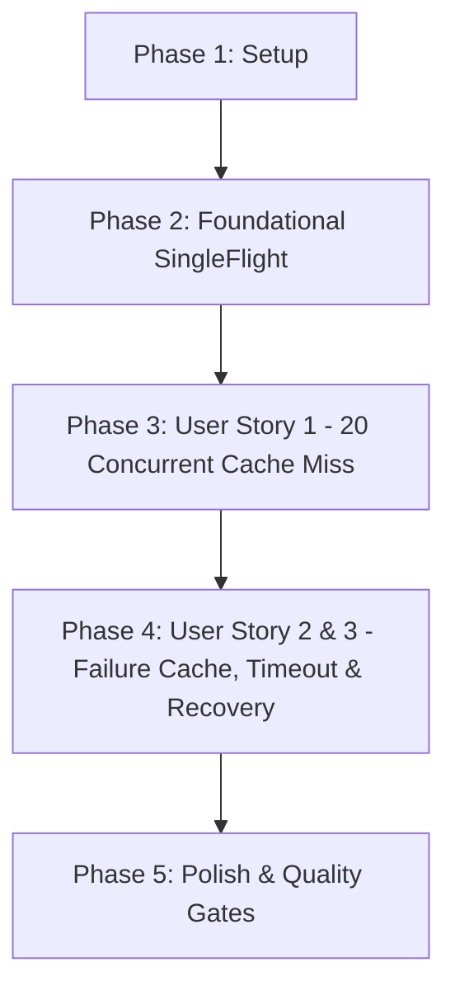

# Tasks: Model Discovery SingleFlight (Gộp Yêu Cầu Đồng Thời)

**Branch**: `045-model-discovery-singleflight` | **Spec**: [spec.md](file:///e:/tailieuhoctap/laptrinhnangcao/th/merged/specs/045-model-discovery-singleflight/spec.md) | **Plan**: [plan.md](file:///e:/tailieuhoctap/laptrinhnangcao/th/merged/specs/045-model-discovery-singleflight/plan.md)

---

## Phase 1: Setup & Constants

**Purpose**: Định nghĩa hằng số thời gian sống của Short Failure Cache và cấu trúc `FailureCacheEntry`.

- [x] T001 Thêm `FAILURE_CACHE_TTL_MS = 30 * 1000` và `FailureCacheEntry` vào `server/services/modelInfoService.ts`

---

## Phase 2: Foundational Architecture (SingleFlight Engine & Dual-Tier Cache)

**Purpose**: Cài đặt động cơ SingleFlight Coalescing cho `listModelsForKey` và quản lý bộ nhớ đệm kép.

- [x] T002 Thêm `inFlightDiscovery` map và `failureCache` map vào class `ModelInfoService` trong `server/services/modelInfoService.ts`
- [x] T003 Cài đặt logic SingleFlight coalescing và Short Failure Cache trong `listModelsForKey` tại `server/services/modelInfoService.ts`
- [x] T004 Cập nhật `clearCache()` và cài đặt timer dọn dẹp bộ nhớ định kỳ trong `server/services/modelInfoService.ts`

**Checkpoint**: Động cơ SingleFlight đã sẵn sàng — các User Stories có thể bắt đầu tích hợp kiểm thử.

---

## Phase 3: User Story 1 - SingleFlight Coalescing (Priority: P1) 🎯 MVP

**Goal**: Đảm bảo 20 yêu cầu đồng thời khi cache miss chỉ tạo đúng 1 request lên Google API và trả về cùng kết quả chuẩn xác.

**Independent Test**: Gửi đồng thời 20 calls `listModelsForKey(apiKey)` $\to$ `fetch` chỉ được gọi 1 lần, 20 requests resolve thành công.

### Tests for User Story 1

- [x] T005 [P] [US1] Tạo file test `server/services/__tests__/modelDiscoverySingleflight.test.ts` và viết 3 ca kiểm thử: `single request`, `20 concurrent cache miss`, `cache hit`

**Checkpoint**: User Story 1 hoàn thành — Triệt tiêu 100% hiện tượng Thundering Herd.

---

## Phase 4: User Story 2 & 3 - Failure Cache, Timeout & Recovery (Priority: P1) 🎯 MVP

**Goal**: Đảm bảo khi upstream lỗi hoặc timeout, toàn bộ các request đang await nhận lỗi an toàn, lỗi được lưu vào failure cache (30s) và tự động khôi phục khi hết hạn.

**Independent Test**: Upstream 500 $\to$ cả 20 request nhận lỗi, in-flight map được giải phóng; sau 30s request tiếp theo gọi lại upstream thành công.

### Tests for User Story 2 & 3

- [x] T006 [P] [US2] Bổ sung 3 ca kiểm thử: `failure`, `timeout`, `recovery` trong `server/services/__tests__/modelDiscoverySingleflight.test.ts`

### Implementation for User Story 2 & 3

- [x] T007 [US2] Tinh chỉnh xử lý timeout và giải phóng in-flight maps trong `server/services/modelInfoService.ts`

**Checkpoint**: User Story 2 & 3 hoàn thành — Bounded memory, short failure cache và tự động khôi phục.

---

## Phase 5: Polish & Quality Gates (Constitution Non-Negotiable)

**Purpose**: Cập nhật tài liệu kỹ thuật, rà soát type safety và chạy toàn diện các Quality Gates theo Hiến pháp.

- [x] T008 [P] Cập nhật tài liệu kiến trúc trong `docs/quota-and-scheduling.md` (mục SingleFlight Discovery & Dual-Tier Cache)
- [x] T009 Kiểm tra Type Safety không có lỗi với `npm run lint` (`tsc --noEmit`)
- [x] T010 Chạy toàn bộ test suite và đảm bảo pass 100% với `npm test` (`vitest run`)
- [x] T011 Kiểm tra đóng gói build production thành công với `npm run build`
- [x] T012 Thực hiện kiểm định xác thực 6 ca kiểm thử theo `specs/045-model-discovery-singleflight/quickstart.md`

---

## Dependencies & Execution Order

### Phase Dependencies

- **Phase 1 (Setup)**: Không có phụ thuộc — bắt đầu ngay.
- **Phase 2 (Foundational)**: Phụ thuộc vào Phase 1 — CHẶN toàn bộ User Stories.
- **Phase 3 (User Story 1 - P1 MVP)**: Phụ thuộc vào Phase 2.
- **Phase 4 (User Story 2 & 3 - P1 MVP)**: Phụ thuộc vào Phase 3.
- **Phase 5 (Polish & Quality Gates)**: Phụ thuộc vào toàn bộ các Phase trước.

---

## Parallel Execution Opportunities

- **Trong Phase 3 & 4**: Viết test suite `T005` và `T006` có thể chuẩn bị song song với các bước logic.
- **Trong Phase 5**: Cập nhật tài liệu `T008` có thể thực hiện song song với việc kiểm tra lints.

---

## Implementation Strategy

### MVP Scope (User Story 1, 2, 3)
1. Hoàn thành Phase 1 (Setup) và Phase 2 (Foundational).
2. Triển khai Phase 3 (US1 - 20 Concurrent Requests) và Phase 4 (US2 - Failure Cache & Recovery).
3. **STOP & VALIDATE**: Chạy toàn bộ 6 bài test kịch bản trong `modelDiscoverySingleflight.test.ts` để chứng minh MVP hoạt động chuẩn xác 100%.

### Quality Delivery
4. Hoàn tất Phase 5 (Quality Gates: lint, test, build).
