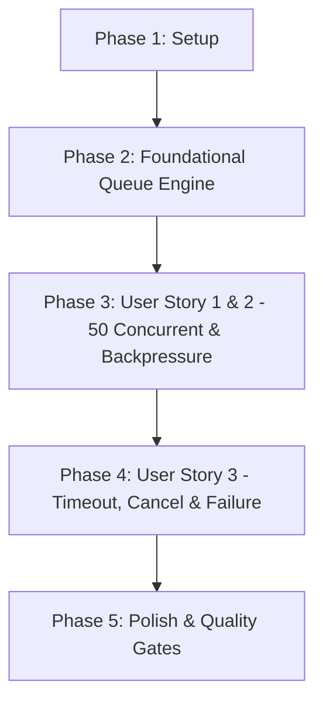

# Tasks: Bounded Concurrency Queue (Cổng Đồng Thời Kèm Hàng Đợi Có Giới Hạn)

**Branch**: `046-bounded-concurrency-queue` | **Spec**: [spec.md](file:///e:/tailieuhoctap/laptrinhnangcao/th/merged/specs/046-bounded-concurrency-queue/spec.md) | **Plan**: [plan.md](file:///e:/tailieuhoctap/laptrinhnangcao/th/merged/specs/046-bounded-concurrency-queue/plan.md)

---

## Phase 1: Setup & Constants

**Purpose**: Thiết lập các types, cấu trúc dữ liệu và hằng số mặc định cho `BoundedConcurrencyQueue`.

- [x] T001 Tạo module `server/services/concurrencyGate.ts` với các interfaces `BoundedConcurrencyQueueConfig`, `QueueMetrics` và các hằng số mặc định (`DEFAULT_MAX_CONCURRENT = 50`, `DEFAULT_MAX_DEPTH = 100`, `DEFAULT_QUEUE_TIMEOUT_MS = 30000`)

---

## Phase 2: Foundational Architecture (BoundedConcurrencyQueue Engine & Integration)

**Purpose**: Cài đặt động cơ Bounded Concurrency Queue hoàn chỉnh và tích hợp vào dịch vụ Gemini.

- [x] T002 Cài đặt lớp `BoundedConcurrencyQueue` với các phương thức `execute`, `drainNext`, `getMetrics`, `resetForTesting` trong `server/services/concurrencyGate.ts`
- [x] T003 Khởi tạo và export `geminiConcurrencyGate = new BoundedConcurrencyQueue()` trong `server/services/concurrencyGate.ts`
- [x] T004 Tích hợp `geminiConcurrencyGate` vào `server/services/geminiService.ts`, thay thế biến đếm `activeConcurrentRequests` thô

**Checkpoint**: Bounded Concurrency Queue đã sẵn sàng — các User Stories có thể bắt đầu tích hợp kiểm thử.

---

## Phase 3: User Story 1 & 2 - Concurrency & Backpressure Tests (Priority: P1) 🎯 MVP

**Goal**: Đảm bảo 50 tác vụ chạy song song ngay lập tức, tác vụ thứ 51 được xếp hàng chờ (`queuedCount = 1`) và tự động thực thi khi có slot trống, tác vụ thứ 151 bị chặn bởi Backpressure `QUEUE_FULL`.

**Independent Test**:
- 50 tasks $\to$ `activeCount = 50, queuedCount = 0`.
- 51st task $\to$ `queuedCount = 1`, chạy thành công khi 1 task trước đó release slot.
- 151st task $\to$ ném ngoại lệ Backpressure `QUEUE_FULL`.

### Tests for User Story 1 & 2

- [x] T005 [P] [US1] Tạo file test `server/services/__tests__/boundedConcurrencyQueue.test.ts` và viết 3 ca kiểm thử: `50 concurrent`, `51st behavior`, `queue full`

**Checkpoint**: User Story 1 & 2 hoàn thành — Ngữ nghĩa Concurrency Queue và Backpressure chính xác 100%.

---

## Phase 4: User Story 3 - Timeout, Cancellation & Failure Isolation (Priority: P1) 🎯 MVP

**Goal**: Đảm bảo timeout 30s tự động rút task khỏi queue, AbortSignal hủy tức thì không rò rỉ bộ nhớ, và task ném Error luôn giải phóng slot an toàn trong `finally`.

**Independent Test**:
- Task chờ quá 30s $\to$ reject `QUEUE_TIMEOUT`, queue rỗng.
- Task abort qua `AbortSignal` $\to$ reject `ABORTED`, timer dọn dẹp.
- Task ném Error $\to$ slot giải phóng an toàn, task tiếp theo trong queue chạy bình thường.

### Tests for User Story 3

- [x] T006 [P] [US3] Bổ sung 3 ca kiểm thử: `timeout`, `cancel`, `failure` trong `server/services/__tests__/boundedConcurrencyQueue.test.ts`
- [x] T007 [US3] Đồng bộ các test suite hiện hữu trong `server/services/__tests__/` với `geminiConcurrencyGate`

**Checkpoint**: User Story 3 hoàn thành — Bảo vệ tài nguyên, timeout và hủy yêu cầu an toàn.

---

## Phase 5: Polish & Quality Gates (Constitution Non-Negotiable)

**Purpose**: Cập nhật tài liệu kỹ thuật, rà soát type safety và chạy toàn diện các Quality Gates theo Hiến pháp.

- [x] T008 [P] Cập nhật tài liệu kiến trúc trong `docs/quota-and-scheduling.md` (mục Bounded Concurrency Queue & Backpressure)
- [x] T009 Kiểm tra Type Safety không có lỗi với `npm run lint` (`tsc --noEmit`)
- [x] T010 Chạy toàn bộ test suite và đảm bảo pass 100% với `npm test` (`vitest run`)
- [x] T011 Kiểm tra đóng gói build production thành công với `npm run build`
- [x] T012 Thực hiện kiểm định xác thực 6 ca kiểm thử theo `specs/046-bounded-concurrency-queue/quickstart.md`

---

## Dependencies & Execution Order

### Phase Dependencies

- **Phase 1 (Setup)**: Không có phụ thuộc — bắt đầu ngay.
- **Phase 2 (Foundational)**: Phụ thuộc vào Phase 1 — CHẶN toàn bộ User Stories.
- **Phase 3 (User Story 1 & 2 - P1 MVP)**: Phụ thuộc vào Phase 2.
- **Phase 4 (User Story 3 - P1 MVP)**: Phụ thuộc vào Phase 3.
- **Phase 5 (Polish & Quality Gates)**: Phụ thuộc vào toàn bộ các Phase trước.

---

## Parallel Execution Opportunities

- **Trong Phase 3 & 4**: Viết test suite `T005` và `T006` có thể chuẩn bị song song với các bước logic.
- **Trong Phase 5**: Cập nhật tài liệu `T008` có thể thực hiện song song với việc kiểm tra lints.

---

## Implementation Strategy

### MVP Scope (User Story 1, 2, 3)
1. Hoàn thành Phase 1 (Setup) và Phase 2 (Foundational).
2. Triển khai Phase 3 (US1 & US2) và Phase 4 (US3).
3. **STOP & VALIDATE**: Chạy toàn bộ 6 bài test kịch bản trong `boundedConcurrencyQueue.test.ts` để chứng minh MVP hoạt động chuẩn xác 100%.

### Quality Delivery
4. Hoàn tất Phase 5 (Quality Gates: lint, test, build).
