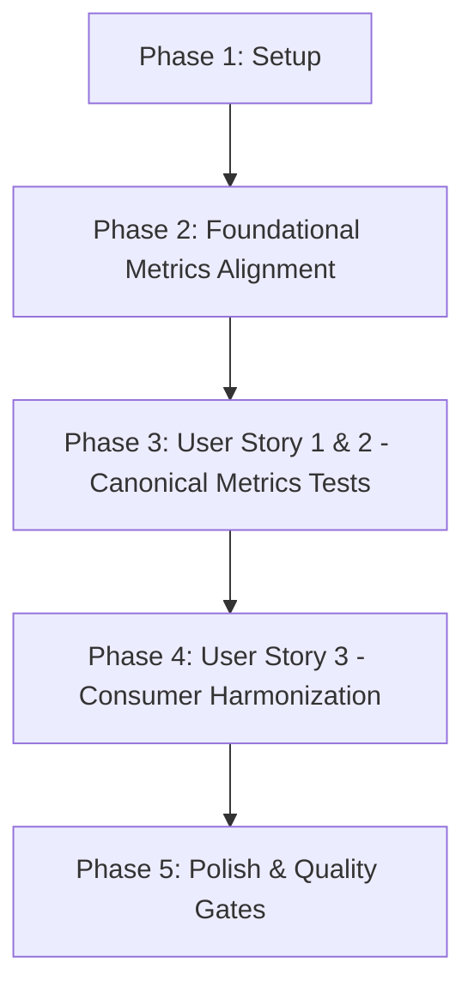

# Tasks: Clean Legacy Metrics (Dọn Dẹp Số Liệu Di Sản & Chuẩn Tắc Hóa)

**Branch**: `047-clean-legacy-metrics` | **Spec**: [spec.md](file:///e:/tailieuhoctap/laptrinhnangcao/th/merged/specs/047-clean-legacy-metrics/spec.md) | **Plan**: [plan.md](file:///e:/tailieuhoctap/laptrinhnangcao/th/merged/specs/047-clean-legacy-metrics/plan.md)

---

## Phase 1: Setup & Data Contracts

**Purpose**: Định nghĩa các kiểu dữ liệu chuẩn tắc trong `shared/models.ts` và đánh dấu `@deprecated` các trường di sản.

- [x] T001 Cập nhật `shared/models.ts` với `KeyActivityMetrics`, `ProviderUsageStats`, `LogicalUsageStats`, và đánh dấu `@deprecated` các trường cũ trong `KeyQuotaSnapshot`

---

## Phase 2: Foundational Architecture (Canonical Metrics Alignment)

**Purpose**: Cập nhật logic thu thập, tính toán và xuất snapshot số liệu trong `quotaService.ts`.

- [x] T002 Cập nhật `server/services/quotaService.ts` để đồng bộ canonical metrics (`keyAttempts`, `keyFailures`, `keyCooldowns`, `logicalRequests`, `providerAttempts`, `retries`, `providerFailures`)
- [x] T003 Cập nhật `getQuotaSnapshot` trong `server/services/quotaService.ts` cung cấp đầy đủ canonical metrics và backward-compatibility aliases

**Checkpoint**: Canonical metrics và Compatibility Layer đã sẵn sàng — các User Stories có thể bắt đầu tích hợp kiểm thử.

---

## Phase 3: User Story 1 & 2 - Canonical Metrics Tests (Priority: P1) 🎯 MVP

**Goal**: Đảm bảo 4 kịch bản kiểm thử cốt lõi phản ánh chính xác số liệu qua 3 tầng (Logical, Provider, Key Activity) và backward compatibility aliases hoạt động chuẩn xác 100%.

**Independent Test**: Chạy 4 test scenarios trong `canonicalMetrics.test.ts` $\to$ 100% pass.

### Tests for User Story 1 & 2

- [x] T004 [P] [US1] Tạo file test `server/services/__tests__/canonicalMetrics.test.ts` và viết 4 ca kiểm thử: `1 request / 1 attempt`, `1 request / 3 attempts`, `multiple logical requests`, `all retries fail`
- [x] T005 [US2] Đồng bộ hóa các unit tests hiện hữu (`logicalMetrics.test.ts`, `quotaService.test.ts`, `quotaAuthority.test.ts`, `QuotaPanelMetrics.test.ts`) để tương thích với canonical metrics

**Checkpoint**: User Story 1 & 2 hoàn thành — Ngữ nghĩa 3 tầng số liệu phân định rành mạch.

---

## Phase 4: User Story 3 - Consumer Migration & Harmonization (Priority: P1) 🎯 MVP

**Goal**: Đảm bảo toàn bộ controllers và consumers nhận diện đúng các trường canonical metrics mà không gây breaking changes.

- [x] T006 [US3] Rà soát `server/controllers/quotaController.ts` và frontend models/components để đảm bảo không có breaking change ngầm

**Checkpoint**: User Story 3 hoàn thành — Toàn hệ thống đồng bộ chuẩn tắc.

---

## Phase 5: Polish & Quality Gates (Constitution Non-Negotiable)

**Purpose**: Cập nhật tài liệu kỹ thuật, rà soát type safety và chạy toàn diện các Quality Gates theo Hiến pháp.

- [x] T007 [P] Cập nhật tài liệu kiến trúc trong `docs/quota-and-scheduling.md` (mục Canonical Metrics Hierarchy & Deprecation)
- [x] T008 Kiểm tra Type Safety không có lỗi với `npm run lint` (`tsc --noEmit`)
- [x] T009 Chạy toàn bộ test suite và đảm bảo pass 100% với `npm test` (`vitest run`)
- [x] T010 Kiểm tra đóng gói build production thành công với `npm run build`
- [x] T011 Thực hiện kiểm định xác thực 4 ca kiểm thử theo `specs/047-clean-legacy-metrics/quickstart.md`

---

## Dependencies & Execution Order

### Phase Dependencies

- **Phase 1 (Setup)**: Không có phụ thuộc — bắt đầu ngay.
- **Phase 2 (Foundational)**: Phụ thuộc vào Phase 1 — CHẶN toàn bộ User Stories.
- **Phase 3 (User Story 1 & 2 - P1 MVP)**: Phụ thuộc vào Phase 2.
- **Phase 4 (User Story 3 - P1 MVP)**: Phụ thuộc vào Phase 3.
- **Phase 5 (Polish & Quality Gates)**: Phụ thuộc vào toàn bộ các Phase trước.

---

## Parallel Execution Opportunities

- **Trong Phase 3**: Viết test suite `T004` có thể chuẩn bị song song với việc đồng bộ `T005`.
- **Trong Phase 5**: Cập nhật tài liệu `T007` có thể thực hiện song song với việc kiểm tra lints.

---

## Implementation Strategy

### MVP Scope (User Story 1, 2, 3)
1. Hoàn thành Phase 1 (Setup) và Phase 2 (Foundational).
2. Triển khai Phase 3 (US1 & US2) và Phase 4 (US3).
3. **STOP & VALIDATE**: Chạy toàn bộ 4 bài test kịch bản trong `canonicalMetrics.test.ts` để chứng minh MVP hoạt động chuẩn xác 100%.

### Quality Delivery
4. Hoàn tất Phase 5 (Quality Gates: lint, test, build).
