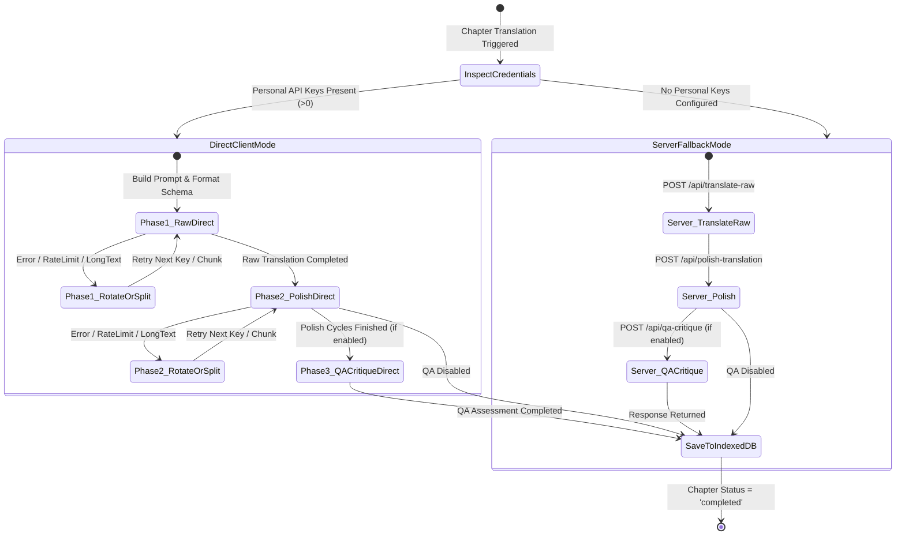

# Data Model: Direct Client Translation for Personal API Keys

## Core Entities & Interfaces

### 1. Translation Execution Mode

Determines whether the client executes translation directly against the AI provider or dispatches requests through the backend server fallback pipeline.

```typescript
export type TranslationExecutionMode = 'direct_client' | 'server_fallback';

export function determineExecutionMode(apiKeys?: string[]): TranslationExecutionMode {
  if (Array.isArray(apiKeys) && apiKeys.some(k => typeof k === 'string' && k.trim().length > 0)) {
    return 'direct_client';
  }
  return 'server_fallback';
}
```

---

### 2. Direct Gemini Client Payload Models

Defines the structure of REST payloads sent directly to Google Gemini's `generateContent` endpoint:

```typescript
export interface GeminiDirectPart {
  text: string;
}

export interface GeminiDirectContent {
  role?: 'user' | 'model';
  parts: GeminiDirectPart[];
}

export interface GeminiDirectRequestPayload {
  contents: GeminiDirectContent[];
  systemInstruction?: {
    parts: GeminiDirectPart[];
  };
  generationConfig: {
    temperature?: number;
    responseMimeType?: 'application/json' | 'text/plain';
    responseSchema?: Record<string, any>;
  };
}

export interface GeminiDirectCandidate {
  content: {
    parts: { text: string }[];
    role: string;
  };
  finishReason?: string;
}

export interface GeminiDirectResponsePayload {
  candidates?: GeminiDirectCandidate[];
  promptFeedback?: {
    blockReason?: string;
  };
  error?: {
    code: number;
    message: string;
    status: string;
  };
}
```

---

### 3. Shared Prompt & Phase Definition Entities

Shared between client and server to guarantee deterministic generation:

```typescript
export interface RawTranslationPromptInput {
  text: string;
  genre: string;
  tone: string;
  description?: string;
  glossary: GlossaryItem[];
}

export interface RawTranslationResult {
  rawTranslation: string;
  discoveredEntities: DiscoveredEntity[];
  successKeyIndex: number;
  isPartial?: boolean;
}

export interface PolishTranslationPromptInput {
  sourceText: string;
  rawTranslation: string;
  genre: string;
  tone: string;
  description?: string;
  glossary: GlossaryItem[];
  additionalInstructions?: string;
}

export interface PolishTranslationResult {
  polishedTranslation: string;
  successKeyIndex: number;
  isPartial?: boolean;
}

export interface QaCritiquePromptInput {
  sourceText: string;
  translatedText: string;
}

export interface QaCritiqueResult {
  isValid: boolean;
  issues: Array<{
    type: 'omission' | 'addition' | 'repetition' | 'terminology' | 'other';
    severity: 'critical' | 'warning' | 'info';
    description: string;
  }>;
  successKeyIndex: number;
}
```

---

## State Transitions & Execution Lifecycle



---

## Storage & Isolation Guarantees

| Storage Layer | Direct Client Mode | Server Fallback Mode |
| :--- | :--- | :--- |
| **Browser `sessionStorage`** | Holds user's ephemeral personal API keys | Empty / not populated |
| **Browser `IndexedDB`** | Receives and stores final translated chapters | Receives and stores final translated chapters |
| **Server Memory / Concurrency Gate** | **ZERO USAGE** (Bypassed entirely) | Evaluated against `MAX_CONCURRENT_REQUESTS` |
| **Server Redis Cache** | **ZERO INTERACTION** | Used for rate limiting and fallback caching |
| **AI Provider Endpoint** | Direct client HTTPS connection | Server outbound HTTPS connection |
