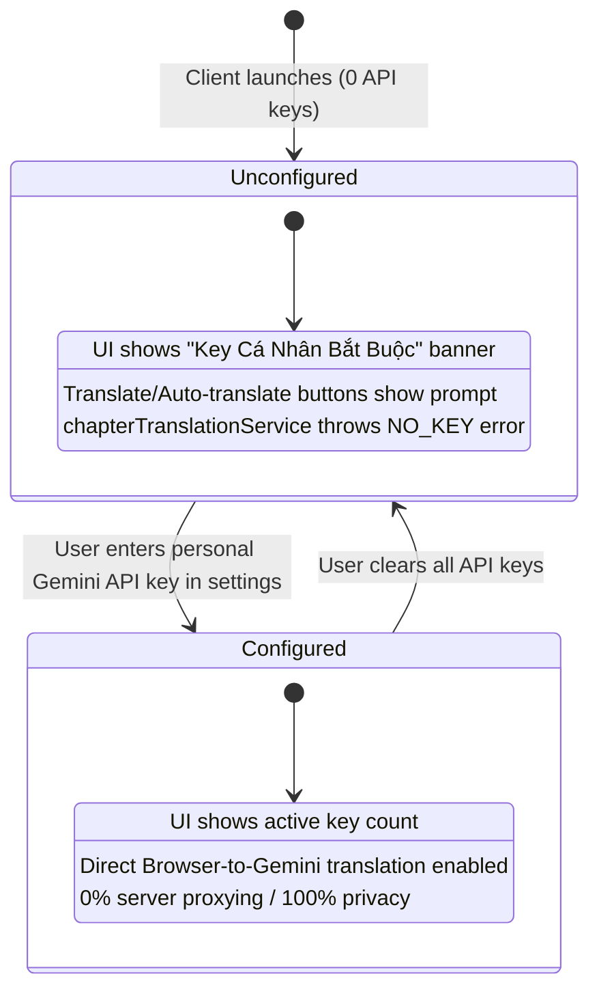

# Data Model & State Lifecycle: Enforce Personal API Keys

**Feature Directory**: `specs/050-remove-server-fallback`
**Date**: 2026-08-22

---

## 1. Key Entities & States



---

## 2. Credential Verification Lifecycle

### Client Guard Lifecycle
1. **Pre-flight Check**: Before initiating any single-chapter or batch translation, the client inspects `apiKeys`:
   ```typescript
   const hasValidKeys = Array.isArray(apiKeys) && apiKeys.some(k => typeof k === 'string' && k.trim().length > 0);
   ```
2. **Action Interception**:
   - If `hasValidKeys === false`:
     - Display warning notification (`showToast({ message: "Vui lòng thêm ít nhất một Gemini API Key cá nhân trong Cấu hình AI để bắt đầu dịch!", type: 'error' })`).
     - Open or guide the user to the API Settings modal.
     - Abort translation queue initialization immediately.
   - If `hasValidKeys === true`:
     - Dispatch direct client translation via `directTranslationEngine.ts`.

### Server Middleware Rejection Lifecycle
1. **Request Received**: Incoming request to server endpoints (`/api/translate-raw`, `/api/polish-translation`, etc.).
2. **Credential Extraction**: Check `x-session-token` or `req.body.apiKeys`.
3. **Rejection Rule**:
   ```typescript
   if (!hasValidKeys) {
     return res.status(400).json({
       error: "Vui lòng cấu hình API key cá nhân của bạn trong phần 'Cấu hình AI' trước khi sử dụng. Máy chủ không hỗ trợ dịch qua key mặc định.",
       code: "NO_PERSONAL_API_KEY_CONFIGURED"
     });
   }
   ```
4. **Zero Fallback Invariant**: `process.env.GEMINI_API_KEY` is never accessed or used for user translation requests.
