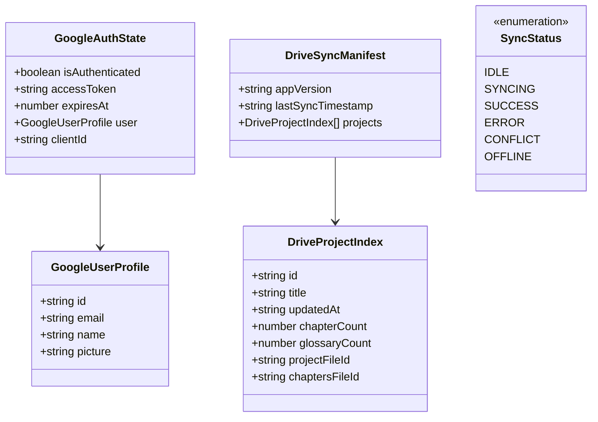

# Data Model: Client-Side Google Authentication & Drive Sync

**Feature Directory**: `specs/051-google-drive-sync`
**Date**: 2026-08-22

---

## 1. Entities & Types



---

## 2. Type Definitions (Client-Side)

### `src/types/googleAuth.ts`

```typescript
export interface GoogleUserProfile {
  id: string;
  email: string;
  name: string;
  picture: string;
}

export interface GoogleAuthState {
  isAuthenticated: boolean;
  accessToken: string | null;
  expiresAt: number | null;
  user: GoogleUserProfile | null;
  clientId: string;
  error: string | null;
}

export interface PKCEChallenge {
  codeVerifier: string;
  codeChallenge: string;
  state: string;
}
```

### `src/types/googleDriveSync.ts`

```typescript
export type SyncStateStatus = 'idle' | 'syncing' | 'success' | 'error' | 'conflict' | 'offline';

export interface DriveProjectSummary {
  id: string;
  title: string;
  updatedAt: string;
  chapterCount: number;
  glossaryCount: number;
  projectFileId?: string;
  chaptersFileId?: string;
}

export interface DriveSyncManifest {
  version: string;
  lastSyncTimestamp: string;
  projects: DriveProjectSummary[];
}

export interface SyncProgress {
  status: SyncStateStatus;
  message: string;
  currentProjectTitle?: string;
  progressPercent: number;
  lastSyncedAt?: string;
  error?: string;
}

export interface SyncConflictInfo {
  projectId: string;
  projectTitle: string;
  localUpdatedAt: string;
  remoteUpdatedAt: string;
  localChapterCount: number;
  remoteChapterCount: number;
}
```
