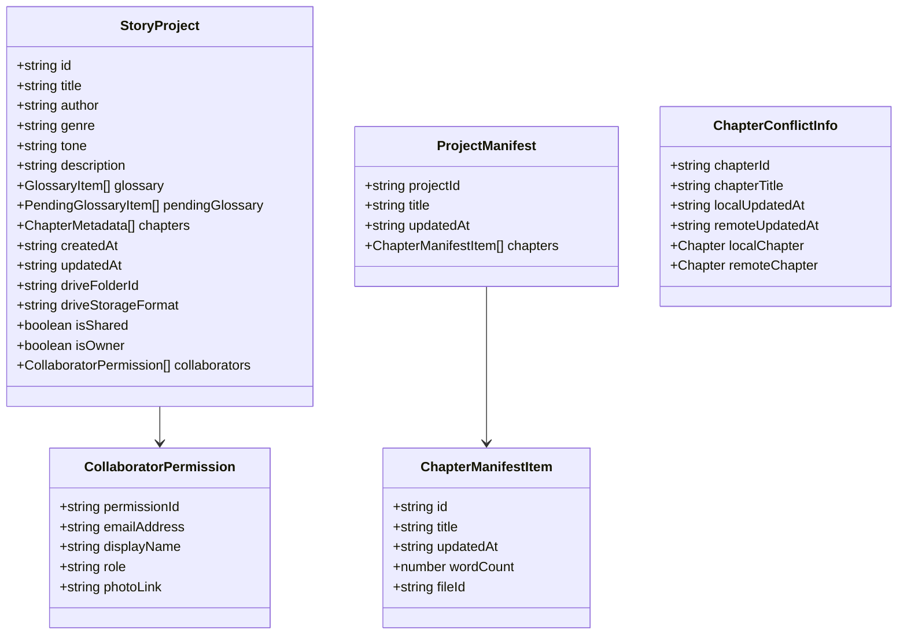

# Data Model: Project Sharing & Drive Collaboration

**Feature Directory**: `specs/052-drive-collaboration`
**Date**: 2026-08-22

---

## 1. Entities & Relationships



---

## 2. Extended TypeScript Types

### Extensions to `src/types.ts` & `src/types/googleDriveSync.ts`

```typescript
export interface CollaboratorPermission {
  permissionId: string;
  emailAddress: string;
  displayName?: string;
  role: 'writer' | 'reader' | 'owner';
  photoLink?: string;
}

export interface ChapterManifestItem {
  id: string;
  title: string;
  updatedAt: string;
  status: 'not_started' | 'in_progress' | 'completed';
  fileId?: string;
}

export interface SharedProjectManifest {
  version: string;
  projectId: string;
  title: string;
  updatedAt: string;
  chapters: ChapterManifestItem[];
}

export interface ChapterConflictInfo {
  chapterId: string;
  chapterTitle: string;
  localUpdatedAt: string;
  remoteUpdatedAt: string;
  localChapter: Chapter;
  remoteChapter: Chapter;
}
```
