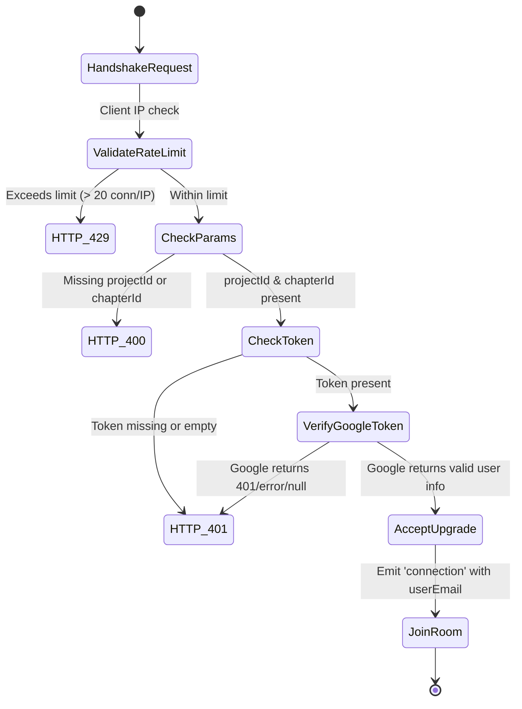

# Data Model: Security & Access Control

**Feature**: [`specs/058-security-hardening`](file:///e:/tailieuhoctap/laptrinhnangcao/th/merged/specs/058-security-hardening)  
**Date**: 2026-08-22  

---

## 1. WebSocket Upgrade Handshake Entity

```text
HTTP GET /ws/sync?projectId=<string>&chapterId=<string>&token=<google_oauth_token>
```

| Field | Type | Validation Rules | Description |
|---|---|---|---|
| `projectId` | `string` | Non-empty, sanitized string | ID of the novel project |
| `chapterId` | `string` | Non-empty, sanitized string | ID of the specific chapter |
| `token` | `string` | **Mandatory**, valid Google OAuth 2.0 Bearer token | Used to verify user identity against Google UserInfo API |

### Handshake State Transitions



---

## 2. Server Authentication State

| Environment Variable | Type | Production Behavior |
|---|---|---|
| `ACCESS_PASSWORD` | `string` (optional) | If set: Requires `X-Auth-Token` / Bearer token on `/api/*`.<br>If empty: Allows `/api/*` access, logs prominent security warning box on startup. |
| `NODE_ENV` | `'production' \| 'development' \| 'test'` | Controls warning display and Helmet CSP activation. |
