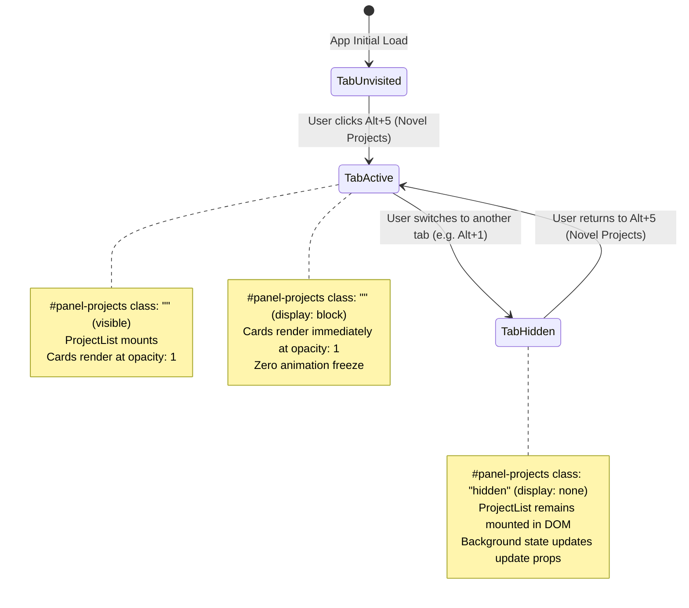

# Data Model & State Transitions: Fix Disappearing Project Card Grid

**Feature Directory**: `specs/059-fix-project-list-disappearing`  
**Feature Branch**: `059-fix-project-list-disappearing`  

---

## 1. Entities & UI State Structure

### A. Project Entity (`StoryProject`)
```typescript
interface StoryProject {
  id: string;
  title: string;
  author: string;
  genre: string;
  tone: string;
  description: string;
  glossary: GlossaryItem[];
  chapters: ChapterMetadata[];
  pendingGlossary?: PendingGlossaryItem[];
  ignoredDuplicatePairs?: string[];
  isShared?: boolean;
  driveFileId?: string;
  createdAt: string;
}
```

### B. ProjectList UI Component State
```typescript
interface ProjectListState {
  isCreating: boolean;
  editingProjectId: string | null;
  sharingProject: StoryProject | null;
  projectProgressMap: Map<string, { total: number; done: number; pct: number }>;
}
```

---

## 2. Tab Navigation & Rendering State Machine



---

## 3. Validation Rules

1. **Card Visibility Invariant**: Every card in `projects` MUST evaluate with `opacity: 1` and `visibility: visible` whenever `#panel-projects` is not hidden.
2. **Interactive Handlers**: Clicking any card MUST invoke `onSelectProject(id)` and update `activeProjectId`.
3. **Empty State Guard**: EmptyState ONLY renders when `projects.length === 0` and `isLoading === false`.
