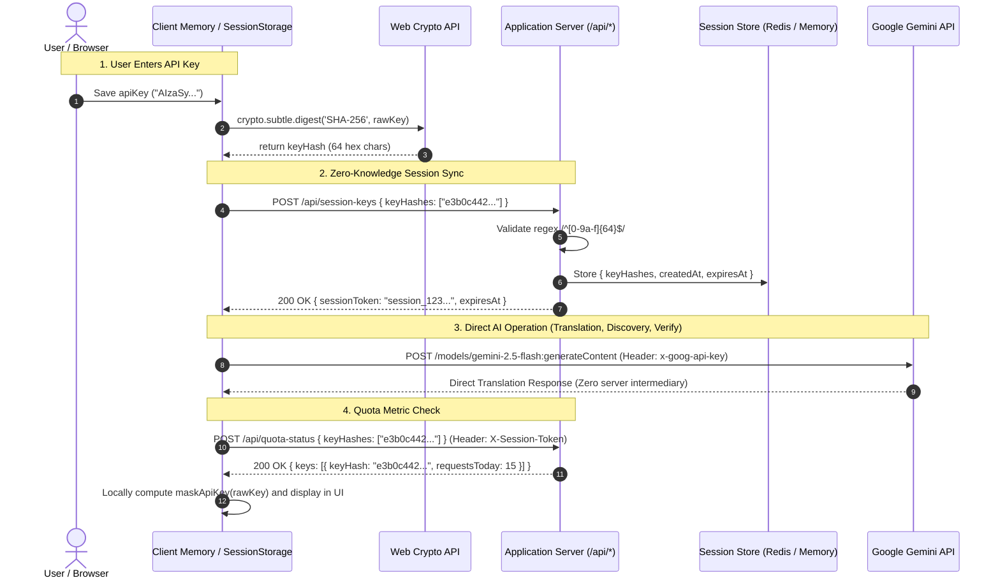

# Data Model & Schema: Zero-Knowledge Session Sync

**Feature Directory**: `specs/060-zero-knowledge-session-sync`  
**Feature Branch**: `060-zero-knowledge-session-sync`  

---

## 1. Entities & Data Models

### A. Client-Side Cryptographic Session Entities
```typescript
/**
 * Raw API key held only in browser memory and sessionStorage
 */
type RawApiKey = string;

/**
 * SHA-256 lowercase hex string (64 characters)
 * Computed via crypto.subtle.digest('SHA-256', textEncoder.encode(key.trim()))
 */
type KeyHash = string; // /^[0-9a-f]{64}$/

/**
 * Session creation payload dispatched from client to server
 */
interface SessionSyncPayload {
  keyHashes: KeyHash[];
}

/**
 * Server session response received by client
 */
interface SessionSyncResponse {
  sessionToken: string; // "session_<uuid>"
  keyCount: number;
  expiresAt: string; // ISO 8601 string
  message: string;
}
```

### B. Server Session Store Entities (`server/services/sessionStore.ts`)
```typescript
interface SessionData {
  keyHashes: string[];      // Array of 64-character SHA-256 hex hashes
  createdAt: number;        // Epoch millisecond timestamp
  lastAccessedAt: number;   // Epoch millisecond timestamp
  expiresAt: number;        // Epoch millisecond timestamp
}

interface SessionInfo {
  valid: boolean;
  keyCount: number;
  expiresAt?: string;
}
```

### C. Quota Status Entities (`server/services/quotaService.ts`)
```typescript
interface QuotaStatusRequest {
  keyHashes?: string[];
  apiKeys?: string[]; // Legacy fallback for transitional client support
}

interface KeyQuotaFullSnapshot {
  keyHash: string;
  maskedKey: string;
  requestsTotal: number;
  requestsToday: number;
  requestsThisMinute: number;
  errorsTotal: number;
  tokensTotal?: number;
  tokensToday?: number;
  tokensThisMinute?: number;
  byModel: Record<string, ModelUsageStats>;
  runtime: KeyRuntimeStatus;
  healthState?: string;
  cooldownRemainingMs?: number;
}
```

---

## 2. Sequence Diagram: Zero-Knowledge Session Sync & AI Execution


