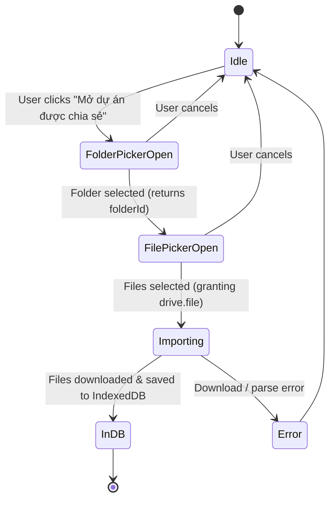
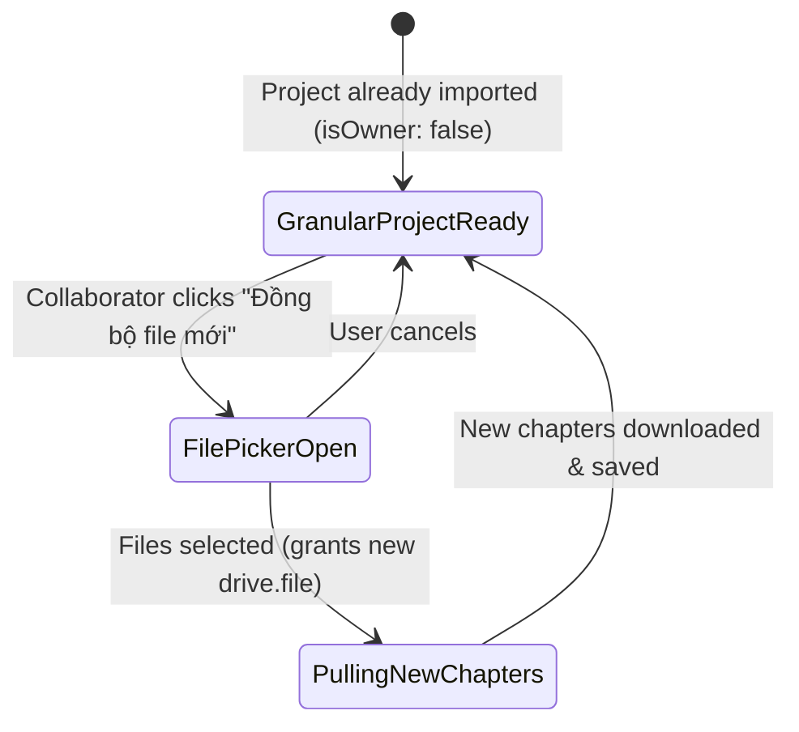

# Data Model: Incremental Drive Permissions & Granular Sync

**Feature**: `069-incremental-drive-permissions`
**Date**: 2026-08-23

---

## 1. Selected Drive File Representation

Represents an individual file item returned by Google Picker after user selection.

```typescript
export interface SelectedDriveFile {
  /** Google Drive file ID */
  id: string;
  /** File name (e.g. 'project.json', 'chapter_1.json', 'manifest.json') */
  name: string;
  /** MIME type (e.g. 'application/json') */
  mimeType?: string;
}
```

---

## 2. Google Picker File Selector Options

Options passed to `openFilePicker` in `GooglePickerService`.

```typescript
export interface OpenFilePickerOptions {
  /** Valid Google OAuth 2.0 access token */
  accessToken: string;
  /** Developer API Key for Google Picker */
  pickerApiKey?: string;
  /** ID of the parent folder to anchor to (prevents navigating elsewhere) */
  folderId: string;
  /** Title displayed on the picker dialog */
  title?: string;
  /** Callback fired when user selects one or more files */
  onFilesSelected: (files: SelectedDriveFile[]) => void;
  /** Callback fired when user dismisses or cancels the picker */
  onCancel?: () => void;
}
```

---

## 3. Granular Sync Result & Status Reporting

Extended result structure for granular project synchronization and error tracking.

```typescript
export interface GranularSyncChapterResult {
  chapterId: string;
  title: string;
  status: 'synced_push' | 'synced_pull' | 'failed_pull' | 'in_sync';
  error?: string;
}

export interface GranularProjectSyncResult {
  success: boolean;
  uploadedChapters: number;
  downloadedChapters: number;
  failedPullCount: number;
  failedChapters: { id: string; title?: string; error?: string }[];
  error?: string;
}
```

---

## 4. Entity Lifecycle & State Transitions

### Initial Import Flow


### Incremental Sync Flow

