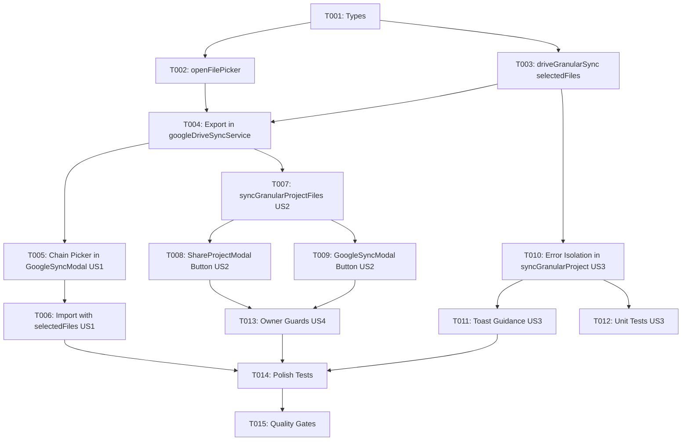

# Tasks: Incremental Drive Permissions for Shared Project Files

**Feature**: Incremental Drive Permissions (`069-incremental-drive-permissions`)
**Plan**: [plan.md](plan.md) | **Spec**: [spec.md](spec.md)

---

## Phase 1: Setup & Foundational Types

**Purpose**: Core type definitions for multi-file picker selection and granular sync resilience

- [X] T001 [P] Update type definitions in `src/types/googleDriveSync.ts` to include `SelectedDriveFile`, `OpenFilePickerOptions`, and `GranularProjectSyncSummary`

---

## Phase 2: Foundational Service Core

**Purpose**: Core Google Picker and Drive sync service methods that block all user stories

- [X] T002 Implement `openFilePicker` in `src/services/googlePickerService.ts` using `DocsView(ViewId.DOCS).setParent(folderId)` and `Feature.MULTISELECT_ENABLED`
- [X] T003 [P] Update `src/services/google-drive/driveGranularSync.ts` to accept `selectedFiles` in `importProjectFromSharedFolder` and map `project.json`, `manifest.json`, and chapter IDs directly
- [X] T004 Export `openFilePicker` and updated import method via `src/services/googleDriveSyncService.ts`

---

## Phase 3: User Story 1 - Open Shared Project with File Permissions (Priority: P1) 🎯 MVP

**Goal**: Collaborators can open a shared project via Google Picker and grant permissions for all project files in a single, chained flow, resolving the "project.json not found" error.

**Independent Test**: Have User A share a project folder with User B. As User B, click "Mở dự án được chia sẻ (Google Picker)", pick the folder, select all files in the subsequent file picker, and verify that `project.json`, `manifest.json`, and chapters import cleanly into IndexedDB.

- [X] T005 [US1] Chain `openFolderPicker` into `openFilePicker` inside `handleOpenSharedProjectPicker` in `src/components/google-sync/GoogleSyncModal.tsx`
- [X] T006 [US1] Pass `selectedFiles` to `googleDriveSyncService.importProjectFromSharedFolder` and handle picker cancellation gracefully in `src/components/google-sync/GoogleSyncModal.tsx`

---

## Phase 4: User Story 2 - Incremental Sync for Newly Added Chapters (Priority: P1)

**Goal**: Collaborators can click "Đồng bộ file mới" to authorize and download newly added chapters from the owner without re-selecting the project folder.

**Independent Test**: As User A, push new chapters to Drive. As User B, click "Đồng bộ file mới", confirm file selection in the pre-anchored picker, and verify new chapters are downloaded and saved locally.

- [X] T007 [P] [US2] Implement `syncGranularProjectFiles` helper in `src/services/google-drive/driveGranularSync.ts` and export it in `src/services/googleDriveSyncService.ts`
- [X] T008 [US2] Add the "Đồng bộ file mới" card and action handler in `src/components/google-sync/ShareProjectModal.tsx` for granular shared projects
- [X] T009 [P] [US2] Add "Đồng bộ file mới" button and status handling in `src/components/google-sync/GoogleSyncModal.tsx`

---

## Phase 5: User Story 3 - Resilient Granular Sync with Error Isolation (Priority: P2)

**Goal**: Chapter download failures (e.g. missing permissions on newly added files) are isolated per-chapter without crashing the overall sync, and clear guidance is reported to the user.

**Independent Test**: With 8 authorized chapters and 2 unauthorized chapters on Drive, trigger Two-Way Sync. Verify the 8 chapters sync cleanly, the sync completes, and a toast notification states: *"Đã đồng bộ 8/10 chương — còn 2 chương mới cần bấm 'Đồng bộ file mới'"*.

- [X] T010 [US3] Wrap chapter downloads in `syncGranularProject` in `src/services/google-drive/driveGranularSync.ts` with per-chapter `try/catch` and track `failedPullCount` and failed chapter details
- [X] T011 [US3] Update two-way sync reporting in `src/services/googleDriveSyncService.ts` and `src/components/google-sync/GoogleSyncModal.tsx` to show informative toast summaries when chapters fail
- [X] T012 [P] [US3] Add unit tests for chapter failure isolation and summary reporting in `src/services/__tests__/granularSyncReconciliation.test.ts`

---

## Phase 6: User Story 4 - Zero-Overhead Workflow for Project Owners (Priority: P3)

**Goal**: Ensure project owners (`isOwner: true`) continue syncing with zero file-picker interruptions.

**Independent Test**: As the project owner, execute Push, Pull, and Two-Way Sync. Verify that no file picker popups appear and sync completes directly.

- [X] T013 [US4] Verify and guard owner sync workflows in `src/components/google-sync/GoogleSyncModal.tsx` and `src/components/google-sync/ShareProjectModal.tsx` against unnecessary file permission prompts

---

## Phase 7: Polish & Quality Gates

**Purpose**: Cross-cutting test coverage, linting, and build verification

- [X] T014 [P] Update unit tests in `src/services/__tests__/googleDriveSyncService.test.ts` to test file picker options and serialization
- [X] T015 Run quality verification gates (`npm run lint`, `npm test`, `npm run build`) and perform quickstart verification per `specs/069-incremental-drive-permissions/quickstart.md`

---

## Dependencies & Execution Order

---

## Parallel Opportunities

- **Phase 1 & Phase 2**: T001 and T003 can be developed in parallel.
- **Phase 4**: T007, T008, and T009 can be developed in parallel once T004 is complete.
- **Phase 5**: T012 can be written in parallel with T011.

---

## Implementation Strategy

### MVP Scope (User Story 1 Only)
1. Complete T001 through T004 (Foundational Core).
2. Complete T005 and T006 (User Story 1).
3. **Validate**: Collaborator can open a shared project for the first time without "project.json not found" error.

### Full Incremental Delivery
1. Add User Story 2 (T007-T009) to enable "Đồng bộ file mới" for new chapters.
2. Add User Story 3 (T010-T012) to isolate chapter pull errors.
3. Validate User Story 4 (T013) to ensure zero overhead for owners.
4. Complete Polish & Quality Gates (T014-T015).
