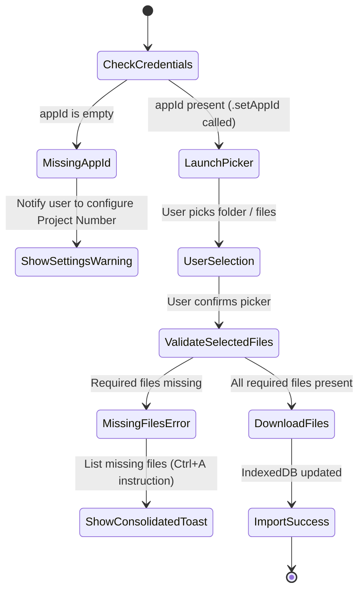

# Data Model: Google Picker App ID & Permission Validation

**Feature**: `070-fix-picker-app-id-404`
**Date**: 2026-08-23

---

## 1. Google Sync Credentials Tuple

Represents the complete credentials configuration required for Google Drive OAuth and Picker.

```typescript
export interface GoogleSyncConfig {
  /** OAuth 2.0 Client ID (Web Application) */
  clientId: string;
  /** Browser API Key for Google Picker */
  pickerApiKey: string;
  /** Google Cloud Project Number (numeric string) */
  appId: string;
}
```

---

## 2. Picker Validation & Missing Permissions Model

Data structure representing missing permission validation results before downloading files.

```typescript
export interface MissingFilePermissionReport {
  isValid: boolean;
  missingFiles: string[];
  errorMessage?: string;
}
```

---

## 3. Storage & Configuration Keys

| Credential | Environment Variable | LocalStorage Key | Description |
|---|---|---|---|
| **Client ID** | `VITE_GOOGLE_CLIENT_ID` | `ai_dich_truyen_google_client_id` | OAuth 2.0 Web Client ID |
| **Picker API Key** | `VITE_GOOGLE_PICKER_API_KEY` | `ai_dich_truyen_google_picker_key` | Google Picker API Key |
| **App ID (Project Number)** | `VITE_GOOGLE_APP_ID` | `ai_dich_truyen_google_app_id` | Google Cloud Project Number |

---

## 4. State Transitions


