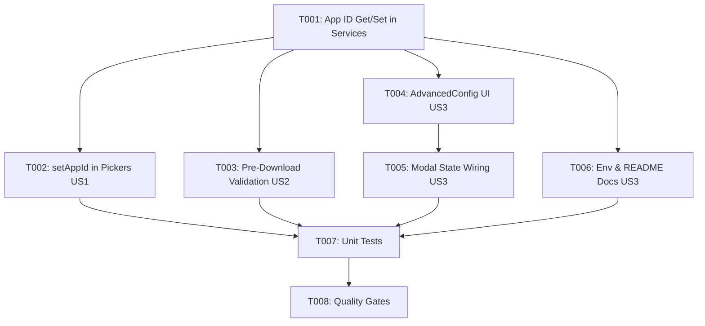

# Tasks: Google Picker App ID Binding & 404 Fix

**Feature**: Google Picker App ID Binding (`070-fix-picker-app-id-404`)
**Plan**: [plan.md](plan.md) | **Spec**: [spec.md](spec.md)

---

## Phase 1: Setup & Foundational Configuration

**Purpose**: Core App ID getter/setter methods and environment fallback logic

- [X] T001 [P] Implement `getAppId`, `setAppId`, and `getCustomAppId` in `src/services/googlePickerService.ts` and `src/services/googleAuthService.ts`

---

## Phase 2: User Story 1 - Google Picker App ID Binding (Priority: P1) 🎯 MVP

**Goal**: Both Google Picker builders call `.setAppId(appId)` before `.build()`, enabling `drive.file` per-file authorization for access tokens and eliminating HTTP 404 errors during file downloads.

**Independent Test**: Configure `VITE_GOOGLE_APP_ID`, open a shared project via Google Picker as a collaborator, and verify all files download with HTTP 200 without 404 errors.

- [X] T002 [US1] Update `openFolderPicker` and `openFilePicker` in `src/services/googlePickerService.ts` to call `.setAppId(appId)` and validate `appId` presence with Vietnamese error messaging

---

## Phase 3: User Story 2 - Pre-Download Permission Validation (Priority: P1)

**Goal**: `importProjectFromSharedFolder` validates `selectedFiles` against `project.json` and `manifest.json` before starting chapter downloads, reporting missing files in a single consolidated message.

**Independent Test**: In the multi-select picker, omit a chapter file. Verify the system stops before downloading and reports: *"Chưa cấp quyền cho các tệp: [tên tệp]. Vui lòng mở lại và chọn TẤT CẢ tệp trong hộp thoại Google Picker (Ctrl+A / Cmd+A)."*

- [X] T003 [US2] Implement pre-download file validation in `src/services/google-drive/driveGranularSync.ts` inside `importProjectFromSharedFolder` and surface consolidated missing file error

---

## Phase 4: User Story 3 - App ID Configuration & Documentation (Priority: P2)

**Goal**: Users can configure and manage the Google Cloud App ID (Project Number) via UI or environment variable, with clear documentation in `.env.example` and `README.md`.

**Independent Test**: Open Google Sync modal -> Cấu hình nâng cao, enter a custom App ID, save, and verify persistence in localStorage and fallback behavior.

- [X] T004 [US3] Add App ID (Project Number) input field, helper text, reveal toggle, and save/reset buttons in `src/components/google-sync/GoogleSyncAdvancedConfig.tsx`
- [X] T005 [US3] Wire `appIdInput` state, save, and reset handlers in `src/components/google-sync/GoogleSyncModal.tsx`
- [X] T006 [P] [US3] Document `VITE_GOOGLE_APP_ID` and Google Cloud Console Project Number setup instructions in `.env.example` and `README.md`

---

## Phase 5: Polish & Quality Gates

**Purpose**: Unit test coverage, linting, and build verification

- [X] T007 [P] Add unit tests for App ID configuration and file validation in `src/services/__tests__/googleDriveSyncService.test.ts` and `src/services/__tests__/granularSyncReconciliation.test.ts`
- [X] T008 Run quality verification gates (`npm run lint`, `npm test`, `npm run build`) and perform quickstart verification per `specs/070-fix-picker-app-id-404/quickstart.md`

---

## Dependencies & Execution Order

---

## Implementation Strategy

### MVP Scope (User Story 1 Only)
1. Complete T001 (App ID helpers).
2. Complete T002 (`setAppId` in `googlePickerService.ts`).
3. **Validate**: Collaborator can open shared project without HTTP 404 errors.

### Full Delivery
1. Add T003 (Pre-download validation) to catch omitted files.
2. Add T004-T006 (UI controls & documentation).
3. Complete T007-T008 (Unit tests & quality gates).
