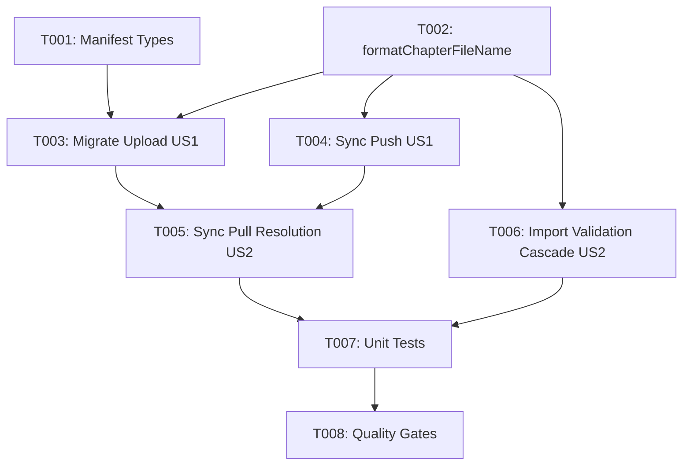

# Tasks: Human-Readable Chapter Filenames on Google Drive

**Feature**: Human-Readable Chapter Filenames (`071-drive-chapter-filename-format`)
**Plan**: [plan.md](plan.md) | **Spec**: [spec.md](spec.md)

---

## Phase 1: Setup & Foundational Types

**Purpose**: Core types and filename formatting utilities

- [X] T001 [P] Update `ChapterManifestItem` in `src/types/googleDriveSync.ts` to include optional `fileName?: string`
- [X] T002 [P] Implement `sanitizeChapterTitleSlug` and `formatChapterFileName` in `src/services/google-drive/driveGranularSync.ts`

---

## Phase 2: User Story 1 - Human-Readable Chapter Filename Generation on Upload (Priority: P1) 🎯 MVP

**Goal**: Newly uploaded and migrated chapter files on Google Drive use `chapter_{001-999}_{sanitized-title}.json` instead of internal hash/timestamp IDs, making chapters visually distinguishable in Google Picker.

**Independent Test**: Migrate a 3-chapter project to a granular subfolder on Google Drive. Inspect Drive file names and verify they follow `chapter_001_hoi-1.json`, `chapter_002_hoi-2.json`, and `manifest.json` contains `fileName` fields.

- [X] T003 [US1] Update `migrateProjectToGranularSubfolder` in `src/services/google-drive/driveGranularSync.ts` to upload chapter files with `formatChapterFileName` and record `fileName` in `manifest.json`
- [X] T004 [US1] Update `syncGranularProject` push branch in `src/services/google-drive/driveGranularSync.ts` to upload new chapters with `formatChapterFileName`

---

## Phase 3: User Story 2 - Resilient Backward Compatibility & Matching (Priority: P1)

**Goal**: `importProjectFromSharedFolder` and `syncGranularProject` resolve chapter files seamlessly whether they use new formatted filenames or legacy `chapter_chap_*.json` filenames.

**Independent Test**: Run `importProjectFromSharedFolder` against a mock manifest containing a mix of new and legacy filenames. Verify all chapters import cleanly into IndexedDB without changing `Chapter.id`.

- [X] T005 [US2] Update `syncGranularProject` pull branch and fallback query in `src/services/google-drive/driveGranularSync.ts` to resolve chapters using `fileName`, `fileId`, `formatChapterFileName`, or legacy patterns
- [X] T006 [US2] Update `importProjectFromSharedFolder` validation and download loops in `src/services/google-drive/driveGranularSync.ts` to check `chapMeta.fileName`, `formatChapterFileName`, `chapMeta.fileId`, and legacy filenames

---

## Phase 4: Polish & Quality Gates

**Purpose**: Unit test coverage, linting, and build verification

- [X] T007 [P] Add unit tests for `formatChapterFileName`, `sanitizeChapterTitleSlug`, and filename resolution in `src/services/__tests__/granularSyncReconciliation.test.ts` and `src/services/__tests__/googleDriveSyncService.test.ts`
- [X] T008 Run quality verification gates (`npm run lint`, `npm test`, `npm run build`) and perform quickstart verification per `specs/071-drive-chapter-filename-format/quickstart.md`

---

## Dependencies & Execution Order

---

## Implementation Strategy

### MVP Scope (User Story 1 Only)
1. Complete T001 and T002 (Types & Format Utility).
2. Complete T003 and T004 (Upload formatting).
3. **Validate**: Chapter files on Google Drive appear as `chapter_001_title.json`.

### Full Delivery
1. Add T005 and T006 for full backward compatibility.
2. Complete T007 and T008 (Unit tests and Quality Gates).
