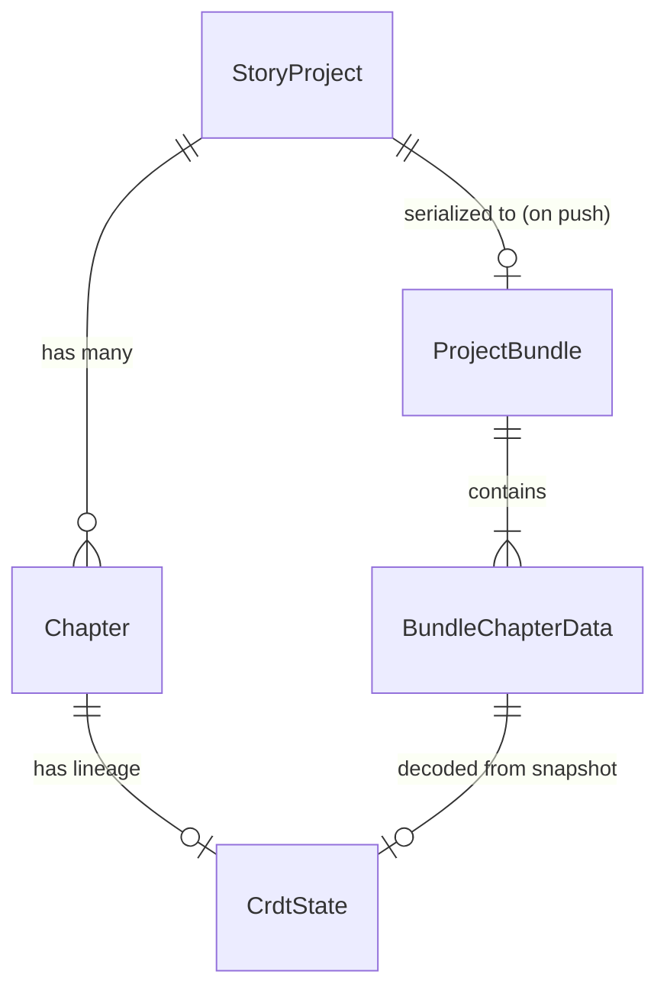
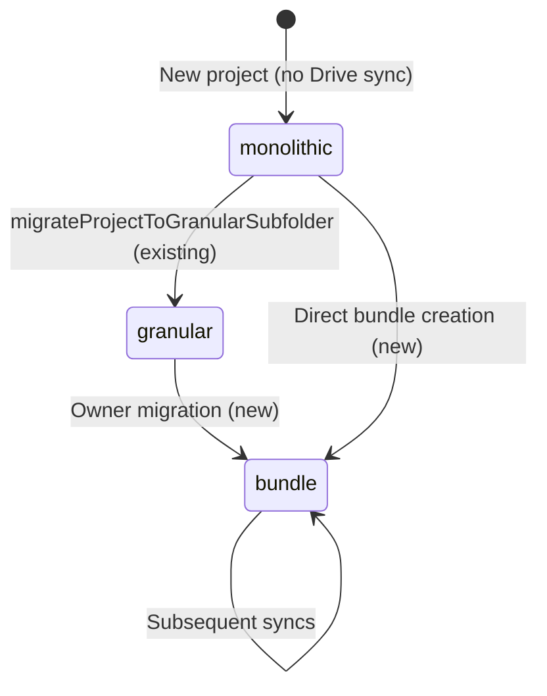
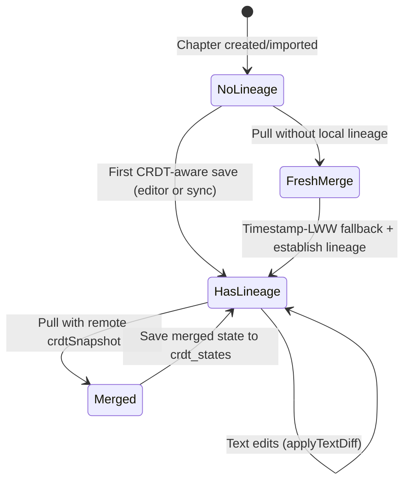

# Data Model: 072 Drive Bundle + CRDT Sync

## New Entities

### ProjectBundle (Google Drive JSON file)

The unified file uploaded/downloaded from Google Drive. Not stored directly in IndexedDB — it is serialized on push and deserialized on pull.

| Field | Type | Description |
|-------|------|-------------|
| `bundleVersion` | `number` | Schema version (starts at `1`). Enables future migration. |
| `exportedAt` | `string` (ISO 8601) | Timestamp of last bundle export. |
| `project` | `BundleProjectData` | Project metadata (subset of `StoryProject`). |
| `chapters` | `BundleChapterData[]` | All chapters with full content + CRDT snapshot. |

```typescript
export interface ProjectBundle {
  bundleVersion: number;
  exportedAt: string;
  project: BundleProjectData;
  chapters: BundleChapterData[];
}

export interface BundleProjectData {
  id: string;
  title: string;
  author: string;
  genre: string;
  tone: string;
  description: string;
  glossary: GlossaryItem[];
  pendingGlossary: PendingGlossaryItem[];
  chapters: ChapterMetadata[];  // lightweight metadata array
  createdAt: string;
  updatedAt?: string;
  collaborators?: StoryProject['collaborators'];
  translationQueueState?: StoryProject['translationQueueState'];
  glossaryScanQueueState?: StoryProject['glossaryScanQueueState'];
  ignoredDuplicatePairs?: string[];
}

export interface BundleChapterData extends Chapter {
  crdtSnapshot?: string;      // base64-encoded Y.encodeStateAsUpdate
  crdtStateVector?: string;   // base64-encoded Y.encodeStateVector (for future delta sync)
}
```

---

### CrdtState (New IndexedDB Object Store)

Persists Yjs document binary state per chapter for CRDT lineage continuity across sync cycles.

| Field | Type | Key | Description |
|-------|------|-----|-------------|
| `chapterId` | `string` | Primary key | Matches `Chapter.id` |
| `projectId` | `string` | Index | Parent project ID |
| `state` | `Uint8Array` | — | Binary Yjs state from `Y.encodeStateAsUpdate(doc)` |
| `updatedAt` | `string` | — | ISO timestamp of last state save |

```typescript
// Stored in IndexedDB 'crdt_states' object store
export interface CrdtStateRecord {
  chapterId: string;     // keyPath
  projectId: string;     // indexed
  state: Uint8Array;     // Y.encodeStateAsUpdate binary
  updatedAt: string;     // ISO 8601
}
```

**IndexedDB Schema Change** (version 3 → 4):
```
onupgradeneeded(event):
  if oldVersion < 4:
    db.createObjectStore('crdt_states', { keyPath: 'chapterId' })
      .createIndex('projectId', 'projectId', { unique: false })
```

---

## Modified Entities

### StoryProject (IndexedDB `projects` store)

**Additive changes only** — existing fields untouched:

| New Field | Type | Default | Description |
|-----------|------|---------|-------------|
| `driveFileId?` | `string \| undefined` | `undefined` | File ID of the project bundle on Google Drive. Replaces `driveFolderId` for bundle-format projects. |
| `driveStorageFormat?` | `'monolithic' \| 'granular' \| 'bundle'` | existing | New `'bundle'` value added to existing union type. |

```typescript
// In src/types.ts — additions only:
export interface StoryProject {
  // ... existing fields unchanged ...
  
  driveFileId?: string;  // NEW: Google Drive bundle file ID
  // driveStorageFormat already exists, add 'bundle' to its type union
  driveStorageFormat?: 'monolithic' | 'granular' | 'bundle';
}
```

---

## Entity Relationships



---

## State Transitions

### Project Storage Format



### Chapter CRDT Lineage



---

## Validation Rules

| Entity | Rule | Source |
|--------|------|--------|
| `ProjectBundle.bundleVersion` | Must be `>= 1` | FR-001 |
| `ProjectBundle.chapters` | Must be array (can be empty) | Edge case |
| `BundleChapterData.crdtSnapshot` | If present, must be valid base64 decodable to `Uint8Array` | FR-005, FR-006 |
| `CrdtState.state` | Must be valid `Uint8Array` producible by `Y.encodeStateAsUpdate` | FR-006 |
| `StoryProject.driveFileId` | If `driveStorageFormat === 'bundle'`, must be non-empty string | FR-001 |
| `StoryProject.driveStorageFormat` | Must be one of `'monolithic' \| 'granular' \| 'bundle'` | FR-010 |
