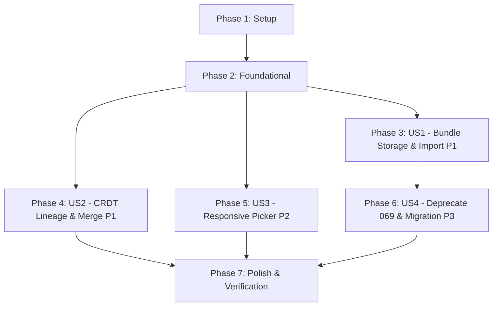

# Tasks: Single-File Bundle Storage, CRDT Merge on Pull, and Responsive Google Picker

**Branch**: `072-drive-bundle-crdt-sync` | **Date**: 2026-08-23 | **Spec**: [spec.md](spec.md) | **Plan**: [plan.md](plan.md)

---

## Phase 1: Setup (Shared Types & Schemas)

**Purpose**: Establish core TypeScript interfaces and types for the single-file bundle architecture and CRDT persistence.

- [x] T001 Update `StoryProject` interface in `src/types.ts` to add optional `driveFileId?: string` and extend `driveStorageFormat` union to `'monolithic' | 'granular' | 'bundle'`
- [x] T002 [P] Define `ProjectBundle`, `BundleProjectData`, `BundleChapterData`, `CrdtStateRecord`, and `OpenBundlePickerOptions` interfaces in `src/types/googleDriveSync.ts`

---

## Phase 2: Foundational (Blocking Prerequisites)

**Purpose**: Core IndexedDB v4 upgrade and CRDT merge utilities required by all user stories.

**⚠️ CRITICAL**: No user story implementation can begin until this foundational phase is complete.

- [x] T003 Upgrade IndexedDB schema from version 3 to version 4 in `src/services/db.ts` by adding the `crdt_states` object store (`keyPath: 'chapterId'`, index: `'projectId'`)
- [x] T004 [P] Implement CRDT state database access functions (`getCrdtState`, `saveCrdtState`, `saveCrdtStates`, `deleteCrdtStatesByProject`) in `src/services/db.ts`
- [x] T005 [P] Implement CRDT document merging and snapshot utilities (`mergeChapterCrdt`, `extractCrdtSnapshot`) in `src/services/crdtDocManager.ts`

**Checkpoint**: Database schema v4 and CRDT state helpers are functional; User Story implementation can proceed.

---

## Phase 3: User Story 1 - Single-File Bundle Storage & Import (Priority: P1) 🎯 MVP

**Goal**: Enable single-click shared project import and one-file Google Drive storage using `project_bundle.json`.

**Independent Test**: Have User A push a project as a bundle. User B opens Google Picker once, selects the bundle JSON file, and confirms the project and all chapters are imported into local IndexedDB without 404s or duplicate files.

- [x] T006 [P] [US1] Implement `openBundlePicker` in `src/services/googlePickerService.ts` to open a single-file Google Picker filtered for `application/json` bundle files
- [x] T007 [P] [US1] Create bundle sync core module `src/services/google-drive/driveBundleSync.ts` implementing `buildProjectBundle`, `pushBundle`, `pullBundle`, and `importBundle`
- [x] T008 [US1] Expose bundle sync facade methods (`importProjectFromBundle`, `pushProjectBundle`, `pullProjectBundle`) in `src/services/googleDriveSyncService.ts`
- [x] T009 [US1] Update `handleOpenSharedProjectPicker` in `src/components/google-sync/GoogleSyncModal.tsx` to invoke `openBundlePicker` directly in a single step
- [x] T010 [US1] Update bidirectional sync routing in `src/services/google-drive/driveProjectSync.ts` to delegate `bundle` format projects to `driveBundleSync`

**Checkpoint**: User Story 1 is complete. Shared projects can be imported and pushed as a single bundle file.

---

## Phase 4: User Story 2 - CRDT Lineage Persistence & Merge on Pull (Priority: P1) 🎯 MVP

**Goal**: Automatically merge concurrent local and remote chapter modifications during pull operations without destructive overwrites.

**Independent Test**: Make concurrent edits on Chapter 1 (remote paragraph 1 edit, local paragraph 2 edit). Execute pull and verify both edits are preserved via CRDT merge in IndexedDB.

- [x] T011 [P] [US2] Update debounced auto-save in `src/hooks/useChapterCRDT.ts` to persist active Yjs binary state (`exportDocUpdate`) to `crdt_states` in IndexedDB
- [x] T012 [US2] Implement chapter pull-merge algorithm in `src/services/google-drive/driveBundleSync.ts` with local `crdt_states` retrieval, character diff application, per-key metadata merge, and timestamp-LWW fallback when no prior lineage exists
- [x] T013 [P] [US2] Create unit test suite `src/services/__tests__/bundleSyncMerge.test.ts` verifying concurrent text merge, metadata merge, and fallback resolution

**Checkpoint**: User Story 2 is complete. Chapter pull operations perform conflict-free CRDT merges.

---

## Phase 5: User Story 3 - Responsive Google Picker Sizing (Priority: P2)

**Goal**: Ensure Google Picker modals fit cleanly within viewports without clipping headers or buttons across all zoom levels.

**Independent Test**: Launch Google Picker under 125% and 80% browser zoom; verify dialog constraints (`width <= Math.min(1051, innerWidth * 0.9)`, `height <= Math.min(650, innerHeight * 0.9)`) and full element visibility.

- [x] T014 [US3] Add `builder.setSize(Math.min(1051, Math.round(window.innerWidth * 0.9)), Math.min(650, Math.round(window.innerHeight * 0.9)))` before `setOrigin` across all picker methods (`openFolderPicker`, `openFilePicker`, `openBundlePicker`) in `src/services/googlePickerService.ts`
- [x] T015 [P] [US3] Add unit tests in `src/services/__tests__/googleDriveSyncService.test.ts` verifying `setSize` execution and viewport constraint boundaries

**Checkpoint**: User Story 3 is complete. Google Picker is responsive and immune to header clipping.

---

## Phase 6: User Story 4 - Deprecate Spec 069 & Owner Migration (Priority: P3)

**Goal**: Remove obsolete "Đồng bộ file mới" workaround UI and provide explicit owner migration to bundle format.

**Independent Test**: Verify `ShareProjectModal` has no "Đồng bộ file mới" card or button, and an existing granular project owned by User A can be explicitly upgraded to bundle format with collaborator re-invite awareness.

- [x] T016 [P] [US4] Remove "Đồng bộ file mới" card, buttons, and `handleSyncNewFiles` logic from `src/components/google-sync/ShareProjectModal.tsx`
- [x] T017 [P] [US4] Remove references to "Đồng bộ file mới" toast messages and warnings from `src/components/google-sync/GoogleSyncModal.tsx` and `src/services/google-drive/driveGranularSync.ts`
- [x] T018 [US4] Implement owner project migration in `src/services/google-drive/driveBundleSync.ts` to repackage legacy granular/monolithic projects into `project_bundle_<id>.json` on explicit owner upgrade in Share modal

**Checkpoint**: User Story 4 is complete. Legacy workarounds are cleanly deprecated and migration is explicit and secure.

---

## Phase 7: Polish & Cross-Cutting Verification

**Purpose**: Comprehensive testing, type validation, and production build verification across all changes.

- [x] T019 [P] Create unit test suite `src/services/__tests__/bundleSync.test.ts` covering bundle building, validation, import, and error scenarios
- [x] T020 [P] Update existing test suites in `src/components/google-sync/__tests__/GoogleSyncModal.test.ts` and `src/services/__tests__/crdtDocManager.test.ts` to match single-file Picker and CRDT merge flows
- [x] T021 Run full quality gates (`npm run lint`, `npm test`, `npm run build`) and confirm 0 type errors, 0 test failures, and clean production build

---

## Dependencies & Execution Order

### Phase Dependencies



### User Story Dependencies

- **User Story 1 (P1)**: Depends on Phase 2 (Foundational). Delivers core bundle import & push.
- **User Story 2 (P1)**: Depends on Phase 2 (Foundational). Integrates with US1 bundle pull flow to merge CRDT data.
- **User Story 3 (P2)**: Depends on Phase 2 (Foundational). Can be implemented in parallel with US1/US2.
- **User Story 4 (P3)**: Depends on US1 (needs bundle sync in place to deprecate 069 and perform migration).

---

## Parallel Execution Opportunities

### Within Phase 1 & 2 (Setup & Foundation)
```bash
# Launch type definitions together:
Task T001: "Update StoryProject interface in src/types.ts"
Task T002: "Define bundle types in src/types/googleDriveSync.ts"

# Launch DB helpers and CRDT utilities together after schema migration T003:
Task T004: "Implement CRDT state database access functions in src/services/db.ts"
Task T005: "Implement CRDT document merging utilities in src/services/crdtDocManager.ts"
```

### Within Phase 3 & 4 (User Stories 1 & 2)
```bash
# Launch Picker and Bundle Core in parallel:
Task T006: "Implement openBundlePicker in src/services/googlePickerService.ts"
Task T007: "Create bundle sync core module in src/services/google-drive/driveBundleSync.ts"

# Launch hook persistence and test suite in parallel:
Task T011: "Update useChapterCRDT.ts to persist state to crdt_states"
Task T013: "Create unit test suite in src/services/__tests__/bundleSyncMerge.test.ts"
```

### Within Phase 6 & 7 (Cleanup & Testing)
```bash
# Launch UI cleanup and migration in parallel:
Task T016: "Remove 'Đồng bộ file mới' card from ShareProjectModal.tsx"
Task T017: "Remove 'Đồng bộ file mới' messages from GoogleSyncModal.tsx"
Task T019: "Create unit test suite in src/services/__tests__/bundleSync.test.ts"
Task T020: "Update existing test suites"
```

---

## Implementation Strategy

### MVP Milestone (Phases 1, 2, 3, 4)
1. Complete **Phase 1: Setup** and **Phase 2: Foundational**.
2. Implement **Phase 3: User Story 1** (Bundle building, push, single-step Picker import).
3. Implement **Phase 4: User Story 2** (CRDT merge on pull, `crdt_states` persistence).
4. **STOP & VALIDATE**: Run `npm test` and verify bundle import/pull with CRDT merge.

### Incremental Delivery (Phases 5, 6, 7)
5. Add **Phase 5: User Story 3** (Picker `.setSize()` responsive bounds).
6. Add **Phase 6: User Story 4** (Deprecate Spec 069 UI, owner auto-migration).
7. Execute **Phase 7: Polish** (Comprehensive unit tests, `npm run lint`, `npm test`, `npm run build`).
