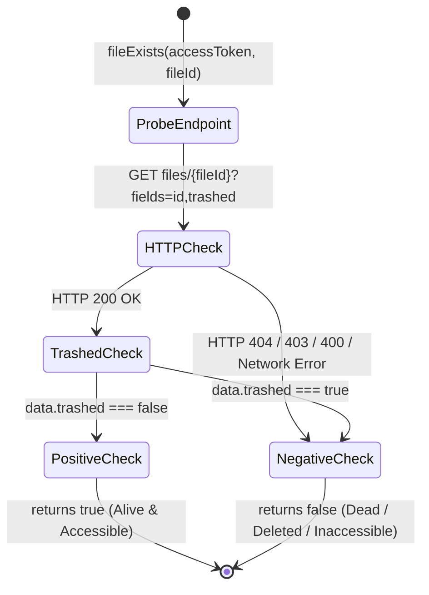
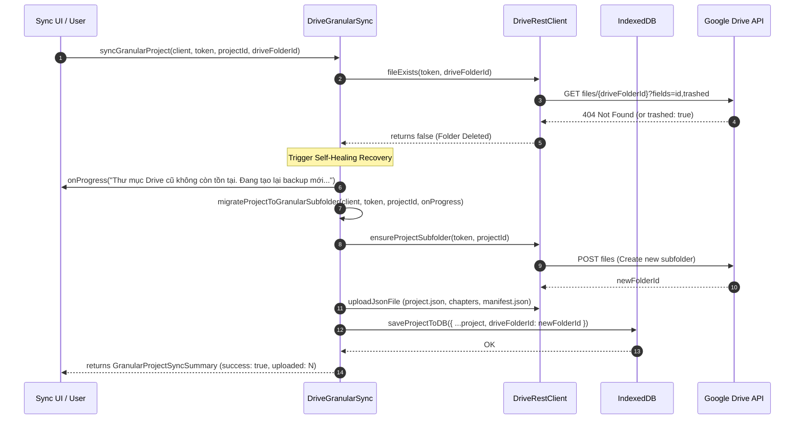
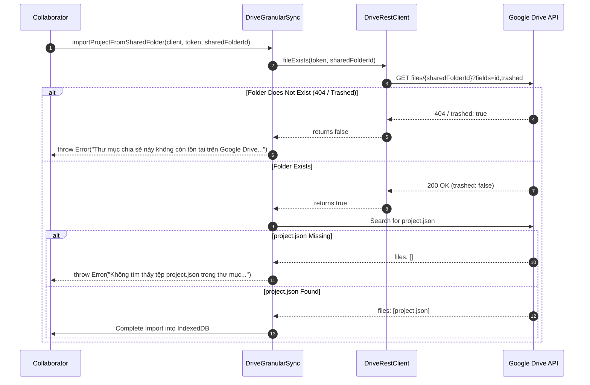

# Data Model & State Transitions: Google Drive Folder Self-Healing

**Feature**: Self-Healing and Graceful Recovery for Missing Google Drive Folders and Files  
**Branch**: `073-drive-folder-self-healing`  
**Date**: 2026-08-23  

---

## 1. Entity Definitions & Database Schema Stability

> [!NOTE]
> Per Principle IV of the Constitution, this feature requires **zero mutations** to existing core types in `src/types.ts` or IndexedDB object stores. It operates entirely using existing data fields (`project.driveFolderId`, `project.driveFileId`, `project.driveStorageFormat`).

### Core Entities Involved

```text
┌─────────────────────────────────────────────────────────────┐
│ StoryProject (IndexedDB: 'projects')                        │
├─────────────────────────────────────────────────────────────┤
│ id: string                                                  │
│ title: string                                               │
│ driveFolderId?: string      ◄── Replaced on self-healing    │
│ driveFileId?: string        ◄── Replaced on bundle recovery │
│ driveStorageFormat?: 'monolithic' | 'granular' | 'bundle'   │
│ isOwner?: boolean                                           │
│ isShared?: boolean                                          │
│ updatedAt: string           ◄── Refreshed on migration      │
│ chapters: ChapterMetadata[]                                 │
└─────────────────────────────────────────────────────────────┘
```

---

## 2. Remote Resource Vitality & Existence State Machine

When querying Google Drive for a resource identity (`fileId` or `folderId`), the client transitions through the following evaluation states:



---

## 3. Granular Project Sync Self-Healing Flow

During `syncGranularProject`, the state transitions seamlessly from normal sync to self-healing migration upon detecting a missing remote container:



---

## 4. Shared Folder Import Pre-Flight Validation



---

## 5. In-Memory Cache Life-Cycle (`DriveRestClient.ensureAppFolder`)

| State | Action | Next State |
|---|---|---|
| `cachedFolderId === null` | Search query for `AI_Dich_Truyen_Data` | Set `cachedFolderId = foundId` or `createdId` |
| `cachedFolderId !== null` | Call `fileExists(token, cachedFolderId)` | If `true`: return `cachedFolderId`<br/>If `false`: reset `cachedFolderId = null` and execute search/create flow |
