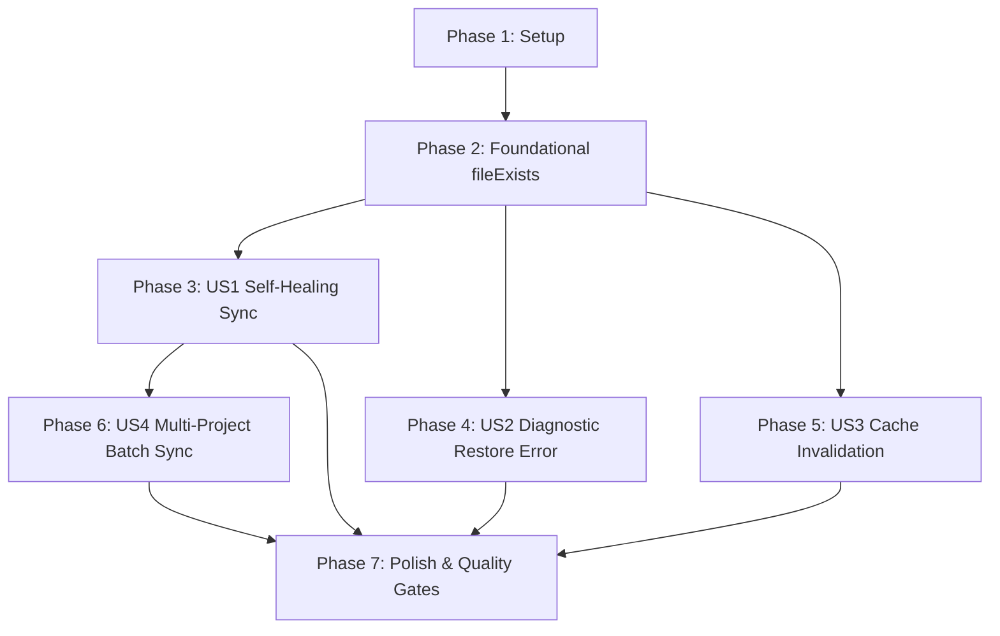

# Implementation Tasks: Self-Healing and Graceful Recovery for Missing Google Drive Folders and Files

**Feature Branch**: `073-drive-folder-self-healing` | **Spec**: [spec.md](spec.md) | **Plan**: [plan.md](plan.md)

---

## Phase 1: Setup (Shared Infrastructure)

**Purpose**: Establish test fixtures and mock helpers for Google Drive REST API responses.

- [X] T001 Create test scaffold and mock utilities for Drive recovery in `src/services/__tests__/driveSelfHealing.test.ts`

---

## Phase 2: Foundational (Blocking Prerequisites)

**Purpose**: Implement the core non-throwing `fileExists` vitality probe in `DriveRestClient` required by all downstream recovery flows.

**⚠️ CRITICAL**: No user story work can begin until this foundational method is implemented and verified.

- [X] T002 Implement non-throwing `fileExists` probe method in `src/services/google-drive/driveRestClient.ts`
- [X] T003 [P] Add unit tests for `fileExists` covering 200 (trashed=false/true), 404, 403, and network error scenarios in `src/services/__tests__/driveSelfHealing.test.ts`

**Checkpoint**: Foundation ready — `fileExists` is available for granular sync, folder import, and cache validation.

---

## Phase 3: User Story 1 - Automatic Self-Healing Sync for Deleted Project Folders (Priority: P1) 🎯 MVP

**Goal**: Automatically detect deleted or trashed remote project folders during `syncGranularProject`, re-provision a new subfolder via `migrateProjectToGranularSubfolder`, re-upload local data, update `project.driveFolderId` in IndexedDB, and complete synchronization cleanly without throwing 404 errors.

**Independent Test**: Mock `fileExists` returning `false` for `driveFolderId`, invoke `syncGranularProject`, and verify progress notifications, subfolder re-creation, chapter re-uploads, and updated `driveFolderId`.

### Implementation for User Story 1

- [X] T004 [US1] Add pre-flight folder existence check and self-healing migration workflow in `syncGranularProject` in `src/services/google-drive/driveGranularSync.ts`
- [X] T005 [P] [US1] Add unit tests for `syncGranularProject` self-healing on deleted folder in `src/services/__tests__/driveSelfHealing.test.ts`

**Checkpoint**: User Story 1 complete — projects with deleted folders self-heal automatically during synchronization.

---

## Phase 4: User Story 2 - Clear Diagnostic Error on Restoring Missing Shared Folders (Priority: P1) 🎯 MVP

**Goal**: Provide clear, actionable Vietnamese error reporting when a user attempts to import or restore from a non-existent or deleted shared folder ID, distinguishing missing containers from missing metadata files.

**Independent Test**: Call `importProjectFromSharedFolder` with a non-existent folder ID and verify the specific Vietnamese error message is thrown.

### Implementation for User Story 2

- [X] T006 [US2] Add early folder existence validation and descriptive Vietnamese error in `importProjectFromSharedFolder` in `src/services/google-drive/driveGranularSync.ts`
- [X] T007 [P] [US2] Add unit tests for `importProjectFromSharedFolder` non-existent folder error in `src/services/__tests__/driveSelfHealing.test.ts`

**Checkpoint**: User Story 2 complete — restore flow gives clear diagnostic guidance when shared folders are deleted.

---

## Phase 5: User Story 3 - In-Memory App Root Folder Cache Invalidation and Recovery (Priority: P2)

**Goal**: Validate cached root folder ID before reuse in `ensureAppFolder`, automatically invalidating `cachedFolderId` and recreating the root folder if deleted during long active browser sessions.

**Independent Test**: Set `cachedFolderId`, mock remote deletion, call `ensureAppFolder`, and verify cache reset and root folder re-creation.

### Implementation for User Story 3

- [X] T008 [US3] Add cache existence validation and cache invalidation in `ensureAppFolder` in `src/services/google-drive/driveRestClient.ts`
- [X] T009 [P] [US3] Add unit tests for root folder cache invalidation in `src/services/__tests__/driveSelfHealing.test.ts`

**Checkpoint**: User Story 3 complete — long-running client instances recover gracefully from remote root folder deletions.

---

## Phase 6: User Story 4 - Resilient Multi-Project Push and Bi-Directional Synchronization (Priority: P2)

**Goal**: Ensure batch multi-project backup flows (`pushAllToDrive`, `syncBiDirectional`) succeed completely when one or more projects undergo self-healing recovery.

**Independent Test**: Execute `pushAllToDrive` on a list of projects containing one with a deleted remote folder and verify all projects sync successfully.

### Implementation for User Story 4

- [X] T010 [US4] Add batch push and bi-directional sync integration test with self-healing projects in `src/services/__tests__/driveSelfHealing.test.ts`

**Checkpoint**: User Story 4 complete — multi-project sync flows are resilient to individual missing remote folders.

---

## Phase 7: Polish & Quality Gates

**Purpose**: Execute strict verification gates across the entire codebase.

- [X] T011 [P] Run TypeScript compiler type checking (`npm run lint`) to guarantee 0 type errors
- [X] T012 [P] Run full Vitest test suite (`npm test`) to guarantee 100% pass rate without regressions
- [X] T013 [P] Run production build (`npm run build`) to guarantee Vite and server buildability
- [X] T014 Execute quickstart end-to-end verification scenarios per `specs/073-drive-folder-self-healing/quickstart.md`

---

## Dependencies & Execution Order

### Phase Dependencies

### User Story Dependencies

- **User Story 1 (P1)**: Depends on Foundational (`fileExists`). No dependency on US2/US3.
- **User Story 2 (P1)**: Depends on Foundational (`fileExists`). Independent of US1/US3.
- **User Story 3 (P2)**: Depends on Foundational (`fileExists`). Independent of US1/US2.
- **User Story 4 (P2)**: Depends on US1 (relies on self-healing in `syncGranularProject`).

### Parallel Opportunities

- Within Phase 2: T003 unit tests can be written alongside T002 implementation.
- After Phase 2: US1 (T004/T005), US2 (T006/T007), and US3 (T008/T009) can be developed in parallel.
- Within Phase 7: T011, T012, T013 quality checks can run in parallel.

---

## Implementation Strategy

### MVP First (User Stories 1 & 2)

1. Complete Phase 1: Setup (`driveSelfHealing.test.ts` scaffold).
2. Complete Phase 2: Foundational (`fileExists` in `DriveRestClient`).
3. Complete Phase 3: User Story 1 (`syncGranularProject` self-healing).
4. Complete Phase 4: User Story 2 (`importProjectFromSharedFolder` error handling).
5. **Validate MVP**: Test deleted folder self-healing and restore error messages independently.

### Incremental Delivery (User Stories 3 & 4)

6. Complete Phase 5: User Story 3 (`ensureAppFolder` cache validation).
7. Complete Phase 6: User Story 4 (Multi-project batch sync resilience).
8. Complete Phase 7: Polish & Quality verification (`npm run lint`, `npm test`, `npm run build`).
