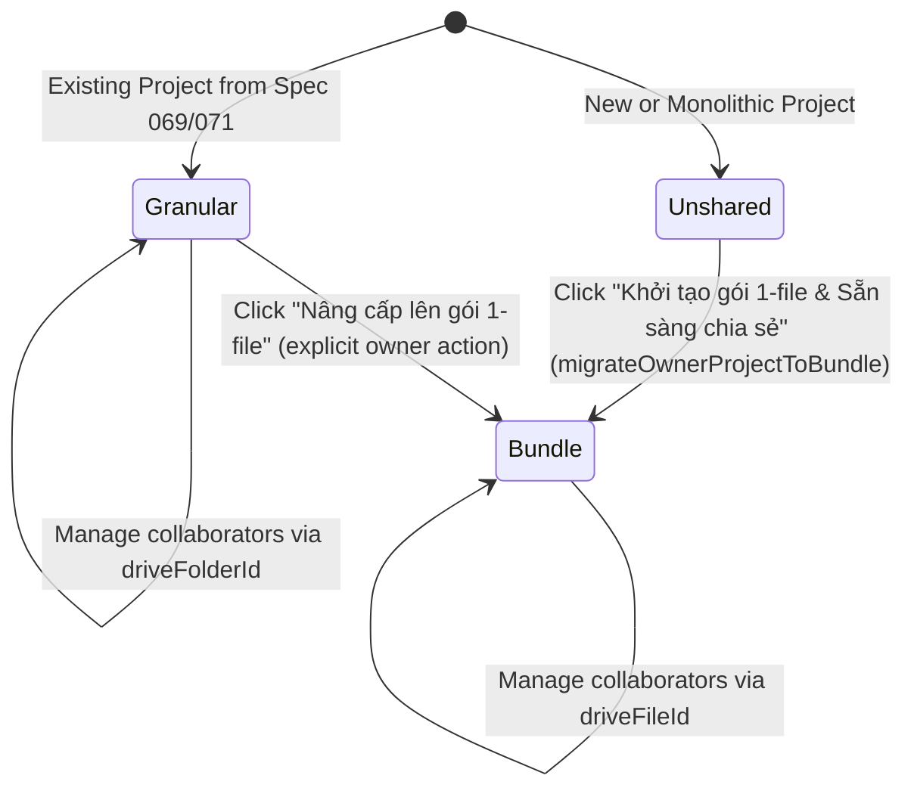

# Data Model: Single-File Bundle Sharing & Permission Scoping

**Feature Branch**: `074-fix-bundle-share-wiring`
**Date**: 2026-08-24
**Status**: Completed

## 1. Entities & Type Definitions

### 1.1 StoryProject (Existing Interface - `src/types.ts`)

```typescript
export interface StoryProject {
  id: string;
  title: string;
  author: string;
  genre: string;
  tone: string;
  description: string;
  glossary: GlossaryItem[];
  pendingGlossary?: GlossaryItem[];
  chapters: ChapterMetadata[];
  createdAt: string;
  updatedAt: string;
  
  // Storage & Sync Properties
  driveFolderId?: string;       // Present if legacy granular format
  driveFileId?: string;         // Present if single-file bundle format
  driveStorageFormat?: 'monolithic' | 'granular' | 'bundle';
  isShared?: boolean;
  isOwner?: boolean;
  collaborators?: CollaboratorPermission[];
  // ... queue states
}
```

### 1.2 CollaboratorPermission (`src/types/googleDriveSync.ts`)

```typescript
export interface CollaboratorPermission {
  permissionId: string;
  emailAddress: string;
  displayName?: string;
  role: 'owner' | 'writer' | 'reader';
  photoLink?: string;
}
```

---

## 2. Storage Format State Machine in ShareProjectModal



### State Transitions and Target Resource Scopes

| Initial State | Condition | Target Resource ID for Permissions | Primary Action | Target New State |
|---|---|---|---|---|
| **State A: Unshared** | `!project.driveFileId && !project.driveFolderId` or `driveStorageFormat === 'monolithic'` | N/A (none yet) | Invoke `migrateOwnerProjectToBundle()` | **State C: Bundle** |
| **State B: Granular** | `project.driveStorageFormat === 'granular' && !!project.driveFolderId` | `project.driveFolderId` | Option to invoke `migrateOwnerProjectToBundle()` with confirmation | **State C: Bundle** |
| **State C: Bundle** | `project.driveStorageFormat === 'bundle' && !!project.driveFileId` | `project.driveFileId` | Invite / List / Revoke collaborators on `driveFileId` | **State C: Bundle** |

---

## 3. Google Drive Permissions Service Signatures

```typescript
class GoogleDrivePermissionsService {
  /**
   * Cấp quyền truy cập (writer / reader) trên một tài nguyên Google Drive (file hoặc folder)
   */
  public async shareFolderWithUser(
    accessToken: string,
    resourceId: string, // Generalized from folderId
    emailAddress: string,
    role?: 'writer' | 'reader'
  ): Promise<CollaboratorPermission>;

  /**
   * Lấy danh sách cộng tác viên có quyền truy cập trên tài nguyên Google Drive (file hoặc folder)
   */
  public async listFolderCollaborators(
    accessToken: string,
    resourceId: string // Generalized from folderId
  ): Promise<CollaboratorPermission[]>;

  /**
   * Thu hồi quyền truy cập của cộng tác viên khỏi tài nguyên Google Drive (file hoặc folder)
   */
  public async revokeFolderPermission(
    accessToken: string,
    resourceId: string, // Generalized from folderId
    permissionId: string
  ): Promise<boolean>;
}
```
