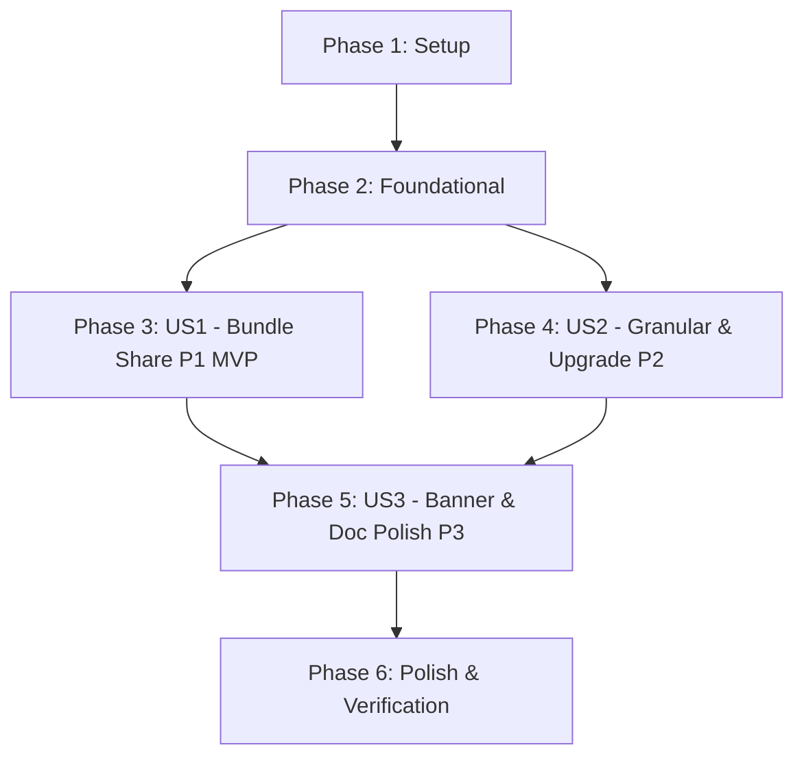

# Tasks: Fix Single-File Bundle Sharing Wiring & Permission Scoping

**Branch**: `074-fix-bundle-share-wiring` | **Date**: 2026-08-24 | **Spec**: [spec.md](spec.md) | **Plan**: [plan.md](plan.md)

---

## Phase 1: Setup (Shared Infrastructure)

**Purpose**: Verify clean build and baseline environment prior to modifications.

- [x] T001 [P] Verify project dependencies and baseline status with `npm run lint` and `npm test`

---

## Phase 2: Foundational (Blocking Prerequisites)

**Purpose**: Generalize Google Drive Permissions service so it safely accepts any Drive `resourceId` (file ID or folder ID).

**⚠️ CRITICAL**: Must be completed before wiring the UI to ensure both file-level (bundle) and folder-level (granular) permissions succeed.

- [x] T002 [P] Generalize parameter names from `folderId` to `resourceId` in `src/services/googleDrivePermissionsService.ts` (`shareFolderWithUser`, `listFolderCollaborators`, `revokeFolderPermission`) with updated JSDoc documentation
- [x] T003 [P] Update unit tests in `src/services/__tests__/googleDrivePermissionsService.test.ts` to verify file-level and folder-level permission grants, listings, and revocations

**Checkpoint**: Permissions service is resource-agnostic and verified by tests; User Story implementation can proceed.

---

## Phase 3: User Story 1 - Single-File Bundle Sharing for New Projects (Priority: P1) 🎯 MVP

**Goal**: Enable newly shared (unshared / monolithic) projects to initialize directly into the 1-file bundle format (`migrateOwnerProjectToBundle`) and manage collaborators strictly on `driveFileId`.

**Independent Test**: Open an unshared project in `ShareProjectModal`, click "Khởi tạo gói 1-file & Sẵn sàng chia sẻ", verify `migrateOwnerProjectToBundle` is called, `driveFileId` is populated with `driveStorageFormat = 'bundle'`, and inviting a collaborator targets `driveFileId`.

- [x] T004 [P] [US1] Create unit test suite in `src/components/google-sync/__tests__/ShareProjectModal.test.tsx` verifying unshared project triggers `migrateOwnerProjectToBundle` and scopes collaborator operations to `driveFileId`
- [x] T005 [US1] Wire sharing initialization button in `src/components/google-sync/ShareProjectModal.tsx` to invoke `googleDriveSyncService.migrateOwnerProjectToBundle` instead of `migrateProjectToGranularSubfolder`
- [x] T006 [US1] Update `ShareProjectModal.tsx` collaborator handlers (`loadCollaborators`, `handleAddCollaborator`, `handleRevoke`) to target `project.driveFileId` when `driveStorageFormat === 'bundle'`

**Checkpoint**: User Story 1 is complete. New projects share cleanly as 1-file bundles with file-scoped permissions.

---

## Phase 4: User Story 2 - Granular Project Backward Compatibility & Explicit Upgrade (Priority: P2)

**Goal**: Maintain working collaborator management for existing granular projects via `driveFolderId`, and provide an explicit "Nâng cấp lên gói 1-file" button for owners.

**Independent Test**: Open a project with `driveStorageFormat === 'granular'` and `driveFolderId`. Verify existing collaborators are loaded via `driveFolderId`, the "Nâng cấp lên gói 1-file" button is present, and clicking it prompts confirmation and migrates to bundle format.

- [x] T007 [P] [US2] Add unit tests in `src/components/google-sync/__tests__/ShareProjectModal.test.tsx` verifying granular project loads collaborators via `driveFolderId` and handles the explicit upgrade flow
- [x] T008 [US2] Implement legacy granular state UI with collaborator management via `driveFolderId` and an explicit "Nâng cấp lên gói 1-file" button with confirmation warning in `src/components/google-sync/ShareProjectModal.tsx`

**Checkpoint**: User Story 2 is complete. Legacy granular projects operate smoothly with an explicit migration path.

---

## Phase 5: User Story 3 - Privacy Notice Banner & Spec 072 Rectification (Priority: P3)

**Goal**: Accurately explain single-file storage privacy in the UI banner and rectify Task T018 documentation in Spec 072.

**Independent Test**: Inspect the security notice banner in `ShareProjectModal.tsx` to verify correct copy. Check `specs/072-drive-bundle-crdt-sync/tasks.md` to verify Task T018 accurately documents explicit owner upgrade.

- [x] T009 [P] [US3] Update security notice banner text in `src/components/google-sync/ShareProjectModal.tsx` to clearly communicate single-file storage in `AI_Dich_Truyen_Data` with file-specific access rights
- [x] T010 [P] [US3] Rectify Task T018 description in `specs/072-drive-bundle-crdt-sync/tasks.md` from automatic background sync to explicit owner-triggered upgrade

**Checkpoint**: User Story 3 is complete. Copy and documentation are fully synchronized.

---

## Phase 6: Polish & Cross-Cutting Verification

**Purpose**: Run all quality gates and ensure 0 type errors, 0 test failures, and clean production build.

- [x] T011 [P] Execute full quality verification (`npm run lint`, `npm test`, `npm run build`) and confirm clean pass across the repository

---

## Dependencies & Execution Order

### Phase Dependencies



### User Story Dependencies

- **User Story 1 (P1)**: Depends on Phase 2 (Foundational permissions service generalization). Core sharing MVP.
- **User Story 2 (P2)**: Depends on Phase 2 (Foundational). Can be implemented alongside or immediately following US1 in `ShareProjectModal.tsx`.
- **User Story 3 (P3)**: Depends on US1/US2 UI structure for banner update. Documentation task T018 can run in parallel.

---

## Parallel Execution Opportunities

### Within Phase 2 (Foundational)
```bash
# Launch service generalization and test update together:
Task T002: "Generalize parameter names in src/services/googleDrivePermissionsService.ts"
Task T003: "Update unit tests in src/services/__tests__/googleDrivePermissionsService.test.ts"
```

### Within Phase 3 & 4 (User Stories 1 & 2)
```bash
# Launch test creation in parallel with component updates:
Task T004: "Create unit test suite in src/components/google-sync/__tests__/ShareProjectModal.test.tsx"
Task T007: "Add unit tests for granular project and explicit upgrade in ShareProjectModal.test.tsx"
```

### Within Phase 5 & 6 (Documentation & Quality)
```bash
# Documentation rectification can run alongside UI banner update:
Task T009: "Update security notice banner text in ShareProjectModal.tsx"
Task T010: "Rectify Task T018 description in specs/072-drive-bundle-crdt-sync/tasks.md"
```

---

## Implementation Strategy

### MVP Milestone (Phases 1, 2, 3)
1. Complete **Phase 1: Setup** and **Phase 2: Foundational** (generalize `googleDrivePermissionsService.ts`).
2. Implement **Phase 3: User Story 1** (`ShareProjectModal.tsx` calls `migrateOwnerProjectToBundle` and attaches permissions to `driveFileId`).
3. **STOP & VALIDATE**: Run `npm test` on permissions and modal tests.

### Incremental Delivery (Phases 4, 5, 6)
4. Add **Phase 4: User Story 2** (tri-state detection, legacy granular support, and manual upgrade button).
5. Add **Phase 5: User Story 3** (banner copy & Spec 072 task rectification).
6. Run **Phase 6: Polish** (`npm run lint`, `npm test`, `npm run build`).
