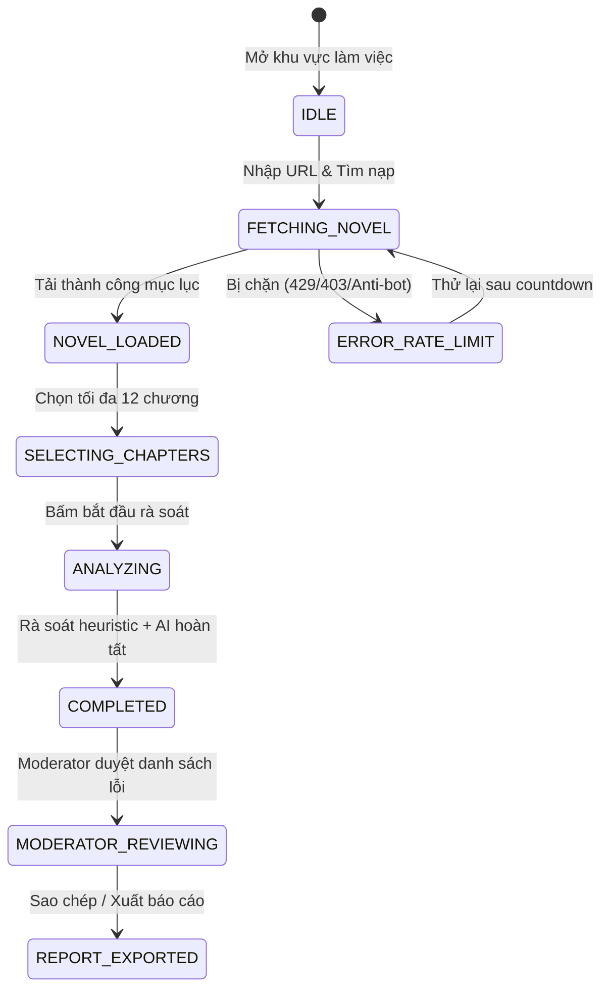

# Data Model: Moderator Hako Quality Checker Workspace

**Feature**: `075-moderator-quality-checker`
**Date**: 2026-08-27
**Status**: Completed

## 1. Entity Definitions & Types

```typescript
export type QualityIssueCategory =
  | 'inconsistent_name'    // Tên riêng nhân vật/địa danh không nhất quán
  | 'pronoun_gender'       // Nhân xưng, giới tính mâu thuẫn
  | 'terminology_drift'    // Thuật ngữ/chiêu thức dịch không đồng bộ
  | 'raw_leak'             // Sót ký tự tiếng Trung / Hán tự chưa dịch
  | 'repetition'           // Lặp đoạn / lặp câu liên tiếp / đăng nhầm
  | 'wrong_chapter'        // Đăng nhầm nội dung chương khác
  | 'mistranslation'       // Dịch sai lệch nghĩa gốc (yêu cầu raw)
  | 'omission'             // Bỏ sót câu/đoạn so với raw (yêu cầu raw)
  | 'hallucination'        // Bịa thêm nội dung không có trong raw (yêu cầu raw)
  | 'other';               // Lỗi biên tập khác

export type QualityIssueSeverity =
  | 'critical'             // Lỗi nghiêm trọng (sai giới tính nhân vật chính, sót raw hàng loạt, sai lệch nghĩa nặng)
  | 'major'                // Lỗi lớn (tên riêng thay đổi, mất đoạn văn, thuật ngữ cốt lõi bị đổi)
  | 'minor'                // Lỗi nhỏ (lỗi ngữ pháp nhẹ, từ đệm không tự nhiên)
  | 'warning';             // Cảnh báo nghi vấn (cần moderator xem xét xác nhận)

export type QualityIssueDecision =
  | 'pending'              // Chờ moderator xem xét
  | 'confirmed'            // Moderator xác nhận là lỗi cần sửa
  | 'review_needed'        // Moderator đánh dấu cần hội ý thêm với dịch giả
  | 'dismissed';           // Moderator bác bỏ / bỏ qua (không phải lỗi)

export interface HakoChapterMeta {
  url: string;
  title: string;
  order: number;
}

export interface HakoVolume {
  volumeTitle: string;
  chapters: HakoChapterMeta[];
}

export interface HakoNovelMeta {
  url: string;
  title: string;
  author: string;
  artist: string;
  description: string;
  coverUrl?: string;
  volumes: HakoVolume[];
  fetchedAt: string;
}

export interface HakoReviewChapter {
  url: string;
  title: string;
  volumeTitle: string;
  vietnameseContent: string;
  rawChineseContent?: string;
  wordCount: number;
  status: 'pending' | 'loaded' | 'analyzing' | 'done' | 'error';
  errorMessage?: string;
}

export interface QualityIssue {
  id: string;                      // UUID định danh lỗi
  chapterUrl: string;
  chapterTitle: string;
  category: QualityIssueCategory;
  severity: QualityIssueSeverity;
  vietnameseSnippet: string;       // Đoạn trích bản dịch tiếng Việt làm bằng chứng
  rawSnippet?: string;             // Đoạn trích raw tiếng Trung đối ứng (nếu có)
  explanation: string;             // Lời giải thích lý do nghi ngờ lỗi
  suggestedFix?: string;           // Gợi ý sửa lỗi nếu có
  decision: QualityIssueDecision;  // Quyết định của moderator
  moderatorNote?: string;          // Ghi chú của moderator
  detectedBy: 'heuristic' | 'ai';  // Nguồn phát hiện
  createdAt: string;
}

export interface QualityReviewSession {
  id: string;
  novelUrl: string;
  novelMeta: HakoNovelMeta | null;
  selectedChapterUrls: string[];   // Tối đa 12 URLs
  chapters: Record<string, HakoReviewChapter>;
  issues: QualityIssue[];
  createdAt: string;
  updatedAt: string;
  status: 'idle' | 'fetching_novel' | 'fetching_chapters' | 'analyzing' | 'completed' | 'error';
  error?: {
    code: string;
    message: string;
    retryAfterSeconds?: number;
  };
}

export interface QualityReportStats {
  totalIssues: number;
  confirmedCount: number;
  reviewNeededCount: number;
  dismissedCount: number;
  pendingCount: number;
  bySeverity: Record<QualityIssueSeverity, number>;
  byCategory: Record<QualityIssueCategory, number>;
}

export interface QualityReport {
  sessionId: string;
  novelTitle: string;
  novelUrl: string;
  generatedAt: string;
  totalChaptersReviewed: number;
  stats: QualityReportStats;
  confirmedIssues: QualityIssue[];
  formattedMarkdown: string;
}
```

---

## 2. Validation & Business Rules

1. **Max Chapters Limit**: `selectedChapterUrls.length` MUST be between 1 and 12 inclusive before starting analysis.
2. **URL Validation**: URL must be a valid Hako/Docln novel URL (`https://ln.hako.vn/truyen/...` or `https://docln.net/truyen/...`).
3. **Decisions Persistence**: Changing `QualityIssue.decision` or `QualityIssue.moderatorNote` MUST immediately update the session in local storage / IndexedDB with timestamp `updatedAt`.
4. **Bilingual Verification Trigger**: If `HakoReviewChapter.rawChineseContent` is provided and non-empty for a chapter, the AI critique prompt includes both bilingual texts and performs source-target alignment checks.

---

## 3. State Transitions


