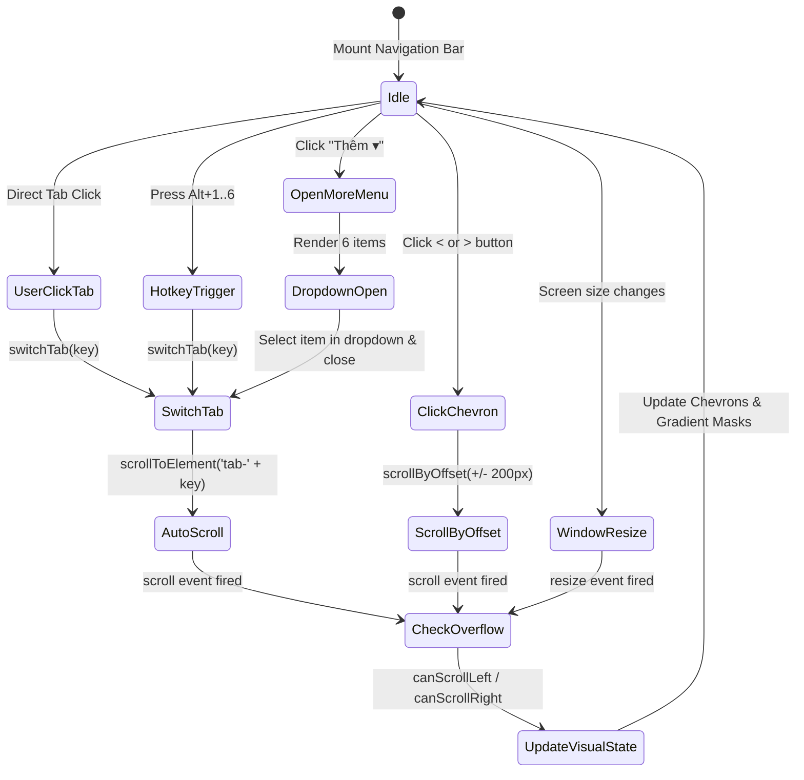

# Data Model & State: Kế Hoạch Toàn Diện — Thanh Điều Hướng Tab Chính

**Feature**: `076-nav-tabs-overflow-fix`
**Date**: 2026-08-27
**Status**: Completed

---

## 1. Type Definitions

```typescript
export type ActiveNavTab =
  | 'translate'
  | 'auto-translate'
  | 'glossary'
  | 'history'
  | 'projects'
  | 'hako-checker';

export interface ScrollOverflowState {
  canScrollLeft: boolean;
  canScrollRight: boolean;
}

export interface UseScrollOverflowReturn<T extends HTMLElement = HTMLElement> {
  containerRef: React.RefObject<T | null>;
  canScrollLeft: boolean;
  canScrollRight: boolean;
  checkOverflow: () => void;
  scrollToElement: (elementOrId: HTMLElement | string | null, behavior?: ScrollBehavior) => void;
  scrollByOffset: (offset: number, behavior?: ScrollBehavior) => void;
  scrollLeftAction: () => void;
  scrollRightAction: () => void;
}

export interface NavTabItemConfig {
  key: ActiveNavTab;
  id: string;
  labelKey: string;
  shortcut: string;
  icon: React.ComponentType<{ className?: string }>;
  badgeCount?: number;
  warningCount?: number;
}
```

---

## 2. Navigation Interaction State Diagram


