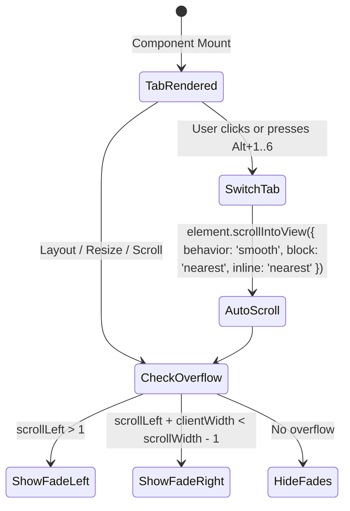

# Data Model & State: Nav Tabs Overflow & Visibility

**Feature**: `076-nav-tabs-overflow-fix`
**Date**: 2026-08-27
**Status**: Completed

---

## 1. Type Definitions

```typescript
export type ActiveNavTab =
  | 'translate'
  | 'auto-translate'
  | 'glossary'
  | 'history'
  | 'projects'
  | 'hako-checker';

export interface ScrollOverflowState {
  canScrollLeft: boolean;
  canScrollRight: boolean;
}

export interface NavTabItem {
  id: string;             // e.g. "tab-translate"
  key: ActiveNavTab;      // e.g. "translate"
  labelKey: string;       // e.g. "nav.translate"
  shortcut: string;       // e.g. "Alt+1"
  icon: string;           // icon component
  badgeCount?: number;    // optional count badge
  warningCount?: number;  // optional warning badge
}
```

---

## 2. State & Flow


