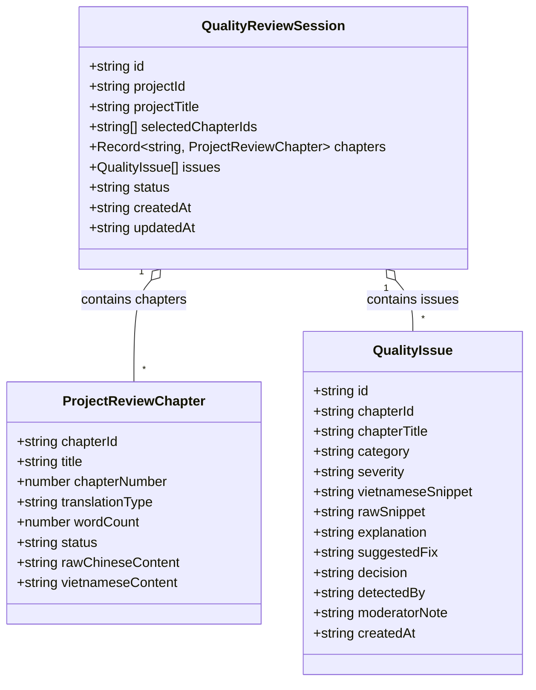

# Data Model: Hako Chapter Selection State & Boundary Resilience

**Feature Branch**: `079-fix-hako-selection-crash`
**Date**: 2026-08-27
**Spec**: [spec.md](./spec.md)

## Entity Relationships & Data Types

The data models for the Moderator Quality Checker remain strictly compatible with existing schemas while enforcing runtime type coercion and defensive checks.

---

## Field Normalization Rules

### 1. Chapter Identifier Normalization

| Field | Source Type | Normalized Type | Coercion Logic |
| :--- | :--- | :--- | :--- |
| `selectedChapterIds` | `Array<string \| number>` | `string[]` | `selectedChapterIds.map(String)` |
| `chapterId` (Param) | `string \| number` | `string` | `String(chapterId)` |
| `chapter.chapterId` | `string \| number` | `string` | `String(chapter.chapterId \|\| chapter.id)` |
| `chapter.id` (StoryProject) | `string \| number` | `string` | `String(chapter.id)` |

---

### 2. Defensive Value Fallbacks

| Target Field | Potential Malformed Value | Safe Default / Fallback |
| :--- | :--- | :--- |
| `chapter.title` | `undefined`, `null`, `""` | `'Chương không có tiêu đề'` |
| `chapter.chapterNumber` | `undefined`, `null`, `NaN` | `index + 1` |
| `chapter.wordCount` | `undefined`, `null`, `< 0` | `0` |
| `chapter.rawChineseContent`| `undefined`, `null` | `undefined` |
| `chapter.translationType` | Invalid / unknown string | `'none'` |

---

## State Transition & Boundary Rules

1. **Selection Bounds**:
   - `0 <= selectedChapterIds.length <= 12`
   - If user attempts to toggle a 13th chapter, state change is rejected with error code `CHAPTER_LIMIT_EXCEEDED`.
2. **Range Selection Limit**:
   - If range input contains $> 12$ translatable IDs, only the first 12 are retained (`slice(0, 12)`).
3. **Sparse Array Protection**:
   - Every mapping over `chapterList` or `session.chapters` filters out `null`/`undefined` records before property access.
4. **Aggregate Summation**:
   - `totalSelectedWords = selectedChapters.reduce((sum, c) => sum + (c?.wordCount || 0), 0)` guarantees a safe number output even if elements have partial metadata.
