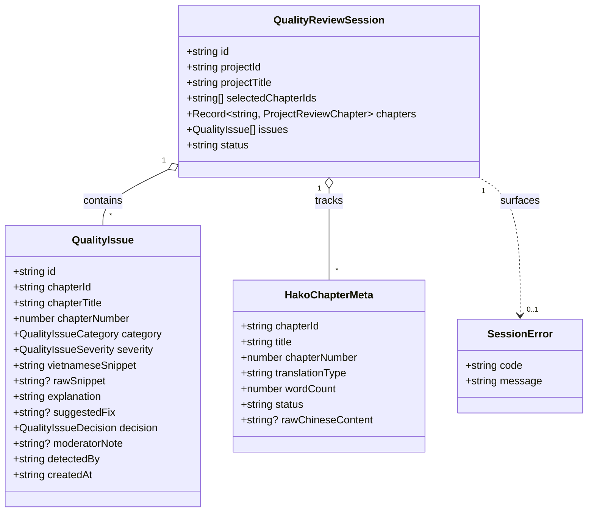

# Data Model: Hako Quality Checker Selection UX, Card Numbering & Error Visibility

**Feature**: Hako Quality Checker Selection UX, Card Numbering & Error Visibility  
**Feature Directory**: `specs/081-hako-checker-range-card-fixes`  
**Date**: 2026-08-27

---

## 1. Domain Entities & Type Definitions



### 1.1 `QualityIssue` Schema (Extended)

```typescript
export interface QualityIssue {
  id: string;                      // Unique issue UUID (e.g., "issue-172474...-abc")
  chapterId: string;               // ID of the parent chapter
  chapterTitle: string;            // Title of the chapter
  chapterNumber: number;           // Sequential chapter number (e.g., 134)
  category: QualityIssueCategory;  // Error taxonomy category
  severity: QualityIssueSeverity;  // critical | major | minor | warning
  vietnameseSnippet: string;       // Evidence snippet from Vietnamese translation
  rawSnippet?: string;             // Corresponding raw Chinese snippet if available
  explanation: string;             // Detailed explanation of the anomaly
  suggestedFix?: string;           // Optional proposed correction
  decision: QualityIssueDecision;  // pending | confirmed | review_needed | dismissed
  moderatorNote?: string;          // Optional moderator note
  detectedBy: 'heuristic' | 'ai';  // Detection engine source
  createdAt: string;               // ISO 8601 timestamp
}
```

---

## 2. Component State Models

### 2.1 `HakoChapterSelector` Internal State

```typescript
interface HakoChapterSelectorState {
  // Range selection inputs
  fromChapter: string;             // Raw string input for start chapter number
  toChapter: string;               // Raw string input for end chapter number

  // Single chapter quick-select input
  singleChapterInput: string;      // Raw string input for quick selection (e.g., "134")

  // Transient user feedback
  transientFeedback: {
    message: string;               // Inline warning (e.g. "Không tìm thấy chương #9999")
    type: 'warning' | 'info';
  } | null;
}
```

### 2.2 `HakoCheckerWorkspace` Error Banner State

```typescript
interface SessionErrorState {
  error: {
    code: 'CHAPTER_LIMIT_EXCEEDED' | 'CHAPTER_NOT_TRANSLATED' | 'ANALYSIS_ERROR' | string;
    message: string;
  } | null;
}
```

---

## 3. State Transitions & Lifecycle

### 3.1 Range Selection Flow
```
[User inputs fromChapter & toChapter]
               │
               ▼
   [Click "Chọn khoảng"]
               │
   ┌───────────┴───────────┐
   │ Check from > to       │ ──> Swap: minNum = min(from, to), maxNum = max(from, to)
   └───────────┬───────────┘
               ▼
   [Filter translatable chapters within [minNum, maxNum]]
               │
               ▼
   [onSelectRange(idsToSelect)]
               │
   ┌───────────┴───────────┐
   │ Length > 12           │ ──> Slice to 12 & emit CHAPTER_LIMIT_EXCEEDED error
   └───────────┬───────────┘
               ▼
   [Persist bounded selection to IndexedDB]
```

### 3.2 Single Chapter Quick Select Flow
```
[User types chapterNumber + Enter]
               │
               ▼
   [Find chapter where ch.chapterNumber === targetNum]
               │
        ───────┴───────
       │               │
    [Found]       [Not Found]
       │               │
       ▼               ▼
[translationType !== 'none'?]    [Set transientFeedback = "Không tìm thấy chương #..."]
   ┌───┴───┐                                │
[Yes]     [No]                              ▼
  │        │                       [Auto-clear after 2.5s]
  ▼        ▼
[Toggle] [Set warning: "Chương chưa dịch"]
  │
  ▼
[Clear singleChapterInput = ""]
```

### 3.3 Error Banner Lifecycle
```
[Error emitted in useHakoReviewSession]
               │
               ▼
   [HakoCheckerWorkspace renders Banner]
               │
        ───────┴───────
       │               │
  [User clicks 'x']   [Session clears / resets]
       │               │
       ▼               ▼
[Call setError(null)]  [error === null]
       │               │
       └───────┬───────┘
               ▼
      [Banner unmounts]
```
