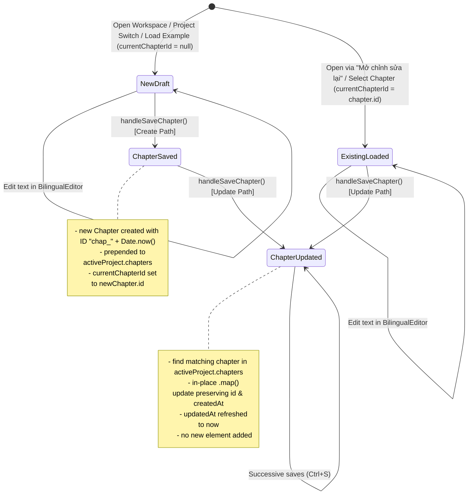

# Data Model: Upsert Chapter Save in Translator Workspace

**Feature**: `082-upsert-chapter-save`
**Date**: 2026-08-27

## Entities

### Chapter

Represents an individual translated or draft chapter entity in a `StoryProject`.

```typescript
interface Chapter {
  id: string;                      // Unique identifier, e.g. "chap_1724738400000" (Immutable)
  title: string;                   // Display title of chapter, e.g. "Chương 1: Khởi đầu"
  sourceText: string;              // Original Chinese source text
  rawTranslation?: string;         // Phase 1 raw translation
  polishedTranslation?: string;    // Phase 2 polished translation
  paragraphs: string[];            // Non-empty paragraphs extracted from sourceText
  translatedLines: string[];       // Non-empty translated lines extracted from polished or raw
  status: 'not_started' | 'in_progress' | 'completed';
  createdAt: string;               // ISO 8601 creation timestamp (Immutable on update)
  updatedAt: string;               // ISO 8601 last update timestamp (Refreshed on save)
}
```

### StoryProject

Root document entity containing project metadata and the chapter collection.

```typescript
interface StoryProject {
  id: string;
  title: string;
  author?: string;
  genre: string;
  tone: string;
  description?: string;
  glossary: GlossaryItem[];
  chapters: Chapter[];             // Array of chapters
  createdAt: number;
}
```

## State Transitions



## Validation & Invariants

1. **Chapter Existence Check**: An update occurs if and only if `currentChapterId !== null` AND `activeProject.chapters.some(c => c.id === currentChapterId)`.
2. **Immutability of Identifiers**: `chapter.id` and `chapter.createdAt` are never overwritten during an update operation.
3. **Monotonic Timestamps**: `updatedAt` is always set to the current ISO 8601 string on every save.
4. **Status Determination**:
   - `'completed'`: `polishedTranslation.trim().length > 0`
   - `'in_progress'`: `rawTranslation.trim().length > 0` and `polishedTranslation.trim().length === 0`
   - `'not_started'`: neither `rawTranslation` nor `polishedTranslation` is present.
5. **No Empty Saves**: If `sourceText.trim().length === 0`, saving is rejected and no modifications to `activeProject.chapters` occur.
