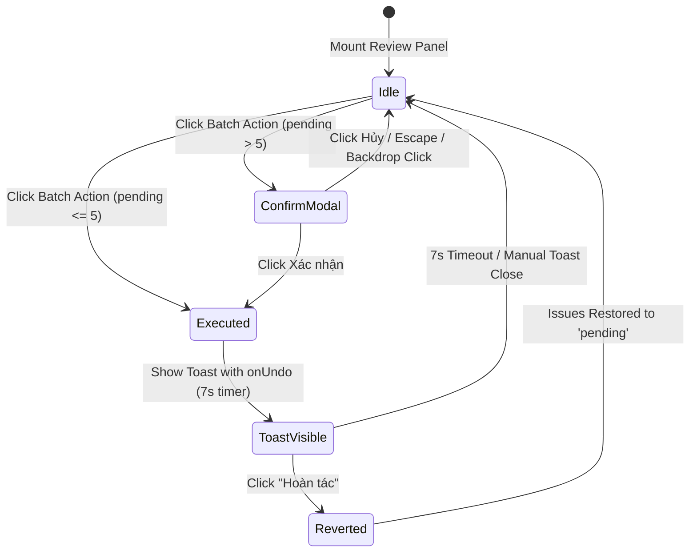

# Data Model: Batch Action Confirmation Guard & Undo Capability

**Feature**: `097-batch-action-confirmation-undo`  
**Date**: 2026-09-10  
**Status**: Completed

## 1. Local State Entities in `HakoIssueReviewPanel`

```typescript
/**
 * Trạng thái của hộp thoại xác nhận trước khi thực thi thao tác hàng loạt lớn (> 5 lỗi).
 */
export interface BatchConfirmState {
  action: 'confirmed' | 'dismissed';
  ids: string[];
  count: number;
}
```

- **`confirmBatch`**: `BatchConfirmState | null`
  - Default: `null` (modal is closed).
  - Transition on click "Duyệt nhanh tất cả" with $> 5$ issues:
    `{ action: 'confirmed', ids: pendingIds, count: pendingIds.length }`
  - Transition on click "Bỏ qua tất cả" with $> 5$ issues:
    `{ action: 'dismissed', ids: pendingIds, count: pendingIds.length }`
  - Transition on "Hủy" / Escape / Backdrop click:
    `null` (no mutation occurs).
  - Transition on "Xác nhận":
    Execute mutation, show undo toast, reset to `null`.

---

## 2. Notification / Toast Integration Contract

```typescript
// Defined in src/components/NotificationSystem.tsx
export interface ToastOptions {
  message: string;
  type?: 'info' | 'success' | 'warning' | 'error';
  duration?: number; // ms, set to 7000ms
  onUndo?: () => void | Promise<void>;
  undoLabel?: string;
}
```

### Undo Payload Model
```typescript
interface ActiveUndoBatch {
  ids: string[];
  previousDecision: 'pending';
  appliedDecision: 'confirmed' | 'dismissed';
  timestamp: number;
}
```

- **Triggering Undo**:
  When user clicks "Hoàn tác" in the toast:
  ```typescript
  const handleUndo = () => {
    if (onBatchDecisionChange) {
      onBatchDecisionChange(targetIds, 'pending');
    } else {
      targetIds.forEach((id) => onDecisionChange(id, 'pending'));
    }
  };
  ```

---

## 3. State Lifecycle & Transitions


