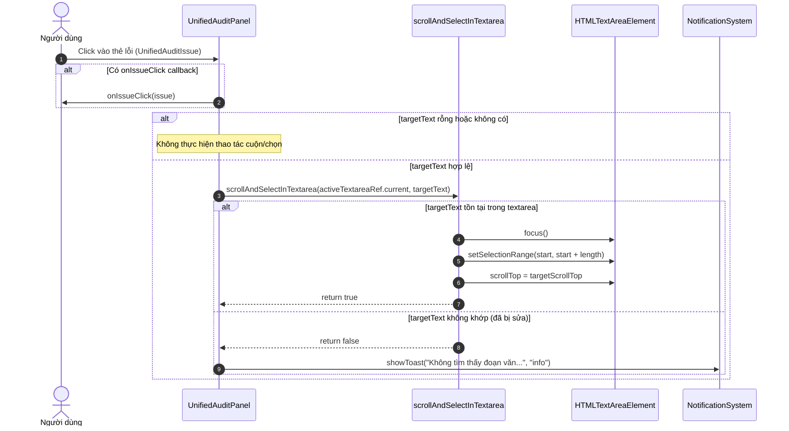

# Data Model: Textarea Issue Selection & Smooth Auto-Scroll

**Feature**: `103-textarea-issue-selection`  
**Date**: 2026-09-10  
**Status**: Ready  

---

## 1. Utility Function Interfaces (`src/utils/textareaHighlight.ts`)

```typescript
/**
 * Định vị đoạn văn bản trong textarea, cuộn mượt và bôi chọn đoạn khớp.
 *
 * @param textareaEl - Tham chiếu tới phần tử HTMLTextAreaElement cần thao tác.
 * @param targetText - Đoạn trích văn bản cần tìm kiếm và bôi chọn.
 * @returns boolean - `true` nếu tìm thấy và bôi chọn thành công; `false` nếu không tìm thấy hoặc input không hợp lệ.
 */
export function scrollAndSelectInTextarea(
  textareaEl: HTMLTextAreaElement | null | undefined,
  targetText: string | null | undefined
): boolean;
```

### Execution Flow:
1. **Validation**: Check if `textareaEl` exists and `targetText` is a non-empty string. If not, return `false`.
2. **Search**: `start = textareaEl.value.indexOf(targetText)`. If `start === -1`, return `false`.
3. **Selection**:
   - `textareaEl.focus()`
   - `textareaEl.setSelectionRange(start, start + targetText.length)`
4. **Scroll Geometry Calculation**:
   - Count newlines in `textareaEl.value.slice(0, start)` → `lineCount`.
   - Extract computed `lineHeight` from `window.getComputedStyle(textareaEl)`. Fallback: `(parseFloat(fontSize) || 14) * 1.5`.
   - Calculate `targetScrollTop = Math.max(0, (lineCount - 2) * lineHeight)`.
   - Assign `textareaEl.scrollTop = targetScrollTop`.
5. **Return**: `true`.

---

## 2. Component Prop Interfaces

### `UnifiedAuditPanelProps` Update (`src/components/translator-workspace/UnifiedAuditPanel.tsx`):

```typescript
export interface UnifiedAuditPanelProps {
  /** Danh sách lỗi quy tắc phát hiện từ Hako Quality Engine */
  hakoIssues: QualityIssue[];
  /** Danh sách góp ý đối chiếu ngữ nghĩa từ AI QA Critique */
  qaIssues: DirectQaCritiqueIssue[];
  /** Cờ trạng thái đang chạy kiểm duyệt AI */
  isCheckingQa: boolean;
  /** Hàm kích hoạt kiểm định chất lượng AI thủ công */
  onRunAiQaCritique: () => void;
  /** Callback tùy chọn khi người dùng click vào thẻ lỗi */
  onIssueClick?: (issue: UnifiedAuditIssue) => void;
  /** Tham chiếu tới phần tử textarea đang hoạt động trong editor */
  activeTextareaRef?: React.RefObject<HTMLTextAreaElement | null>;
  /** Cảnh báo lệch đoạn văn bản giữa bản gốc và bản dịch */
  isMismatch?: boolean;
  /** Số đoạn văn bản nguồn */
  sourceParaCount?: number;
  /** Số đoạn văn bản dịch */
  translationParaCount?: number;
  /** Thông báo lỗi nếu quá trình gọi AI QA Critique thất bại */
  qaError?: string | null;
}
```

---

## 3. Card Click Handler Interaction


