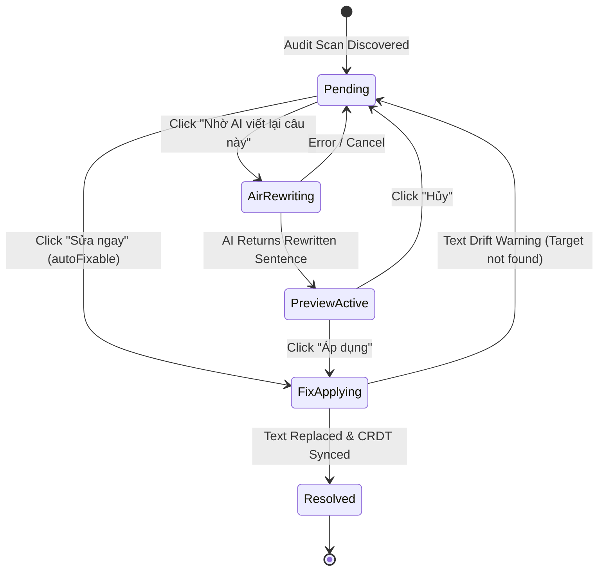

# Data Model: Auto-Fix and Targeted AI Sentence Rewriting

**Feature Branch**: `104-audit-auto-fix-rewrite`  
**Date**: 2026-09-10  
**Status**: Completed  

---

## 1. Entities & Interface Signatures

### 1.1 DirectRewriteSentenceParams (`src/services/directTranslationEngine.ts`)

Parameters for calling `rewriteSentenceDirect`:

```typescript
export interface DirectRewriteSentenceParams {
  /** Đoạn trích văn bản cần viết lại */
  targetText: string;
  /** Ngữ cảnh các câu/đoạn xung quanh để AI hiểu ngữ cảnh (tùy chọn) */
  context?: string;
  /** Hướng dẫn/vấn đề cần khắc phục lấy từ issue.message */
  issueMessage?: string;
  /** Danh sách API Keys cá nhân của người dùng */
  apiKeys: string[];
  /** Mã mô hình Gemini được chọn (mặc định gemini-2.5-flash) */
  model?: string;
  /** Chỉ số API Key bắt đầu xoay vòng */
  startKeyIndex?: number;
  /** Tín hiệu hủy yêu cầu mạng nếu người dùng chuyển trang */
  signal?: AbortSignal;
}

export interface DirectRewriteSentenceResult {
  /** Câu/đoạn trích đã được viết lại hoàn chỉnh */
  rewrittenSentence: string;
  /** Chỉ số API key thành công */
  successKeyIndex: number;
}
```

### 1.2 UnifiedAuditPanelProps Updates (`src/components/translator-workspace/UnifiedAuditPanel.tsx`)

Props accepted by `UnifiedAuditPanel`:

```typescript
export interface UnifiedAuditPanelProps {
  // Existing props
  hakoIssues: QualityIssue[];
  qaIssues: DirectQaCritiqueIssue[];
  isCheckingQa: boolean;
  onRunAiQaCritique: () => void;
  onIssueClick?: (issue: UnifiedAuditIssue) => void;
  isMismatch?: boolean;
  sourceParaCount?: number;
  translationParaCount?: number;
  qaError?: string | null;
  activeTextareaRef?: React.RefObject<HTMLTextAreaElement | null>;

  // New props for Feature 104
  /** Callback áp dụng sửa lỗi tập trung từ workspace */
  onApplyFix?: (issue: UnifiedAuditIssue) => boolean | Promise<boolean>;
  /** API Keys để thực hiện viết lại câu qua AI */
  apiKeys?: string[];
  /** Model AI đang chọn */
  selectedModel?: string;
  /** Callback tùy chọn thay thế việc gọi trực tiếp rewriteSentenceDirect */
  onRewriteSentence?: (params: DirectRewriteSentenceParams) => Promise<string>;
}
```

### 1.3 State Lifecycle of an Audit Issue in Panel



### 1.4 State Management in `UnifiedAuditPanel`

```typescript
// Bộ lưu trữ các ID lỗi đã được sửa thành công trong phiên làm việc
const [resolvedIssueIds, setResolvedIssueIds] = useState<Set<string>>(new Set());

// Trạng thái đang gọi AI viết lại cho từng thẻ (thẻ nào đang quay loader)
const [rewritingIssueId, setRewritingIssueId] = useState<string | null>(null);

// Bản đồ lưu kết quả xem trước đang chờ xác nhận: { [issueId]: rewrittenText }
const [pendingPreviews, setPendingPreviews] = useState<Record<string, string>>({});
```

