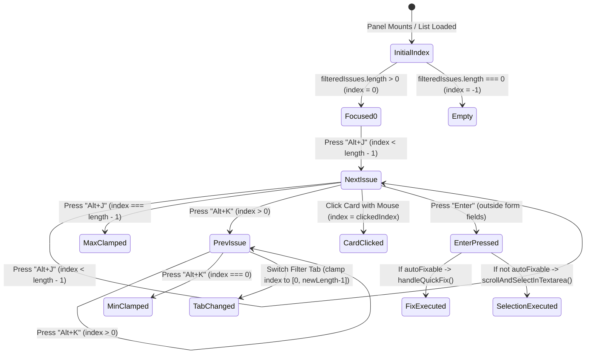

# Data Model: Keyboard Navigation and Quick Execution for Audit Issues

**Feature Branch**: `105-audit-keyboard-navigation`  
**Date**: 2026-09-11  
**Status**: Completed  

---

## 1. State Model in `UnifiedAuditPanel`

```typescript
// Index của issue đang được chọn qua phím tắt (0-indexed trong filteredIssues)
// Giá trị -1 khi danh sách rỗng hoặc chưa chọn
const [focusedIssueIndex, setFocusedIssueIndex] = useState<number>(0);

// Danh sách tham chiếu DOM tới các thẻ issue để thực hiện scrollIntoView
const cardRefs = useRef<(HTMLDivElement | null)[]>([]);
```

---

## 2. Navigation State Transitions



---

## 3. Pure Navigation Helpers

```typescript
/**
 * Tính toán index kế tiếp khi bấm Alt+J (tăng có chặn trên)
 */
export function getNextIssueIndex(currentIndex: number, totalIssues: number): number {
  if (totalIssues <= 0) return -1;
  if (currentIndex < 0) return 0;
  return Math.min(currentIndex + 1, totalIssues - 1);
}

/**
 * Tính toán index trước đó khi bấm Alt+K (giảm có chặn dưới)
 */
export function getPrevIssueIndex(currentIndex: number, totalIssues: number): number {
  if (totalIssues <= 0) return -1;
  if (currentIndex < 0) return 0;
  return Math.max(currentIndex - 1, 0);
}

/**
 * Kiểm tra xem phím Enter có được phép kích hoạt hành động hay không
 * (Tránh xung đột khi người dùng đang nhập liệu trong form / textarea)
 */
export function canTriggerAuditEnterAction(targetElement: Element | null): boolean {
  if (!targetElement) return true;
  const tagName = targetElement.tagName.toUpperCase();
  if (['INPUT', 'TEXTAREA', 'SELECT'].includes(tagName)) return false;
  if (targetElement.getAttribute('contenteditable') === 'true') return false;
  return true;
}
```
