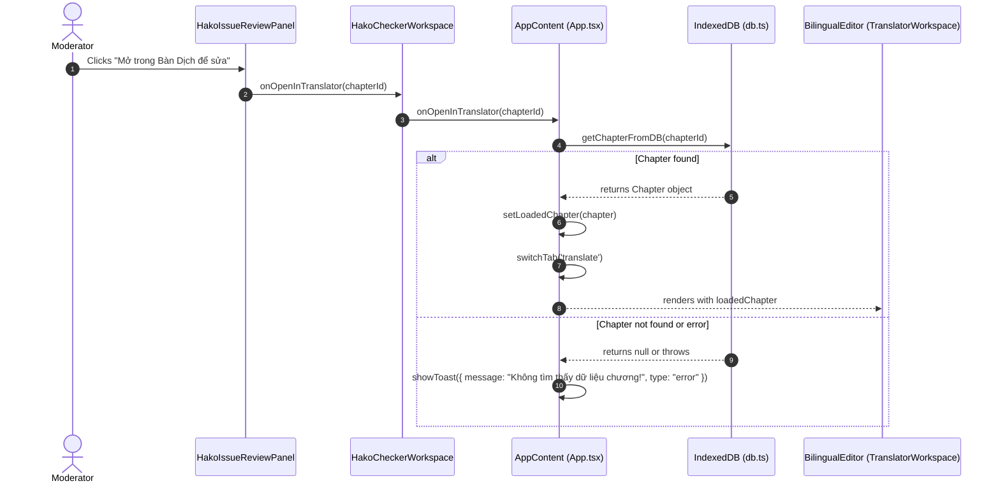

# Data Model: Direct Jump from Hako Checker to Translator

## Entities and State Definitions

### 1. Chapter (Read-only IndexedDB Entity)
Stored in IndexedDB (`CHAPTERS_STORE`). Defined in `src/types.ts`.
```typescript
export interface Chapter {
  id: string;                      // Unique identifier
  projectId: string;               // Owning project ID
  title: string;                   // Chapter title
  chapterNumber: number;           // Sequential chapter number
  sourceText: string;              // Original Chinese text
  rawTranslation?: string;         // Phase 1 translation
  polishedTranslation?: string;    // Phase 2 translation
  status?: ChapterStatus;          // 'pending' | 'translating' | 'completed' | 'error'
  createdAt: string;
  updatedAt: string;
  // ... other metadata fields
}
```

### 2. ChapterWithIssueSummary (Derived Presentation Entity in `HakoIssueReviewPanel`)
Computed client-side from `QualityReviewSession.issues` and `QualityReviewSession.chapters`.
```typescript
export interface ChapterWithIssueSummary {
  id: string;          // Chapter ID (string)
  number: number;      // Chapter sequential number
  title: string;       // Chapter title
  issueCount: number;  // Number of issues detected in this chapter
}
```

### 3. State Flow Diagram


### 4. Validation Rules
- `chapterId` MUST be a non-empty string.
- If `onOpenInTranslator` is undefined, clicking the button does nothing (no runtime crash).
- If `getChapterFromDB` returns `null`, the error toast MUST display and the tab MUST NOT switch.
