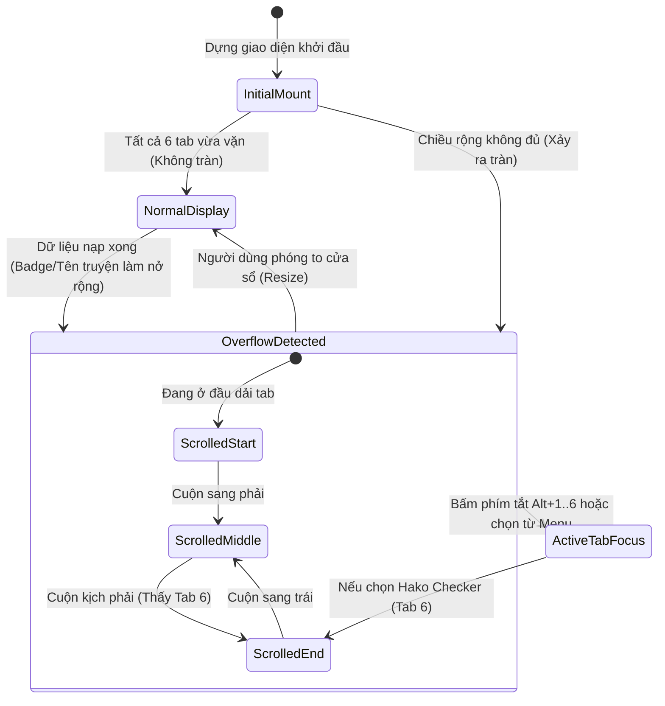

# Data Model: Workspace Navigation Bar State & Layout

**Feature**: `108-fix-hako-nav-button`
**Date**: 2026-09-11
**Status**: Completed

## 1. Entities & Data Structures

Tính năng này tập trung vào tầng giao diện trình diễn (presentation layer) của thanh điều hướng và trạng thái cuộn tràn, không làm thay đổi cấu trúc schema cơ sở dữ liệu IndexedDB.

### Entity: `WorkspaceTabItem`
Mô tả một phân vùng làm việc trong dải tab chính và menu xổ xuống "Thêm ▾".

| Thuộc tính | Kiểu dữ liệu | Bắt buộc | Ý nghĩa / Quy tắc |
| :--- | :--- | :---: | :--- |
| `key` | `'translate' \| 'auto-translate' \| 'glossary' \| 'history' \| 'projects' \| 'hako-checker'` | Có | Định danh duy nhất của phân vùng |
| `icon` | `LucideIcon` | Có | Biểu tượng đại diện từ `lucide-react` |
| `fullLabel` | `string` | Có | Tên đầy đủ bằng tiếng Việt (`t('nav.*')`) |
| `compactPrefix` | `string \| null` | Không | Tiền tố có thể ẩn trên màn hình hẹp (ví dụ: "Mặt Trận ", "Toàn Bộ") |
| `compactLabel` | `string` | Có | Phần cốt lõi của nhãn luôn hiển thị |
| `shortcut` | `string` | Có | Phím tắt kích hoạt (`'Alt+1'` đến `'Alt+6'`) |
| `badge` | `number \| null` | Không | Số lượng hiển thị trong badge (từ điển, chương, truyện) |
| `badgeTone` | `'neutral' \| 'warning' \| 'polish'` | Không | Tông màu của Badge theo chuẩn Design System |

---

### Entity: `ScrollOverflowState`
Trạng thái tính toán hình học về khả năng cuộn tràn của dải tab.

| Thuộc tính | Kiểu dữ liệu | Ý nghĩa |
| :--- | :--- | :--- |
| `canScrollLeft` | `boolean` | `true` khi người dùng đã cuộn sang phải (vị trí `scrollLeft > threshold`) |
| `canScrollRight` | `boolean` | `true` khi còn nội dung bị che khuất ở mép phải (`scrollLeft + clientWidth < scrollWidth - threshold`) |
| `hasOverflow` | `boolean` | `canScrollLeft \|\| canScrollRight` — tổng thể dải tab có bị tràn hay không |

---

## 2. Trạng Thái Giao Diện (UI State Machine)

---

## 3. Quy Tắc Xác Thực & Ràng Buộc (Invariants & Validation)

1. **Bảo toàn số lượng phân vùng**: Luôn có chính xác 6 phân vùng với thứ tự cố định: `translate` (1), `auto-translate` (2), `glossary` (3), `history` (4), `projects` (5), `hako-checker` (6).
2. **Không bóp méo nội dung**: Mọi nút tab đều bắt buộc áp dụng `shrink-0` để không bao giờ bị méo icon hay cắt đứt chữ.
3. **Menu dự phòng luôn sẵn sàng**: Khi `canScrollRight === true`, menu "Thêm ▾" và nút cuộn `ChevronRight` luôn sẵn sàng để người dùng tương tác ngay cả khi chưa chạm vào chuột cuộn.

