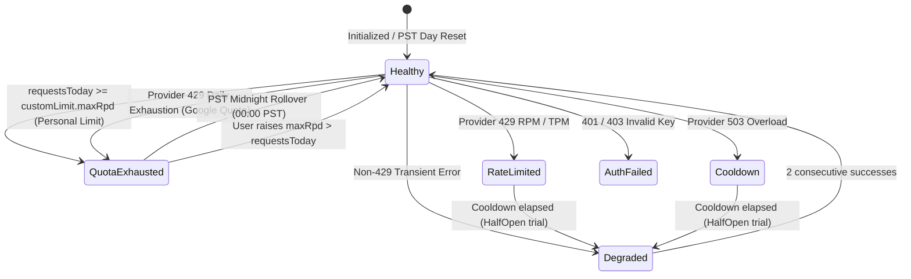

# Data Model: Enforce Personal Quota Limits & Smart Key Selection

**Feature**: `109-enforce-quota-limits`  
**Date**: 2026-09-11  

---

## 1. Entities & Types

### 1.1 CustomLimit
Represents user-configured personal thresholds per API key stored in `localStorage` under `gemini_quota_custom_limits`.

```typescript
export interface CustomLimit {
  maxRpm: number; // Maximum requests allowed per 60-second sliding window (default: 15)
  maxRpd: number; // Maximum requests allowed per PST day (default: 1500)
  maxTpm: number; // Maximum tokens allowed per 60-second sliding window (default: 1,000,000)
}
```

### 1.2 KeyHealthState (Canonical 7-State Machine)
Represents the runtime operational state of an individual API key.

```typescript
export type KeyHealthState =
  | 'Healthy'          // Ready for requests, no rate limits or errors
  | 'Degraded'         // Operating with intermittent errors or in trial recovery (HalfOpen)
  | 'RateLimited'      // Temporarily blocked by 429 RPM/TPM; waiting out short cooldown (e.g. 45s)
  | 'QuotaExhausted'   // Reached daily quota (provider 429 RPD or user-defined maxRpd reached)
  | 'AuthFailed'       // 401/403 invalid credentials; permanently disabled until fixed
  | 'Cooldown'         // 500/503 temporary overload; waiting short cooldown (e.g. 15s)
  | 'Disabled';        // Manually paused by user
```

### 1.3 KeyHealthResult
Result returned by `localQuotaTracker.getKeyHealth` when evaluating candidate keys.

```typescript
export interface KeyHealthResult {
  state: KeyHealthState;
  circuitBreaker: CircuitBreakerStatus;
  cooldownRemainingMs: number;
  transitionReason?: string;
  isAvailable: boolean;
  isCustomLimitReached?: boolean; // True if key is blocked specifically due to personal maxRpd/maxRpm
}
```

### 1.4 KeyQuotaFullSnapshot (Augmented)
Extends snapshot representation consumed by UI components to explicitly indicate personal limit enforcement.

```typescript
export interface KeyQuotaFullSnapshot {
  index: number;
  keyHash: string;
  maskedKey: string;
  requestsTotal: number;
  requestsToday: number;
  requestsThisMinute: number;
  errorsTotal: number;
  tokensTotal: number;
  tokensToday: number;
  tokensThisMinute: number;
  healthState: KeyHealthState;
  transitionReason?: string;
  isCustomLimitReached?: boolean;
  circuitBreakerState: CircuitBreakerStatus;
  cooldownRemainingMs: number;
  lastRequestTimestamp?: number;
  byModel: Record<string, ModelUsageStats>;
  runtime: KeyRuntimeStatus;
}
```

---

## 2. State Transitions & Validation Rules



### Validation Rules:
1. **Personal Daily Ceiling Rule**: A key MUST be marked unavailable (`isAvailable = false`) whenever `requestsToday >= customLimit.maxRpd`.
2. **Pre-Dispatch Filter Rule**: No network `fetch` can be dispatched to an API key if `isAvailable === false`.
3. **Non-Blame Rule for Pre-Filtered Keys**: When a key is skipped due to `isAvailable === false`, its `errorsTotal`, `consecutiveErrors`, and `failedAttemptsToday` MUST remain untouched.
4. **PST Reset Rule**: When the current day in `America/Los_Angeles` changes, `requestsToday`, `tokensToday`, and personal limit exhaustion reset immediately to 0.
