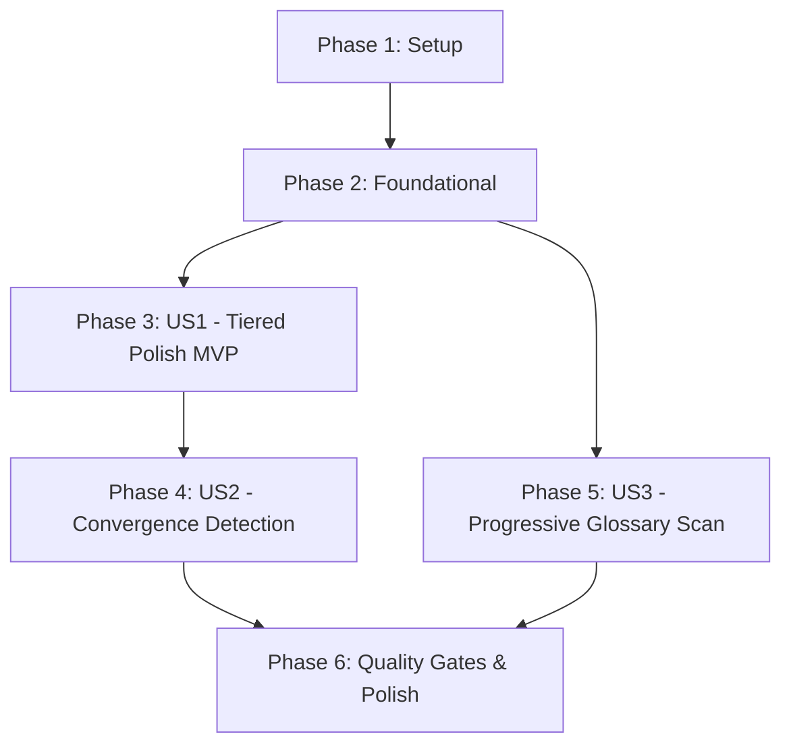

# Tasks: Fix Iterative Polish Cache Bypass

**Feature**: `111-fix-iterative-polish-cache`  
**Spec**: [specs/111-fix-iterative-polish-cache/spec.md](file:///e:/tailieuhoctap/laptrinhnangcao/th/merged/specs/111-fix-iterative-polish-cache/spec.md)  
**Plan**: [specs/111-fix-iterative-polish-cache/plan.md](file:///e:/tailieuhoctap/laptrinhnangcao/th/merged/specs/111-fix-iterative-polish-cache/plan.md)

---

## Phase 1: Setup (Shared Infrastructure)

**Purpose**: Xác minh trạng thái ban đầu của mã nguồn và đồng bộ cấu trúc tài liệu

- [X] T001 Verify existing test suite baseline by running `npm test` and `npm run lint`
- [X] T002 [P] Review and export contracts from `specs/111-fix-iterative-polish-cache/contracts/polish-strategy.contract.ts`

---

## Phase 2: Foundational (Blocking Prerequisites)

**Purpose**: Cung cấp các hàm thuật toán cốt lõi (tính độ tương đồng văn bản Dice bigram và 5 tầng chiến lược chuốt văn) trước khi tích hợp vào engine và pipeline

⚠️ **CRITICAL**: Toàn bộ User Stories phụ thuộc vào các hàm nền tảng này

- [X] T003 Implement `getPolishStrategyForRound` (5 tiered strategies: Round 1..5) in `src/lib/text.ts`
- [X] T004 [P] Implement `calculateTextSimilarity` and `isTextConverged` (Dice coefficient on word bigrams) in `src/lib/text.ts`
- [X] T005 [P] Add unit tests for `getPolishStrategyForRound` and `calculateTextSimilarity` in `src/lib/__tests__/text.test.ts`

**Checkpoint**: Nền tảng thuật toán hoàn thiện và có unit test bao phủ — sẵn sàng tích hợp vào User Stories.

---

## Phase 3: User Story 1 - Vòng chuốt lặp thực sự cải thiện văn phong qua mỗi lần (Priority: P1) 🎯 MVP

**Goal**: Khi người dùng chọn từ 2 đến 5 vòng chuốt văn phong, mỗi vòng lặp gửi prompt riêng biệt với chỉ thị biên tập phân tầng, nhãn đầu vào động tương ứng với kết quả vòng trước, và dynamic temperature (0.40 → 0.65) để triệt tiêu hiện tượng "cache giả".

**Independent Test**: Gọi `polishTranslationDirect` với `roundIndex = 2`, kiểm tra payload gửi tới Gemini API có tiêu đề `[BẢN DỊCH ĐÃ BIÊN TẬP LƯỢT 1]`, chỉ đạo biên tập giai đoạn 2 (Nhịp điệu & Thuần Việt), và `temperature = 0.50`.

### Implementation for User Story 1

- [X] T006 [US1] Update `buildPolishTranslationPayload` in `src/services/ai/prompts.ts` to accept `roundIndex` and `totalRounds`, injecting tiered directives and dynamic input labels (`[BẢN DỊCH THÔ BAN ĐẦU]` vs `[BẢN DỊCH ĐÃ BIÊN TẬP LƯỢT N]`)
- [X] T007 [US1] Update `polishTranslationDirect` in `src/services/directTranslationEngine.ts` to accept `roundIndex`, `totalRounds`, and dynamic `temperature` based on `getPolishStrategyForRound`
- [X] T008 [US1] Update `executeSingleChapterTranslation` in `src/services/chapterTranslationService.ts` to pass `roundIndex = j`, `totalRounds = polishCycles`, and log the current polishing stage name (e.g. `[Cơ bản]`, `[Nhịp điệu]`, `[Nhân vật]`)
- [X] T009 [P] [US1] Update `handlePolishTranslation` in `src/hooks/useWorkspaceState.ts` to polish upon existing `polishedTranslation` (if present) instead of always resetting to `rawTranslation`
- [X] T010 [P] [US1] Add unit tests for `buildPolishTranslationPayload` and `polishTranslationDirect` with roundIndex in `src/services/__tests__/directTranslationEngine.test.ts`

**Checkpoint**: User Story 1 hoàn thành — các vòng chuốt lặp hoạt động độc lập và mang lại sự cải thiện văn phong thực sự qua mỗi lượt.

---

## Phase 4: User Story 2 - Phát hiện hội tụ tự động (Convergence Detection) (Priority: P2)

**Goal**: Khi bản dịch giữa vòng N và vòng N-1 có độ tương đồng $\ge 96\%$, tự động dừng sớm vòng chuốt, ghi log thông báo tiết kiệm lượt gọi API cho người dùng.

**Independent Test**: Chạy `executeSingleChapterTranslation` với mock AI trả về bản dịch gần giống nhau ở vòng 2; xác nhận vòng lặp dừng ngay tại vòng 2 và không gọi tiếp vòng 3, ghi log `[Hội tụ]`.

### Implementation for User Story 2

- [X] T011 [US2] Integrate `calculateTextSimilarity` inside the polishing loop of `executeSingleChapterTranslation` in `src/services/chapterTranslationService.ts` to compare `currentTextToPolish` with previous round output
- [X] T012 [US2] Add convergence logging (diff percentage, changed words, early termination notice) and break out of loop in `src/services/chapterTranslationService.ts`
- [X] T013 [P] [US2] Add unit test for convergence early termination in `src/services/__tests__/chapterTranslationService.test.ts`

**Checkpoint**: User Stories 1 & 2 hoàn thành — chuỗi lặp vừa nâng cấp chất lượng vừa tự động tối ưu hóa hạn mức API khi đạt độ bão hòa.

---

## Phase 5: User Story 3 - Vòng lặp quét thuật ngữ khám phá thuật ngữ mới (Priority: P2)

**Goal**: Khắc phục hiện tượng quét thuật ngữ nhiều vòng bị lặp lại kết quả cũ bằng cách truyền danh sách thuật ngữ đã tìm thấy từ các vòng trước vào prompt để AI loại trừ và tập trung tìm các thực thể bị sót.

**Independent Test**: Gọi `analyzeGlossaryDirect` với `knownChineseTerms: ['萧炎', '乌坦城']`, xác nhận prompt gửi đi có danh sách loại trừ và chỉ thị quét sâu, kèm temperature nâng từ 0.2 lên 0.35/0.45.

### Implementation for User Story 3

- [X] T014 [US3] Update `buildAnalyzeGlossaryPayload` in `src/services/ai/prompts.ts` and `buildEntityExtractionInstruction` in `src/services/ai/glossaryPrompts.ts` to accept `knownChineseTerms`, `loopIndex`, `totalLoops` and inject exclusion instructions
- [X] T015 [US3] Update `analyzeGlossaryDirect` and `callGlossaryAnalysisDirect` in `src/services/directGlossaryEngine.ts` to accept `knownChineseTerms`, `loopIndex`, `totalLoops` and pass progressive temperature (0.2 → 0.35 → 0.45)
- [X] T016 [US3] Update `useGlossaryScan.ts` loop to accumulate discovered Chinese terms and pass `knownChineseTerms: updatedGlossary.map(g => g.chinese)` into `analyzeGlossaryDirect` for loops `loop > 1`
- [X] T017 [P] [US3] Add unit tests for progressive glossary scan with excluded terms in `src/services/__tests__/directGlossaryEngine.test.ts` and `src/hooks/__tests__/useGlossaryScan.test.ts`

**Checkpoint**: Tất cả 3 User Stories hoàn thành và có thể kiểm thử độc lập.

---

## Phase 6: Polish & Cross-Cutting Concerns

**Purpose**: Đảm bảo toàn bộ tiêu chuẩn chất lượng của Hiến pháp dự án (Principle I & V)

- [X] T018 [P] Run full test suite via `npm test` and verify 100% pass status across all unit tests
- [X] T019 Run type check via `npm run lint` (`tsc --noEmit`) and verify zero type errors
- [X] T020 Run production build via `npm run build` (`tsc && vite build`) and ensure bundle builds cleanly
- [X] T021 Execute manual validation scenarios outlined in `specs/111-fix-iterative-polish-cache/quickstart.md`

---

## Dependencies & Execution Order

### Phase Dependencies

- **Phase 1 (Setup)**: Không phụ thuộc — chạy đầu tiên.
- **Phase 2 (Foundational)**: Phụ thuộc Phase 1 — **BLOCKS** toàn bộ User Stories.
- **Phase 3 (User Story 1 - MVP)**: Phụ thuộc Phase 2 — có thể triển khai và bàn giao độc lập.
- **Phase 4 (User Story 2)**: Phụ thuộc Phase 3 (tích hợp trực tiếp vào vòng lặp chuốt).
- **Phase 5 (User Story 3)**: Phụ thuộc Phase 2 — có thể chạy song song với Phase 3 & 4.
- **Phase 6 (Polish)**: Chạy sau khi hoàn thành các User Stories đã chọn.

### Parallel Opportunities

- `T002`, `T004`, `T005` trong Phase 1 & 2 có thể thực thi song song.
- `T009` (workspace editor) và `T010` (test engine) có thể thực thi song song trong Phase 3.
- Phase 5 (Quét thuật ngữ) và Phase 4 (Phát hiện hội tụ chuốt văn) tác động lên 2 module độc lập (`directGlossaryEngine.ts` vs `chapterTranslationService.ts`), có thể phát triển song song.

---

## Implementation Strategy

### MVP First (User Story 1 Only)
1. Hoàn thành Phase 1 & Phase 2.
2. Hoàn thành Phase 3 (User Story 1).
3. **STOP & VALIDATE**: Kiểm tra chuốt văn 2-3 vòng tạo ra prompt khác biệt và văn phong cải thiện rõ rệt. Đạt chuẩn MVP!

### Incremental Delivery
1. Foundation (Phase 1, 2) → Sẵn sàng nền tảng tính tương đồng và 5 cấp độ chiến lược.
2. User Story 1 (Phase 3) → Khắc phục lỗi lặp prompt chuốt văn học.
3. User Story 2 (Phase 4) → Tự động dừng sớm khi bản dịch hội tụ ($\ge 96\%$).
4. User Story 3 (Phase 5) → Khắc phục lỗi lặp trong quét thuật ngữ nhiều vòng.
5. Quality Gates (Phase 6) → `npm run lint` + `npm test` + `npm run build`.
