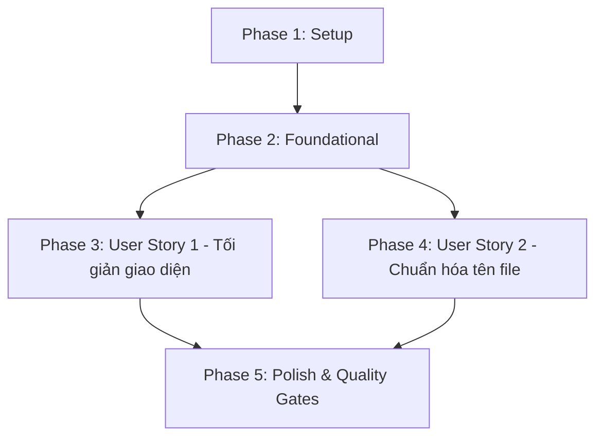

# Tasks: Tối Giản Xuất Tệp .TXT và Chuẩn Hóa Tên File Dễ Hiểu

**Feature**: `112-simplify-txt-export`  
**Spec**: [specs/112-simplify-txt-export/spec.md](file:///e:/tailieuhoctap/laptrinhnangcao/th/merged/specs/112-simplify-txt-export/spec.md)  
**Plan**: [specs/112-simplify-txt-export/plan.md](file:///e:/tailieuhoctap/laptrinhnangcao/th/merged/specs/112-simplify-txt-export/plan.md)

---

## Phase 1: Setup (Shared Infrastructure)

**Purpose**: Xác minh trạng thái ban đầu của mã nguồn và đồng bộ tài liệu giao ước

- [X] T001 Verify existing test suite baseline by running `npm test` and `npm run lint`
- [X] T002 [P] Review interface contracts in `specs/112-simplify-txt-export/contracts/export-files.contract.ts`

---

## Phase 2: Foundational (Blocking Prerequisites)

**Purpose**: Cung cấp kiểu dữ liệu chuẩn và hàm helper sinh tên file chuẩn hóa trước khi tích hợp vào Hook và Giao diện

⚠️ **CRITICAL**: Toàn bộ User Stories phụ thuộc vào các định nghĩa nền tảng này

- [X] T003 Update `ExportMode` type definition to `'web' | 'audio'` in `src/utils/exportFormatter.ts`
- [X] T004 [P] Implement `formatExportTxtFileName` helper function in `src/utils/exportFormatter.ts` supporting multi-chapter range (`Chuong_001_den_Chuong_020`), single-chapter (`Chuong_001`), padding 3 chữ số, và mode suffixes
- [X] T005 [P] Add unit tests for `formatExportTxtFileName` in `src/utils/__tests__/exportFormatter.test.ts`

**Checkpoint**: Nền tảng sinh tên file hoàn thiện và có unit test bao phủ 100% — sẵn sàng tích hợp vào User Stories.

---

## Phase 3: User Story 1 - Tối giản giao diện và quy trình xuất file (Priority: P1) 🎯 MVP

**Goal**: Bảng điều khiển "Sản xuất tập tin kết quả sau dịch" chỉ hiển thị 2 tùy chọn ("Web Truyện" và "Làm Audio") chia đều 2 cột, loại bỏ hoàn toàn nút "Gióng hàng FT", khối mô tả JSONL và nút xuất JSONL.

**Independent Test**: Mở bảng điều khiển xuất file, xác nhận giao diện có 2 cột cân đối, không còn nút "Gióng hàng FT", nút hành động chính luôn là "Bắt đầu xuất tải tệp .TXT sỉ".

### Implementation for User Story 1

- [X] T006 [US1] Update `ExportFilesPanelProps` in `src/components/auto-translator/ExportFilesPanel.tsx` to remove `handleExportAlignJsonl` and use `exportMode: 'web' | 'audio'`
- [X] T007 [US1] Restructure mode selection buttons in `src/components/auto-translator/ExportFilesPanel.tsx` to 2 columns (`grid-cols-2`), removing the "Gióng hàng FT" button, JSONL description block, and JSONL export button logic
- [X] T008 [US1] Update `exportMode` state type and handler in `src/components/AutoTranslator.tsx` and remove passing `handleExportAlignJsonl` to `ExportFilesPanel`

**Checkpoint**: User Story 1 hoàn thành — giao diện xuất file gọn gàng, trực quan và không còn thành phần gióng hàng FT.

---

## Phase 4: User Story 2 - Đặt tên file xuất thân thiện và dễ hiểu (Priority: P1) 🎯 MVP

**Goal**: Các tệp văn bản .TXT trong file nén xuất ra có tên theo định dạng số thứ tự chương chuẩn 3 chữ số có từ nối `_den_` (ví dụ: `{Tên_truyện}_Chuong_001_den_Chuong_020_WEB.txt` cho đa chương, `{Tên_truyện}_Chuong_001_WEB.txt` cho đơn chương), loại bỏ 100% tên chương tiếng Trung gốc.

**Independent Test**: Xuất file truyện ở chế độ Web và Audio với các mức gom chương khác nhau (1 chương/file, 10 chương/file) và khoảng chương tùy chọn (từ 21 đến 35). Mở file zip và kiểm tra tên các tệp bên trong không chứa ký tự tiếng Trung, hiển thị đúng số thứ tự tuyệt đối của chương.

### Implementation for User Story 2

- [X] T009 [US2] Update `UseExportFilesProps` in `src/hooks/useExportFiles.ts` to use `exportMode: 'web' | 'audio'`, remove `handleExportAlignJsonl`, and remove unused `alignChapterDirect` import
- [X] T010 [US2] Integrate `formatExportTxtFileName` into `handleExportTxt` in `src/hooks/useExportFiles.ts` to compute canonical 1-based project chapter indices and format export filenames
- [X] T011 [US2] Pass canonical project chapter index to `formattedInputs` in `src/hooks/useExportFiles.ts` so chapter bodies preserve accurate numbering when range filters are applied
- [X] T012 [P] [US2] Update `exportMode` prop in `src/hooks/useAutoTranslationQueue.ts` to reflect `'web' | 'audio'`
- [X] T013 [P] [US2] Update `src/hooks/__tests__/useExportFiles.test.ts` to verify updated mock props and ensure `handleExportTxt` functions properly while `handleExportAlignJsonl` is cleanly removed

**Checkpoint**: User Story 2 hoàn thành — tên file xuất sạch sẽ, chuyên nghiệp, dễ hiểu và sắp xếp hoàn hảo trên hệ điều hành.

---

## Phase 5: Polish & Cross-Cutting Concerns

**Purpose**: Đảm bảo toàn bộ tiêu chuẩn chất lượng của Hiến pháp dự án (Principle I & V)

- [X] T014 [P] Run type check via `npm run lint` (`tsc --noEmit`) and verify zero type errors
- [X] T015 [P] Run full test suite via `npm test` (`vitest run`) and verify all tests pass cleanly
- [X] T016 Run production build via `npm run build` (`tsc && vite build`) and ensure bundle builds cleanly
- [X] T017 Execute manual validation scenarios outlined in `specs/112-simplify-txt-export/quickstart.md`

---

## Dependencies & Execution Order

### Phase Dependencies



### User Story Dependencies

- **User Story 1 (P1)**: Phụ thuộc vào Phase 2 (Cập nhật `ExportMode`). Có thể thực hiện song song hoặc trước User Story 2.
- **User Story 2 (P1)**: Phụ thuộc vào Phase 2 (`formatExportTxtFileName`). Tích hợp vào `useExportFiles.ts`.

### Parallel Opportunities

- T001, T002 có thể chạy song song trong Phase 1.
- T004 (`formatExportTxtFileName`) và T005 (unit test cho helper) có thể phát triển song song theo chuẩn TDD trong Phase 2.
- T006, T007 trong Phase 3 và T009, T010 trong Phase 4 tác động trên các tệp độc lập (`ExportFilesPanel.tsx` vs `useExportFiles.ts`).
- T012, T013 có thể chạy song song với T011.
- T014 (`npm run lint`) và T015 (`npm test`) có thể chạy song song trong Phase 5.

---

## Parallel Example: Foundational & User Stories

```bash
# Xây dựng helper và test case song song:
Task: "Implement formatExportTxtFileName helper function in src/utils/exportFormatter.ts"
Task: "Add unit tests for formatExportTxtFileName in src/utils/__tests__/exportFormatter.test.ts"

# Cập nhật View và Controller song song:
Task: "Restructure mode selection buttons in src/components/auto-translator/ExportFilesPanel.tsx"
Task: "Integrate formatExportTxtFileName into handleExportTxt in src/hooks/useExportFiles.ts"
```

---

## Implementation Strategy

### MVP First (User Story 1 & 2 Combined Delivery)

1. Hoàn thành Phase 1 & 2: Tạo helper `formatExportTxtFileName` và kiểm thử unit test.
2. Hoàn thành Phase 3: Thu gọn giao diện `ExportFilesPanel.tsx` về 2 cột, bỏ nút FT.
3. Hoàn thành Phase 4: Nâng cấp `useExportFiles.ts` sinh tên file theo STT, dọn dẹp logic FT.
4. Hoàn thành Phase 5: Chạy full test, lint, build kiểm tra chất lượng.
