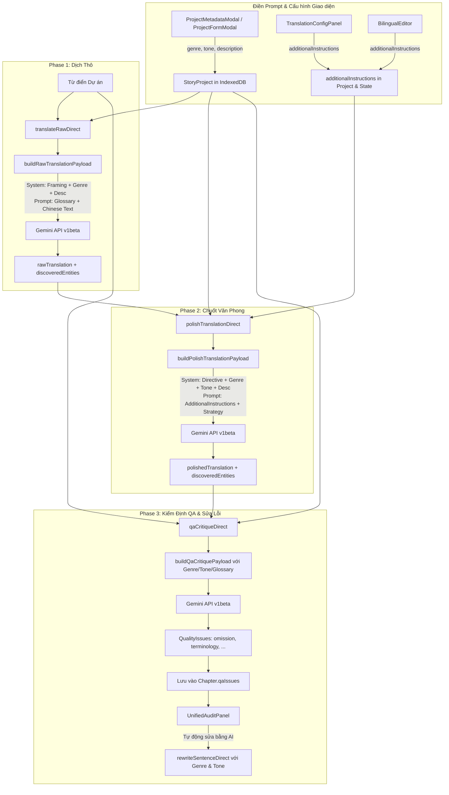

# Data Model: Toàn Diện Rà Soát & Đồng Bộ Luồng Prompt Pipeline

**Feature Branch**: `113-verify-prompt-pipeline`  
**Date**: 2026-09-12  
**Status**: Completed  

---

## 1. Entities & Type Extensions

### 1.1 `StoryProject` (Tập tin dự án truyện trong IndexedDB)

Mở rộng cấu trúc `StoryProject` trong `src/types.ts` để lưu trữ bền bỉ chỉ thị biên tập đặc thù:

```typescript
export interface StoryProject {
    id: string;
    title: string;
    author: string;
    genre: string;                          // Thể loại chính (ví dụ: "Tiên Hiệp", "Linh Dị / Thần Quái", ...)
    tone: string;                           // Tông giọng biên dịch (ví dụ: "Dịch thuần Việt mượt mà", "Kịch tính ly kỳ", ...)
    description: string;                    // Giới thiệu tóm tắt & Nguyên tắc xưng hô, phong cách dịch
    glossary: GlossaryItem[];               // Danh mục từ điển đã duyệt
    pendingGlossary: PendingGlossaryItem[];  // Hàng đợi từ điển nghi vấn / cần xác minh
    chapters: ChapterMetadata[];            // Danh sách siêu dữ liệu các chương
    createdAt: string;
    updatedAt?: string;
    
    // Thuộc tính mở rộng cho prompt pipeline
    additionalInstructions?: string;        // Hướng dẫn bổ sung khi chuốt văn/biên tập (lưu bền vững per-project)
    
    // Các trường hiện hữu khác giữ nguyên (driveFolderId, translationQueueState, ...)
}
```

### 1.2 `Chapter` (Thực thể chương truyện đầy đủ trong IndexedDB)

Mở rộng cấu trúc `Chapter` trong `src/types.ts` để lưu trữ danh sách vấn đề phát hiện từ khâu kiểm duyệt:

```typescript
export interface Chapter {
    id: string;
    title: string;
    projectId?: string;
    sourceText: string;
    processedSourceText?: string;
    rawTranslation: string;
    polishedTranslation: string;
    paragraphs: string[];
    translatedLines: string[];
    status: ChapterStatus;
    createdAt: string;
    updatedAt: string;
    
    // Thuộc tính mở rộng lưu vết kiểm định chất lượng
    qaIssues?: DirectQaCritiqueIssue[];     // Danh sách lỗi phát hiện từ QA Critique (lưu sau dịch tự động)
}
```

---

## 2. Service Interfaces & Payload Signatures

### 2.1 `BuildRawTranslationPromptParams` (Giai đoạn 1: Dịch thô)

```typescript
export interface BuildRawTranslationPromptParams {
    text: string;                           // Văn bản tiếng Trung gốc
    genre: string;                          // Thể loại truyện
    tone: string;                           // Tông giọng dịch
    description?: string;                   // Quy tắc dịch & xưng hô
    glossary?: GlossaryItem[];              // Bảng từ điển (BẮT BUỘC duy trì kể cả khi đã thế trước)
}
```

### 2.2 `BuildPolishTranslationPromptParams` (Giai đoạn 2: Chuốt văn phong)

```typescript
export interface BuildPolishTranslationPromptParams {
    sourceText: string;                     // Bản gốc tiếng Trung đối chiếu
    rawTranslation: string;                 // Bản dịch thô cần chuốt
    genre: string;                          // Thể loại truyện
    tone: string;                           // Tông giọng biên dịch
    description?: string;                   // Quy tắc dịch & xưng hô (BẮT BUỘC đưa vào systemInstruction)
    glossary?: GlossaryItem[];              // Bảng từ điển đối chiếu
    additionalInstructions?: string;        // Yêu cầu bổ sung từ người dùng
    isExtractionEnabled?: boolean;          // Bật rà soát từ vựng mới
    roundIndex?: number;                    // Lượt chuốt hiện tại (1..5)
    totalRounds?: number;                   // Tổng số lượt chuốt
}
```

### 2.3 `BuildQaCritiquePromptParams` (Giai đoạn 3: Kiểm duyệt chất lượng)

Nâng cấp nhận diện bối cảnh truyện để thẩm định chuẩn xác:

```typescript
export interface BuildQaCritiquePromptParams {
    sourceText: string;                     // Văn bản tiếng Trung gốc
    translatedText: string;                 // Bản dịch tiếng Việt hoàn thiện cần kiểm định
    genre?: string;                         // Thể loại truyện (tùy chọn nhưng khuyến nghị)
    tone?: string;                          // Tông giọng biên dịch
    description?: string;                   // Quy tắc xưng hô & phong cách dịch
    glossary?: GlossaryItem[];              // Bảng từ điển đối chiếu lỗi terminology
}
```

### 2.4 `DirectRewriteSentenceParams` (Viết lại câu mục tiêu)

Bổ sung tham số phong cách văn học vào yêu cầu viết lại câu:

```typescript
export interface DirectRewriteSentenceParams {
    targetText: string;                     // Câu/đoạn trích bị lỗi
    context?: string;                       // Ngữ cảnh các câu xung quanh
    issueMessage?: string;                  // Góp ý từ khâu kiểm định
    genre?: string;                         // Thể loại truyện để giữ phong vị
    tone?: string;                          // Tông giọng để câu viết lại đồng điệu
    apiKeys: string[];                      // Danh sách API Key cá nhân
    model?: string;                         // Mã mô hình Gemini
    startKeyIndex?: number;
    signal?: AbortSignal;
}
```

---

## 3. State Flow & Lifecycle Diagram


