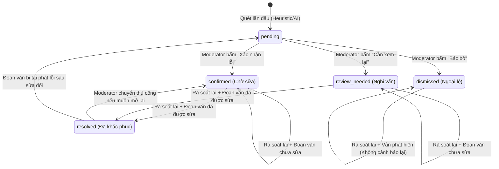

# Phase 1 Data Model: Rà Soát Lại Có Ghi Nhớ Quyết Định Kiểm Định (Smart Re-audit)

## 1. Entities & Types

### 1.1 QualityIssueDecision (Enum / Union Type)
Tập hợp các trạng thái quyết định của một lỗi kiểm định:

```typescript
export type QualityIssueDecision =
  | 'pending'        // Chờ moderator xem xét (mặc định cho lỗi mới)
  | 'confirmed'      // Moderator xác nhận là lỗi cần sửa
  | 'review_needed'  // Moderator đánh dấu cần hội ý thêm
  | 'dismissed'      // Moderator bác bỏ / bỏ qua (ngoại lệ hợp lệ)
  | 'resolved';      // Lỗi đã được khắc phục thành công sau khi sửa bản dịch
```

### 1.2 QualityIssue (Model Interface)
Thực thể đại diện cho một lỗi kiểm định:

```typescript
export interface QualityIssue {
  id: string;                      // UUID định danh lỗi
  chapterId: string;               // ID chương chứa lỗi
  chapterTitle: string;            // Tiêu đề chương
  chapterNumber: number;           // Số thứ tự chương
  category: QualityIssueCategory;  // Phân loại lỗi
  severity: QualityIssueSeverity;  // Mức độ nghiêm trọng
  vietnameseSnippet: string;       // Đoạn trích văn bản tiếng Việt làm bằng chứng
  rawSnippet?: string;             // Đoạn trích raw tiếng Trung đối ứng (nếu có)
  explanation: string;             // Lời giải thích lý do nghi ngờ lỗi
  suggestedFix?: string;           // Gợi ý cách sửa
  decision: QualityIssueDecision;  // Trạng thái quyết định của moderator
  moderatorNote?: string;          // Ghi chú của moderator
  detectedBy: 'heuristic' | 'ai';  // Nguồn phát hiện (quy tắc hoặc Gemini AI)
  createdAt: string;               // Thời điểm phát hiện lần đầu (ISO string)
  resolvedAt?: string;             // Thời điểm xác định đã giải quyết (ISO string)
  isNew?: boolean;                 // Cờ đánh dấu lỗi mới phát sinh sau đợt rà soát lại
}
```

### 1.3 ReauditDiffSummary
Tổng kết biến động giữa 2 lần kiểm định:

```typescript
export interface ReauditDiffSummary {
  resolvedCount: number;    // Số lỗi đã được khắc phục (chuyển sang resolved)
  unresolvedCount: number;  // Số lỗi đã xác nhận nhưng vẫn còn tồn tại
  dismissedCount: number;   // Số lỗi đã bác bỏ được bảo toàn
  newCount: number;          // Số lỗi mới phát sinh được phát hiện
  totalCurrent: number;     // Tổng số lỗi còn hoạt động (chưa giải quyết)
}
```

### 1.4 QualityReportStats
Cập nhật thống kê báo cáo:

```typescript
export interface QualityReportStats {
  totalIssues: number;
  confirmedCount: number;
  reviewNeededCount: number;
  dismissedCount: number;
  pendingCount: number;
  resolvedCount: number;
  bySeverity: Record<QualityIssueSeverity, number>;
  byCategory: Record<QualityIssueCategory, number>;
}
```

---

## 2. State Machine: Vòng Đời Quyết Định Kiểm Định



---

## 3. Quy Tắc Toàn Vẹn Dữ Liệu (Validation Rules)

1. **Bảo toàn ID lỗi**: Khi một lỗi được so khớp qua `fingerprint` giữa lần quét cũ và mới, `id` của lỗi cũ PHẢI được giữ nguyên để bảo đảm tính liên tục của dữ liệu.
2. **Bảo toàn ghi chú**: `moderatorNote` của lỗi cũ KHÔNG BAO GIỜ bị ghi đè thành chuỗi rỗng khi chạy lại phân tích.
3. **Phạm vi đối chiếu theo chương**: Việc hòa giải quyết định chỉ áp dụng cho các chương nằm trong danh sách được quét (`scannedChapterIds`). Lỗi thuộc các chương khác trong cùng dự án (nếu có) được giữ nguyên vẹn.
4. **Tính nhất quán của bộ lọc**: Bộ lọc danh sách lỗi theo quyết định phải hỗ trợ đầy đủ 5 trạng thái: Tất cả (`all`), Đã xác nhận (`confirmed`), Cần xem lại (`review_needed`), Đã khắc phục (`resolved`), Đã bỏ qua (`dismissed`), Chờ duyệt (`pending`).

