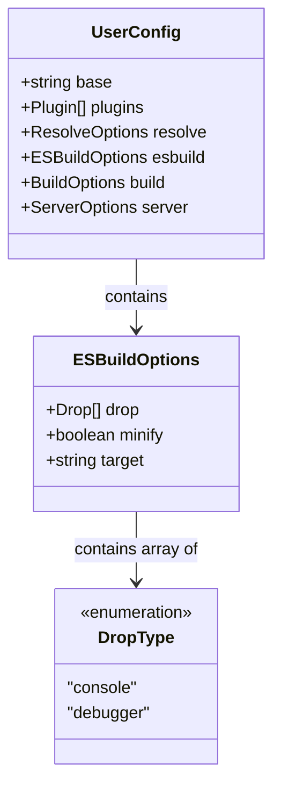

# Data Model: Cấu Hình Bản Dựng Vite & Kiểu Dữ Liệu Esbuild Drop (116-fix-vite-esbuild-drop)

**Feature**: `116-fix-vite-esbuild-drop`  
**Date**: 2026-09-12  
**Status**: Completed  

---

## 1. Khái Niệm Thực Thể (Entity Concepts)

Tính năng này là cấu hình công cụ build tĩnh (build configuration) trong môi trường phát triển và CI/CD. Cấu trúc kiểu dữ liệu phản ánh trực tiếp hợp đồng giữa Vite `UserConfig` và tùy chọn biên dịch `esbuild`.

### Sơ Đồ Thực Thể Kiểu Dữ Liệu (TypeScript Types)



---

## 2. Định Nghĩa Kiểu Chi Tiết (Type Definitions)

### 2.1 Kiểu Drop
Được định nghĩa trong `esbuild`:
```ts
export type Drop = 'console' | 'debugger';
```

### 2.2 Kiểu Cấu Hình `esbuild` trong Vite
```ts
export interface ESBuildOptions {
  drop?: Drop[];
  // các thuộc tính khác...
}
```

### 2.3 Thực Thể Cấu Hình Giá Trị Theo Môi Trường (Environment State Mapping)

| Trạng thái Môi trường (`NODE_ENV`) | Giá trị `drop` dự kiến | Kiểu dữ liệu TypeScript suy luận | Kết quả kiểm tra kiểu |
|---|---|---|---|
| `'production'` | `['console', 'debugger']` | `('console' | 'debugger')[]` | ✅ Hợp lệ với `Drop[]` |
| `'development'` | `[]` | `('console' | 'debugger')[]` | ✅ Hợp lệ với `Drop[]` |
| `'test'` hoặc `undefined` | `[]` | `('console' | 'debugger')[]` | ✅ Hợp lệ với `Drop[]` |

---

## 3. Quy Tắc Xác Thực (Validation Rules)

1. **Tính Bất Biến Về Hành Vi (Behavior Invariance)**:
   - Khi `NODE_ENV === 'production'`: Trình đóng gói esbuild loại bỏ các lệnh gọi `console.*` và các câu lệnh `debugger`.
   - Khi `NODE_ENV !== 'production'`: Không loại bỏ log hay breakpoint nhằm hỗ trợ gỡ lỗi.
2. **Tính Tương Thích Kiểu (Type Safety)**:
   - Thuộc tính `esbuild.drop` không được nới lỏng thành `string[]`.
   - Phải khớp hoàn toàn với định nghĩa `Drop[]` trong định dạng kiểu của Vite.
