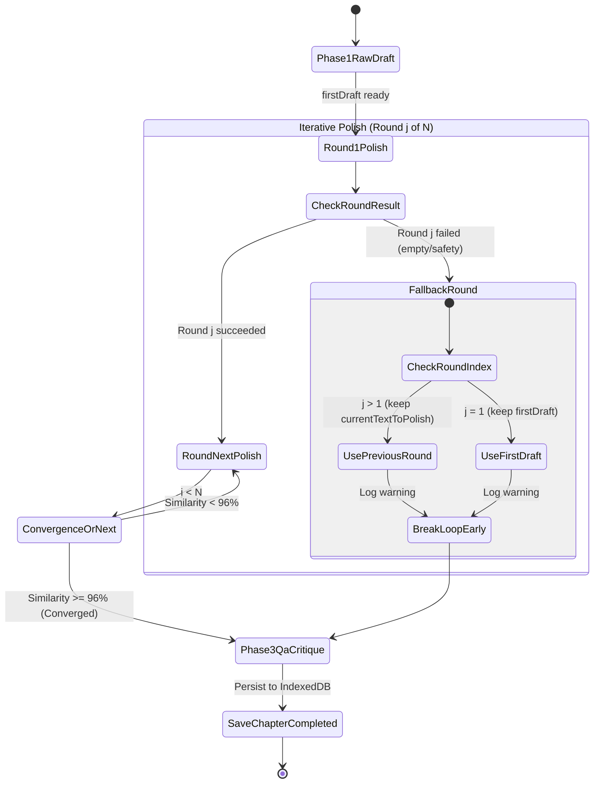
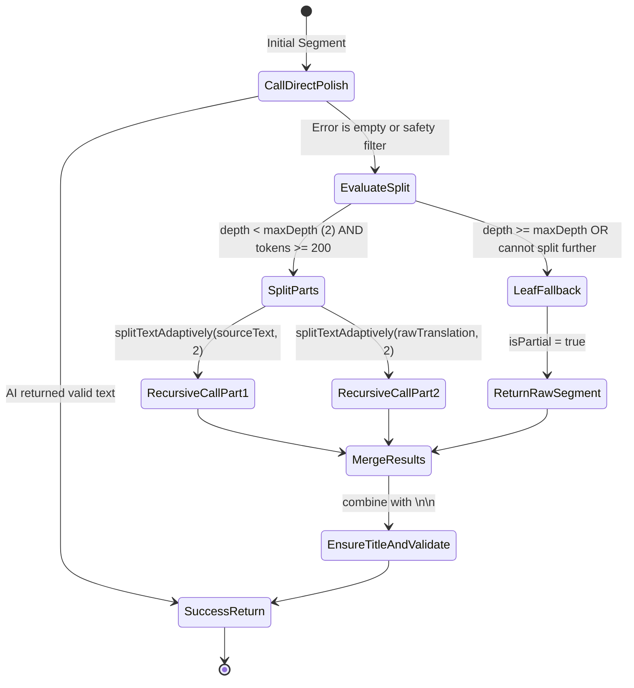

# Data Model: Recursive Divide & Conquer Polish and Empty Response Resilience

## Entities & Type Definitions

### 1. `DirectPolishTranslationResult` (Extension)

Location: `src/services/directTranslationEngine.ts`

```typescript
export interface DirectPolishTranslationResult {
  polishedTranslation: string;
  discoveredEntities?: any[];
  successKeyIndex: number;
  isPartial?: boolean; // Flag indicating one or more sub-segments used raw/previous text fallback
}
```

### 2. `PolishWithContentSplitParams`

Internal helper parameters for recursive polishing:

```typescript
interface PolishWithContentSplitParams extends DirectPolishTranslationParams {
  depth?: number;
  maxDepth?: number;
}
```

### 3. Iterative Polish Execution Flow State Machine



### 4. Recursive Divide & Conquer State Machine


