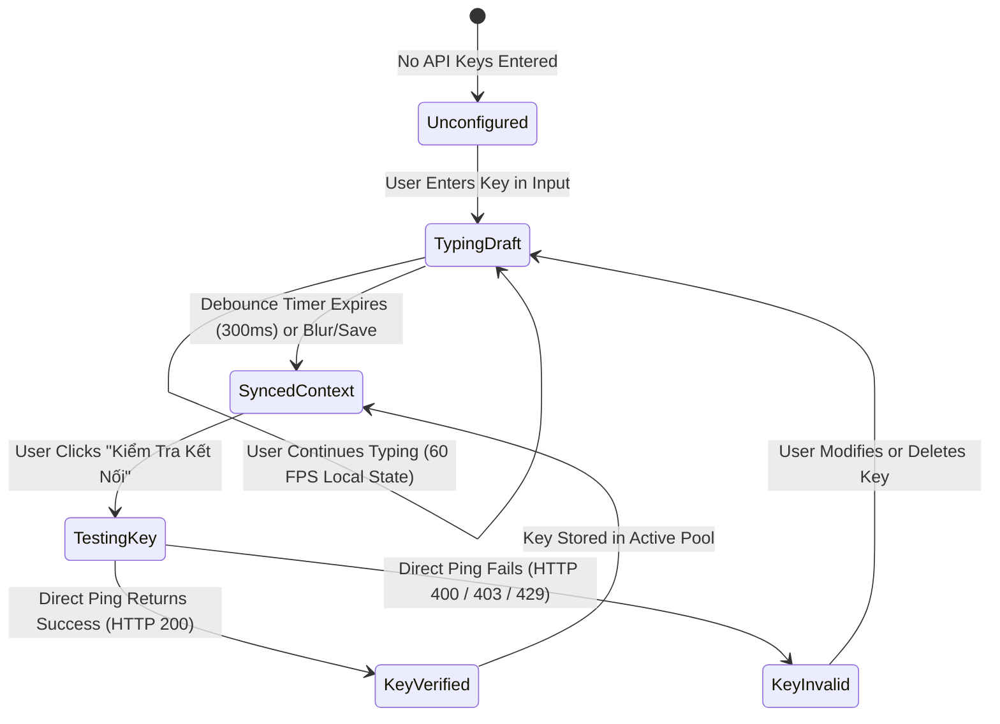

# Data Model: AI Configuration & Key Lifecycle Optimization

**Feature**: `118-fix-api-key-config-lag`  
**Date**: 2026-09-12  

---

## 1. Key Entities & Structures

### `LocalKeyDraftItem`
Represents an individual API key slot maintained within the local state of `KeyListSection` before being flushed to the root context.

```typescript
export interface LocalKeyDraftItem {
  /** Stable local client ID (preserves input focus during re-renders) */
  draftId: string;
  /** The current key value in the input field */
  value: string;
  /** Whether the secret is unmasked in the UI */
  isRevealed: boolean;
  /** Immediate validation status for user feedback */
  testState: 'idle' | 'testing' | 'valid' | 'invalid';
  /** Optional message from validation test */
  testMessage?: string;
}
```

### `ModelSupportAssessment`
Represents the compatibility evaluation between a selected model and the configured API key pool.

```typescript
export type ModelSupportLevel =
  | 'presumed_supported'  // Standard preset models with valid keys present (default ready)
  | 'verified_supported'  // Confirmed via listModels or direct test call
  | 'pending_inspection'   // Custom/discovered model awaiting inspection
  | 'unsupported';         // Confirmed 0 keys support this model (after active check)

export interface ModelSupportAssessment {
  modelId: string;
  displayName: string;
  supportLevel: ModelSupportLevel;
  totalKeys: number;
  availableKeys: number;
  badgeTone: 'polish' | 'neutral' | 'warning' | 'danger';
  badgeLabel: string;
  warningMessage?: string;
}
```

---

## 2. State Lifecycle & Transitions



---

## 3. Storage Invariants & Integrity

1. **Storage Tier Separation**:
   - Primary Session Key: `sessionStorage.getItem('gemini_api_keys')` maintains ephemeral security by default.
   - User Preference: `localStorage.getItem('gemini_remember_keys')` (`'true' | 'false'`) determines whether keys should be securely preserved across browser sessions.
   - When retention is enabled, keys are persisted locally so they survive tab closure.
   - When retention is disabled, keys reside purely in session storage.
2. **Storage Audit Compliance**:
   - Passing all integrity assertions in `src/utils/__tests__/credentialStorage.test.ts` and `src/utils/__tests__/storageAudit.test.ts`.
