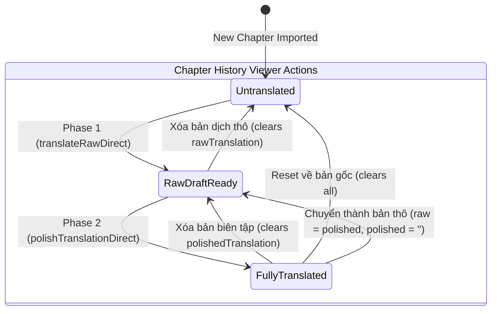

# Data Model: Retranslate Integrity Guard and Safe Draft Preservation

## 1. Type Extensions

### `AutoTranslateMode`
Location: `src/types.ts` / `src/hooks/useAutoTranslationQueue.ts`

```typescript
export type AutoTranslateMode = 'resume' | 'from_scratch' | 'repolish';
```

### `DraftIntegrityCheckResult`
Location: `src/services/chapterTranslationService.ts` or `src/lib/text.ts`

```typescript
export interface DraftIntegrityCheckResult {
  isTruncated: boolean;
  reason?: string;
  sourceLength: number;
  draftLength: number;
  sourceParagraphs: number;
  draftParagraphs: number;
}
```

---

## 2. Draft Lifecycle State Machine in Chapter History



---

## 3. Auto-Translation Pipeline Decision Flow

```mermaid
flowchart TD
    Start([Bắt đầu dịch chương]) --> ModeCheck{autoTranslateMode?}
    
    ModeCheck -->|from_scratch| RunPhase1[Giai đoạn 1: Dịch thô từ sourceText]
    
    ModeCheck -->|repolish| HasRawCheck{Có rawTranslation?}
    ModeCheck -->|resume| StatusCheck{Chapter completed?}
    
    StatusCheck -->|Yes| SkipChapter[Bỏ qua chương đã hoàn thành]
    StatusCheck -->|No| HasRawCheck
    
    HasRawCheck -->|Không| RunPhase1
    HasRawCheck -->|Có| IntegrityCheck{isDraftTruncated?}
    
    IntegrityCheck -->|Bị cụt (Truncated)| WarnAndRunPhase1[Cảnh báo toàn vẹn -> Dịch thô mới GĐ1]
    IntegrityCheck -->|Hợp lệ (Valid)| ReuseRaw[Sử dụng rawTranslation làm firstDraft]
    
    WarnAndRunPhase1 --> RunPhase1
    RunPhase1 --> RunPhase2[Giai đoạn 2: Chuốt văn phong đệ quy]
    ReuseRaw --> RunPhase2
    
    RunPhase2 --> SaveDB[Lưu vào IndexedDB: Bảo vệ rawTranslation]
    SaveDB --> End([Hoàn thành chương])
```
