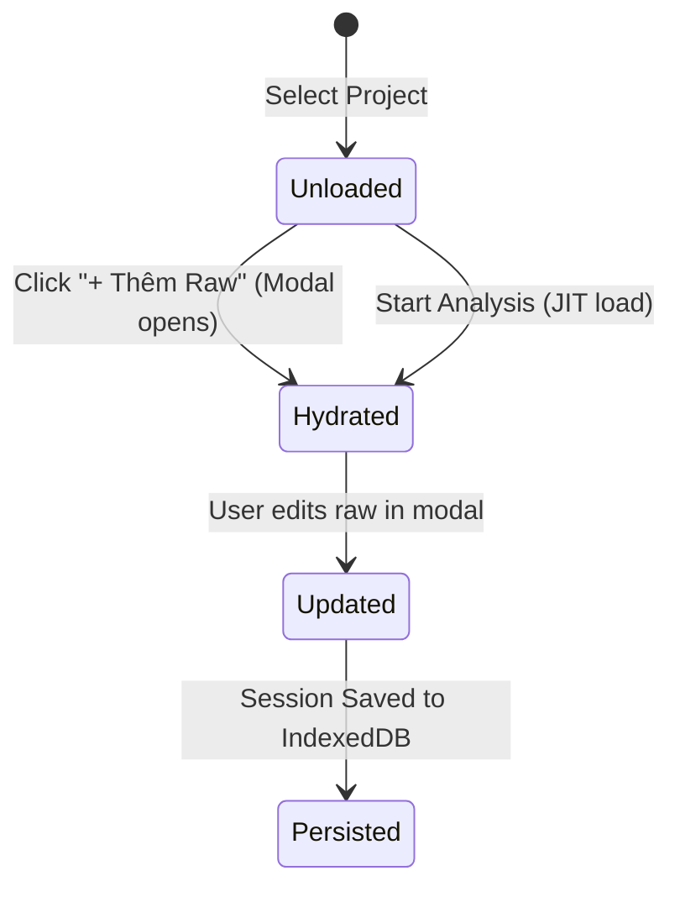

# Data Model: Hako Truncation and Omission Detection

**Feature**: `120-hako-truncation-omission-detection`  
**Date**: 2026-09-12  

## 1. Entities & Types

### 1.1 `QualityIssue` (`src/types/hakoChecker.ts`)
Represents an identified issue in a translated chapter.

```typescript
export type QualityIssueCategory =
  | 'inconsistent_name'
  | 'pronoun_gender'
  | 'terminology_drift'
  | 'raw_leak'
  | 'repetition'
  | 'wrong_chapter'
  | 'mistranslation'
  | 'omission'          // Enhanced for truncation & missing sections
  | 'hallucination'
  | 'other';

export type QualityIssueSeverity = 'critical' | 'major' | 'minor' | 'warning';

export interface QualityIssue {
  id: string;
  chapterId: string;
  chapterTitle: string;
  chapterNumber: number;
  category: QualityIssueCategory;
  severity: QualityIssueSeverity;
  vietnameseSnippet: string;       // For omissions: anchor near cut-off point or last sentence
  rawSnippet?: string;             // For omissions: opening/continuation of missing raw text
  explanation: string;             // Explicit metrics (e.g. 80 words vs 2,000 raw chars, 4%)
  suggestedFix?: string;           // E.g. "Dịch lại chương hoặc bổ sung phần dịch còn thiếu"
  decision: 'pending' | 'confirmed' | 'review_needed' | 'dismissed' | 'resolved';
  detectedBy: 'heuristic' | 'ai';
  moderatorNote?: string;
  isNew?: boolean;
  createdAt: string;
  resolvedAt?: string;
}
```

### 1.2 `ProjectReviewChapter` (`src/types/hakoChecker.ts`)
Per-chapter tracking in the review session.

```typescript
export interface ProjectReviewChapter {
  chapterId: string;
  title: string;
  chapterNumber: number;
  translationType: 'polished' | 'raw' | 'none';
  wordCount: number;
  status: 'pending' | 'analyzing' | 'done';
  rawChineseContent?: string;      // Auto-hydrated from IndexedDB Chapter.sourceText
}
```

---

## 2. Validation Rules & State Transitions

### 2.1 Heuristic Omission Thresholds
1. **Severe Truncation (Bilingual)**:
   - Condition: `cleanRaw.length > 150` AND `cleanVi.length < cleanRaw.length * 0.35`
   - Result: `category = 'omission'`, `severity = 'critical'`, `detectedBy = 'heuristic'`
2. **Structural Paragraph Collapse (Bilingual)**:
   - Condition: `sourceParagraphs >= 3` AND `viParagraphs <= 1` AND `cleanVi.length < cleanRaw.length * 0.5`
   - Result: `category = 'omission'`, `severity = 'critical'`, `detectedBy = 'heuristic'`
3. **Severe Brevity (Monolingual)**:
   - Condition: `cleanRaw` is empty/absent AND `translationType !== 'none'` AND `wordCount < 150`
   - Result: `category = 'omission'`, `severity = 'major'`, `detectedBy = 'heuristic'`

### 2.2 Raw Hydration Lifecycle

