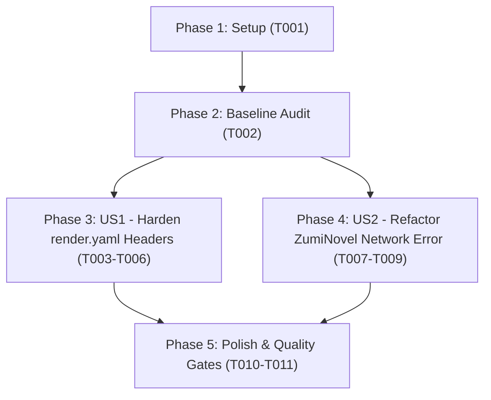

# Tasks: Harden Security Headers in Render Blueprint and Refine ZumiNovel Network Error Diagnostics

**Branch**: `126-harden-security-headers`  
**Input Documents**: [`spec.md`](./spec.md), [`plan.md`](./plan.md), [`data-model.md`](./data-model.md), [`contracts/security-headers-and-client.contract.md`](./contracts/security-headers-and-client.contract.md), [`research.md`](./research.md), [`quickstart.md`](./quickstart.md)

---

## Phase 1: Setup (Shared Infrastructure)

**Purpose**: Project preparation and target file validation

- [X] T001 Verify workspace files and clean working tree in render.yaml and src/services/zuminovel/zuminovelRestClient.ts

---

## Phase 2: Foundational (Blocking Prerequisites)

**Purpose**: Baseline verification of current configuration and test suite before applying changes

- [X] T002 Baseline audit of existing HTTP headers in render.yaml and existing test suite in src/services/zuminovel/__tests__/zuminovelRestClient.test.ts

**Checkpoint**: Baseline established. User story implementation can now proceed.

---

## Phase 3: User Story 1 - Enforce Hardened Security Headers on Production Deployments (Priority: P1) 🎯 MVP

**Goal**: Configure `render.yaml` with `upgrade-insecure-requests` in CSP, `Cross-Origin-Resource-Policy: same-origin`, and expanded `Permissions-Policy` disabling payment, USB, and screen wake lock APIs.

**Independent Test**: Run automated header validation in PowerShell per Scenario A in `specs/126-harden-security-headers/quickstart.md` to verify all 3 header directives match the contract.

### Implementation for User Story 1

- [X] T003 [US1] Prepend upgrade-insecure-requests; to Content-Security-Policy in render.yaml
- [X] T004 [US1] Add Cross-Origin-Resource-Policy same-origin header in render.yaml
- [X] T005 [US1] Expand Permissions-Policy with payment=(), usb=(), screen-wake-lock=() in render.yaml
- [X] T006 [US1] Run automated header syntax and directive validation in render.yaml

**Checkpoint**: User Story 1 complete. `render.yaml` headers are fully hardened and verified.

---

## Phase 4: User Story 2 - Accurate and Meaningful Network Error Diagnostics for ZumiNovel (Priority: P2)

**Goal**: Update `ZuminovelNetworkError` message and JSDoc documentation to remove false claims about CORS proxies and clearly describe genuine transport failure causes.

**Independent Test**: Run `npx vitest run src/services/zuminovel/__tests__/zuminovelRestClient.test.ts` and verify that `ZuminovelNetworkError` is raised with the revised message upon fetch failure.

### Tests for User Story 2

- [X] T007 [P] [US2] Add unit test assertions for new ZuminovelNetworkError message in src/services/zuminovel/__tests__/zuminovelRestClient.test.ts

### Implementation for User Story 2

- [X] T008 [US2] Update ZuminovelNetworkError message and JSDoc documentation in src/services/zuminovel/zuminovelRestClient.ts
- [X] T009 [US2] Verify ZumiNovel client unit tests pass in src/services/zuminovel/__tests__/zuminovelRestClient.test.ts

**Checkpoint**: User Story 2 complete. All error messages and documentation are accurate and test suites pass.

---

## Phase 5: Polish & Cross-Cutting Concerns

**Purpose**: Repository audit, quality gates verification, and regression check

- [X] T010 [P] Audit codebase to ensure zero references to "cần một proxy" remain using git grep in src/services/zuminovel/
- [X] T011 Run constitutional quality gates (npm run lint, npm test, npm run build) across the repository

---

## Dependencies & Execution Order

### Phase Dependencies

- **Setup (Phase 1)**: Can start immediately.
- **Foundational (Phase 2)**: Depends on T001; establishes test baseline.
- **User Story 1 (Phase 3)**: Modifies `render.yaml`; independent of User Story 2.
- **User Story 2 (Phase 4)**: Modifies `zuminovelRestClient.ts` and test file; independent of User Story 1.
- **Polish (Phase 5)**: Depends on completion of User Story 1 and User Story 2.

### User Story Completion Order

---

## Parallel Opportunities

- **Across Stories**: User Story 1 (`render.yaml`) and User Story 2 (`src/services/zuminovel/*`) touch completely disjoint files and can execute in parallel.
- **Within Stories**:
  - T007 (unit test assertion preparation) and T008 (code update) can be developed concurrently.
  - T010 (grep search audit) can run in parallel with general code reviews.

---

## Implementation Strategy

### MVP First (User Story 1 Only)
1. Complete T001 and T002 (Setup & Baseline).
2. Complete T003 - T006 (`render.yaml` header hardening).
3. Validate headers via PowerShell validation script.

### Incremental Delivery
1. Deliver US1 (`render.yaml` headers).
2. Deliver US2 (`zuminovelRestClient.ts` and test updates).
3. Run full verification suite (T010, T011).
