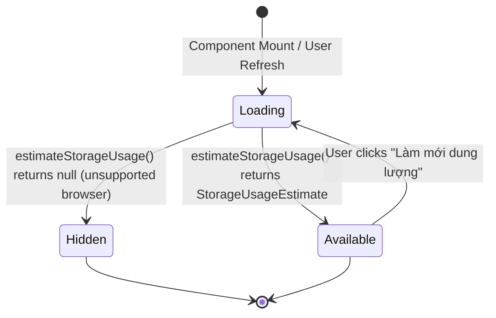

# Data Model: Anti-Scraping Cleaned Text & Storage Estimation

## 1. StorageUsageEstimate Entity

Defined in `src/services/db.ts` to represent browser disk storage capacity and consumption.

| Field | Type | Description | Example / Range |
| :--- | :--- | :--- | :--- |
| `usage` | `number` | Total bytes currently consumed by origin storage (IndexedDB + CacheStorage) | `15420340` (~14.7 MB) |
| `quota` | `number` | Total byte limit available to the origin under browser disk budget | `107374182400` (~100 GB) |
| `percentUsed` | `number` | Utilization percentage rounded to 1 decimal place | `0.1` (range: 0 to 100) |
| `isNearLimit` | `boolean` | High-watermark flag (true when `percentUsed >= 80` or remaining bytes < 100MB) | `false` |
| `formattedUsage` | `string` | Human-readable representation of consumed space | `"14.7 MB"` |
| `formattedQuota` | `string` | Human-readable representation of total disk budget | `"100.0 GB"` |

### UI State Flow



---

## 2. Text Cleaner Pipeline Data Model

Represents the state transformation of untrusted Chinese raw input string within `cleanChineseText`.

```text
Raw Untrusted Text (e.g. Scraped Novel Chapter)
  │
  ├─► Phase 1: Strip Zero-Width Anti-Scraping Characters: [\u200B\uFEFF\u200D\u200C]
  │
  ├─► Phase 2: Strip HTML Tags & Entities (<...>, &nbsp;, &amp;, ...)
  │
  ├─► Phase 3: Strip Web URLs (http://, https://, www.*)
  │
  ├─► Phase 4: Strip Novel Aggregator Watermarks & Scraper Ads (uukanshu, biquge, ...)
  │
  ├─► Phase 5: Normalize Spacing, Full-Width Space (\u3000) & Collapse Redundant Blank Lines
  │
  └─► Phase 6: Canonical Unicode NFC Normalization (.normalize('NFC'))
        │
        ▼
Pristine Cleaned Chinese Text (Guaranteed NFC, No Invisible Anti-Scraping Tokens)
```
